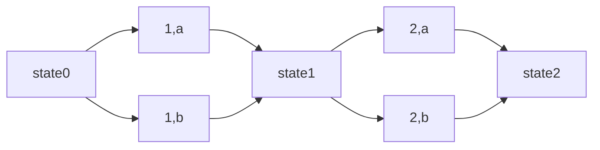

### SU_hash

首先题目自定义的hash函数是一个线性生成器，但是每次截取低128位（原383位上的运算），所以利用线性关系难以得到一些有用的东西。在考虑题目的主要问题

```python
for b in msg:
    h.update(bytes([b]))
    ret = xor(ret,h.digest())
```

很显然

```python
fn(msg) == hash(msg[:1]) ^ hash(msg[:2]) ^ ... ^ hash(msg[:len(msg)-1])
```

找到一个msg满足$fn(msg)==b'justjusthashhash'$

对于myhash自定义hash函数，由于其线性递推很容易想到的是其本身的碰撞攻击。
$$
n = (2g)^c*n_0+(2g)^{c-1}*g*m_1+...+(2g)^0*g*m_c\mod 2^{383}\\
K=(n-(2g)^c*n_0)/g=\sum_{i=1}^cm_i*(2g)^{c-i}
$$
进一步在$2^{128}$上求解一个碰撞问题
$$
\sum_{i=1}^c(m_i-n_i)*(2g)^{c-i}=0\mod 2^{100}
$$
利用格来简单的找到一个close bytes。所以第一步的碰撞就完成了。

后续继续分析这个自定义hash函数，找到碰撞后有这样的关系。



这是hash函数的内部转移，也就是每次都有两次路径选择，但是选择不同的路径对fn函数有不同的影响，借此来构造出目标解。
$$
\Delta_i=fn(m_{i,a})\bigoplus fn(m_{i,b})
$$
所以生成128以上条路径，最终转换成一个线性求解问题，$x_i$指是否选取b路径（cur为默认路径a的原始结果）
$$
cur+\sum_{i=1}^{128}x_iDelta_i=target\mod2
$$
最后来说，这个hash函数是以前比赛中copy过来的，设计上肯定有缺陷，较为容易控制state，所以解法上应该还有其他的简单方法来控制这个state。