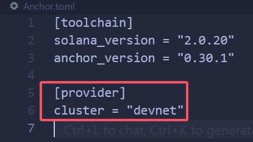
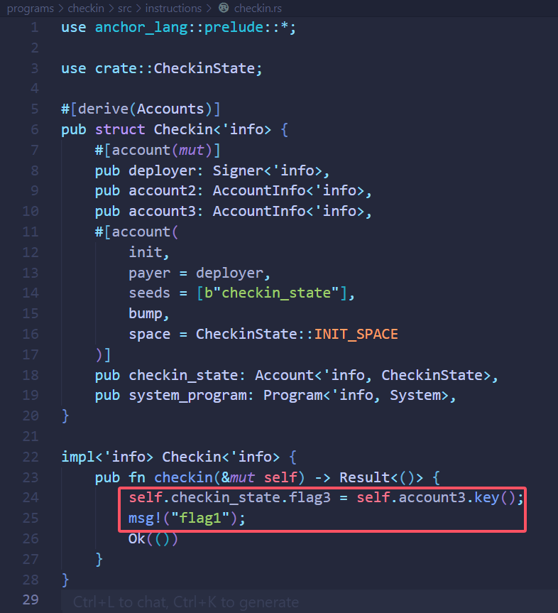
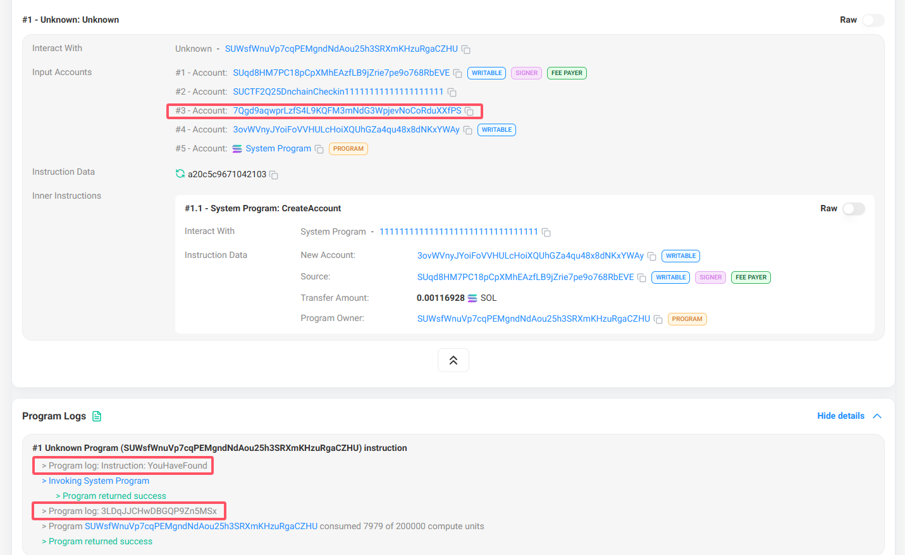

# SUCTF 2025 - Onchain Checkin

根据`lib.rs`和`Anchor.toml`文件中的提示信息，尝试使用Solana Devnet区块浏览器搜索`SUCTF2Q25DnchainCheckin11111111111111111111`。

https://solscan.io/account/SUCTF2Q25DnchainCheckin11111111111111111111?cluster=devnet

发现有两笔交易，逐个查看，并结合`checkin.rs`文件中的提示信息，可以得知在交易[21hrX9ekAihzk5M1fE7EdagACu1LGJj8j4bBbU12oNc26nxdGpXknyXTXhUzG9ukuEgnPV2h5M5Yb57geD4vgjnk](https://solscan.io/tx/21hrX9ekAihzk5M1fE7EdagACu1LGJj8j4bBbU12oNc26nxdGpXknyXTXhUzG9ukuEgnPV2h5M5Yb57geD4vgjnk?cluster=devnet)

中存在flag相关信息。

分别得到`3LDqJJCHwDBGQP9Zn5MSx`、`YouHaveFound`、`7Qgd9aqwprLzfS4L9KQFM3mNdG3WpjevNoCoRduXXfPS`，解`base58`后依次拼接，得到flag为`SUCTF{Con9ra7s!YouHaveFound_7HE_KEeee3ey_P4rt_0f_Th3_F1ag.}`。
