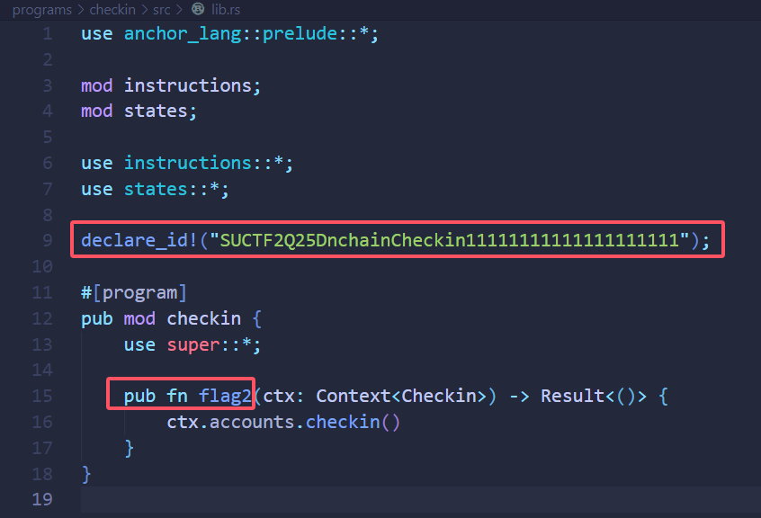
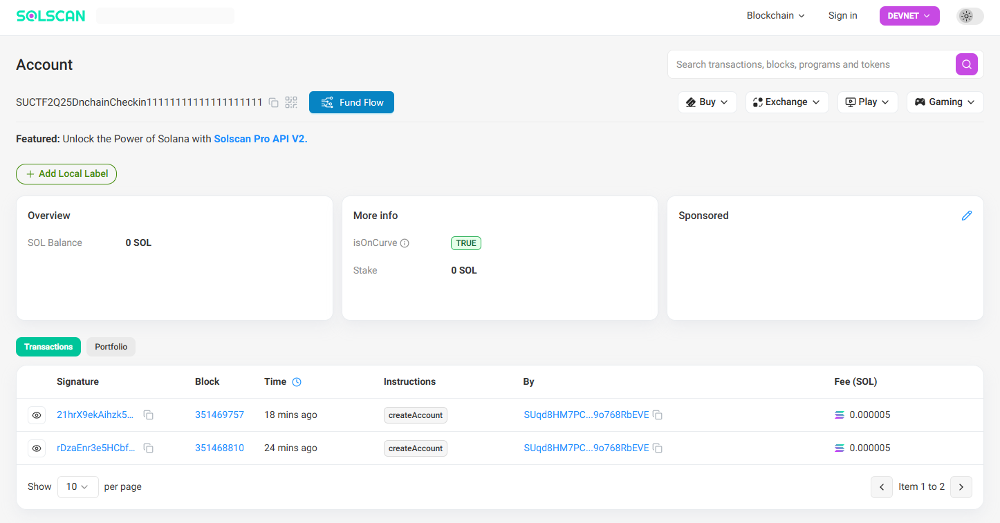

# Onchain Checkin




根据`lib.rs`和`Anchor.toml`文件中的提示信息，尝试使用 Solana Devnet 区块浏览器搜索[SUCTF2Q25DnchainCheckin11111111111111111111](https://solscan.io/account/SUCTF2Q25DnchainCheckin11111111111111111111?cluster=devnet)。




发现有两笔交易，逐个查看，并结合`checkin.rs`文件中的提示信息，可以得知在交易[21hrX9ekAihzk5M1fE7EdagACu1LGJj8j4bBbU12oNc26nxdGpXknyXTXhUzG9ukuEgnPV2h5M5Yb57geD4vgjnk](https://solscan.io/tx/21hrX9ekAihzk5M1fE7EdagACu1LGJj8j4bBbU12oNc26nxdGpXknyXTXhUzG9ukuEgnPV2h5M5Yb57geD4vgjnk?cluster=devnet)中存在 flag 相关信息。


分别得到`3LDqJJCHwDBGQP9Zn5MSx`、`YouHaveFound`、`7Qgd9aqwprLzfS4L9KQFM3mNdG3WpjevNoCoRduXXfPS`，解`base58`后依次拼接。

```flag
SUCTF{Con9ra7s!YouHaveFound_7HE_KEeee3ey_P4rt_0f_Th3_F1ag.}
```

（花絮：我已经尽可能把项目文件删掉以避免能够在本地跑起来，明确表示 flag 在链上，还是有几位师傅顶着“Checkin”“So easy.”“数十个解出”以及私聊回复告知以“最简方式解题”的超明显提示下自己装 Solana 那套超难装的环境、拼凑项目文件进行部署、并试图从本地读取一个完全不可能存在的 flag 的）
