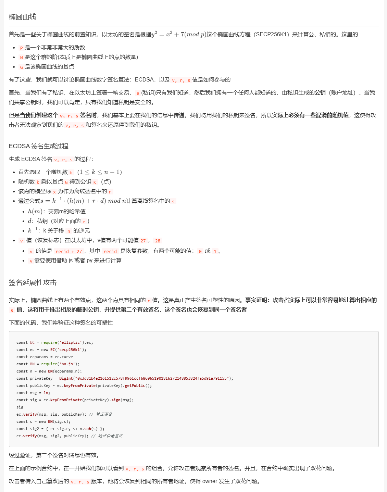

# Onchain Magician

本题尽可能设计成了最简模式，能够一眼定诊漏洞点，并且解法可易可难。使用标准工具对一个消息进行 ECDSA 签名得到的数据是唯一的，但从原理上签名数量并不受限。有两种解法可以突破限制，一是签名延展性攻击，客观上看这是一种被动形式的攻击，因为无需得到 signer 的私钥，只要其暴露出一个有效签名，外界任何人都可以快速计算出另一个等效签名，但此法至多只有两个签名；二是不遵守标准规范，绕过确定性 k 值生成即可自行随意签，客观上看这是一种主动形式的攻击，因为这需要由 signer 私钥持有人自己精心操作，此法可以无限签。

（延伸 1：需要注意自行操作 k 值风险极大，一旦暴露出两个 k 值相同的签名，可结合提取的公钥，通过数学运算将其直接还原出私钥，从未暴露签名数据的账户处于量子安全状态，参考[文章 1](https://bitcoin.stackexchange.com/questions/35848/recovering-private-key-when-someone-uses-the-same-k-twice-in-ecdsa-signatures)&[文章 2](https://xz.aliyun.com/t/2718?time__1311=n4%2Bxni0%3DG%3DGQ%3DDKqY5Ds0f4Qu3x0h78hYWdTD)&[文章 3](https://www.odaily.news/post/5170383)）

（延伸 2：这也是现代区块链如 Solana、TON、Sui 等使用 Ed25519 作为签名算法的主要原因，无签名可延展性问题困扰，参考[文章 4](https://web3caff.com/zh/archives/62191)）

但大道至简，本题设计时以签名延展性攻击为主。

```solidity
// SPDX-License-Identifier: UNLICENSED
pragma solidity 0.8.28;

contract MagicBox {
    struct Signature {
        uint8 v;
        bytes32 r;
        bytes32 s;
    }

    address magician;
    bytes32 alreadyUsedSignatureHash;
    bool isOpened;

    constructor() {}

    function isSolved() public view returns (bool) {
        return isOpened;
    }

    function getMessageHash(address _magician) public view returns (bytes32) {
        return keccak256(abi.encodePacked("I want to open the magic box", _magician, address(this), block.chainid));
    }

    function _getSignerAndSignatureHash(Signature memory _signature) internal view returns (address, bytes32) {
        address signer = ecrecover(getMessageHash(msg.sender), _signature.v, _signature.r, _signature.s);
        bytes32 signatureHash = keccak256(abi.encodePacked(_signature.v, _signature.r, _signature.s));
        return (signer, signatureHash);
    }

    function signIn(Signature memory signature) external {
        require(magician == address(0), "Magician already signed in");
        (address signer, bytes32 signatureHash) = _getSignerAndSignatureHash(signature);
        require(signer == msg.sender, "Invalid signature");
        magician = signer;
        alreadyUsedSignatureHash = signatureHash;
    }

    function openBox(Signature memory signature) external {
        require(magician == msg.sender, "Only magician can open the box");
        (address signer, bytes32 signatureHash) = _getSignerAndSignatureHash(signature);
        require(signer == msg.sender, "Invalid signature");
        require(signatureHash != alreadyUsedSignatureHash, "Signature already used");
        isOpened = true;
    }
}
```

需要提供关于一个特定消息的两个等效签名才能解出题目。

提问，完全使用原生代码就没漏洞了吗，没有，但也有，这个锅要分给底层设计，这是 ECDSA 签名算法的数学缺陷，算是个信息差或是小 0day 吧。大多数新进开发者通常会认为对于一个特定消息进行 ECDSA 签名，一个签名者只能签出一个有效签名（很多刚进来浅学了几天就想去创业然后导致写出各种满是漏洞的 DAPP）。但其实可以通过该签名数据在曲线上计算另外一个等效的点，即另一个可以 ecrecover 出同一个 signer 的等效签名。



```python
s_int = int.from_bytes(original_signature.s, byteorder='big')
v_int = int.from_bytes(original_signature.v, byteorder='big')
new_s_int = secp256k1.N - s_int
new_v_int = 28 if v_int == 27 else 27
```

主要变换在于签名数据 vrs 中的 v 和 s 这两部分，如上代码片段所示。关于其数学原理可以阅读[这篇文章](https://learnblockchain.cn/article/8281)深入学习理解。第二类方法的话可以参考[这篇文章](https://cnwangjihe.notion.site/ECDSA-ec7a150a720d4cf29c6d060bbf56275b)。（该题一血队伍 Lilac 采用）

大道至简，解题脚本如下（还是自研工具好用）：

```python
import os
from dotenv import load_dotenv
from poseidon.evm import Chain, Account, Contract, Utils  # https://github.com/B1ue1nWh1te/Poseidon

load_dotenv()
rpc_url = os.getenv("RPC_URL")
private_key = os.getenv("PRIVATE_KEY")
Utils.set_solidity_version("0.8.28")
abi, bytecode = Utils.compile_solidity_contract("./contracts/MagicBox.sol", "MagicBox")

chain = Chain(rpc_url)
account = Account(chain, private_key)
contract = Contract(account, "<ContractAddress>", abi)

contract.read_only_call_function("isSolved")
message_hash = contract.read_only_call_function("getMessageHash", account.address)
signature1 = account.sign_message_hash(message_hash).signature_data
contract.call_function("signIn", [int(signature1.v.hex(), 16), signature1.r, signature1.s])

signature2 = Utils.convert_equivalent_signature(signature1.signature)
contract.call_function("openBox", [int(signature2.v.hex(), 16), signature2.r, signature2.s])
contract.read_only_call_function("isSolved")
```

运行脚本得到如下日志输出：

```log
2025-01-10 15:45:08.747 | SUCCESS  | poseidon.evm:<module>:34 -
[Poseidon][EVM][v2.0.0]
--------------------------------------------------------------------------------
2025-01-10 15:45:08.912 | SUCCESS  | poseidon.evm:set_solidity_version:995 -
[Utils][set_solidity_version]Current Solidity Version [0.8.28+commit.7893614a]
--------------------------------------------------------------------------------
2025-01-10 15:45:08.964 | SUCCESS  | poseidon.evm:compile_solidity_contract:1040 -
[Utils][compile_solidity_contract]
[file_path]./contracts/MagicBox.sol
[contract_name]MagicBox
[abi][{'inputs': [], 'stateMutability': 'nonpayable', 'type': 'constructor'}, {'inputs': [{'internalType': 'address', 'name': '_magician', 'type': 'address'}], 'name': 'getMessageHash', 'outputs': [{'internalType': 'bytes32', 'name': '', 'type': 'bytes32'}], 'stateMutability': 'view', 'type': 'function'}, {'inputs': [], 'name': 'isSolved', 'outputs': [{'internalType': 'bool', 'name': '', 'type': 'bool'}], 'stateMutability': 'view', 'type': 'function'}, {'inputs': [{'components': [{'internalType': 'uint8', 'name': 'v', 'type': 'uint8'}, {'internalType': 'bytes32', 'name': 'r', 'type': 'bytes32'}, {'internalType': 'bytes32', 'name': 's', 'type': 'bytes32'}], 'internalType': 'struct MagicBox.Signature', 'name': 'signature', 'type': 'tuple'}], 'name': 'openBox', 'outputs': [], 'stateMutability': 'nonpayable', 'type': 'function'}, {'inputs': [{'components': [{'internalType': 'uint8', 'name': 'v', 'type': 'uint8'}, {'internalType': 'bytes32', 'name': 'r', 'type': 'bytes32'}, {'internalType': 'bytes32', 'name': 's', 'type': 'bytes32'}], 'internalType': 'struct MagicBox.Signature', 'name': 'signature', 'type': 'tuple'}], 'name': 'signIn', 'outputs': [], 'stateMutability': 'nonpayable', 'type': 'function'}]
[bytecode]0x6080604052348015600e575f5ffd5b50610ac98061001c5f395ff3fe608060405234801561000f575f5ffd5b506004361061004a575f3560e01c80631f5ac1b21461004e57806356f806941461007e57806364327ff01461009a57806364d98f6e146100b6575b5f5ffd5b610068600480360381019061006391906104f1565b6100d4565b6040516100759190610534565b60405180910390f35b6100986004803603810190610093919061069a565b610107565b005b6100b460048036038101906100af919061069a565b61025d565b005b6100be6103cb565b6040516100cb91906106df565b60405180910390f35b5f8130466040516020016100ea939291906107ba565b604051602081830303815290604052805190602001209050919050565b5f73ffffffffffffffffffffffffffffffffffffffff165f5f9054906101000a900473ffffffffffffffffffffffffffffffffffffffff1673ffffffffffffffffffffffffffffffffffffffff1614610195576040517f08c379a000000000000000000000000000000000000000000000000000000000815260040161018c9061085b565b60405180910390fd5b5f5f6101a0836103e0565b915091503373ffffffffffffffffffffffffffffffffffffffff168273ffffffffffffffffffffffffffffffffffffffff1614610212576040517f08c379a0000000000000000000000000000000000000000000000000000000008152600401610209906108c3565b60405180910390fd5b815f5f6101000a81548173ffffffffffffffffffffffffffffffffffffffff021916908373ffffffffffffffffffffffffffffffffffffffff16021790555080600181905550505050565b3373ffffffffffffffffffffffffffffffffffffffff165f5f9054906101000a900473ffffffffffffffffffffffffffffffffffffffff1673ffffffffffffffffffffffffffffffffffffffff16146102eb576040517f08c379a00000000000000000000000000000000000000000000000000000000081526004016102e29061092b565b60405180910390fd5b5f5f6102f6836103e0565b915091503373ffffffffffffffffffffffffffffffffffffffff168273ffffffffffffffffffffffffffffffffffffffff1614610368576040517f08c379a000000000000000000000000000000000000000000000000000000000815260040161035f906108c3565b60405180910390fd5b60015481036103ac576040517f08c379a00000000000000000000000000000000000000000000000000000000081526004016103a390610993565b60405180910390fd5b600160025f6101000a81548160ff021916908315150217905550505050565b5f60025f9054906101000a900460ff16905090565b5f5f5f60016103ee336100d4565b855f0151866020015187604001516040515f815260200160405260405161041894939291906109c0565b6020604051602081039080840390855afa158015610438573d5f5f3e3d5ffd5b5050506020604051035190505f845f01518560200151866040015160405160200161046593929190610a57565b6040516020818303038152906040528051906020012090508181935093505050915091565b5f604051905090565b5f5ffd5b5f73ffffffffffffffffffffffffffffffffffffffff82169050919050565b5f6104c082610497565b9050919050565b6104d0816104b6565b81146104da575f5ffd5b50565b5f813590506104eb816104c7565b92915050565b5f6020828403121561050657610505610493565b5b5f610513848285016104dd565b91505092915050565b5f819050919050565b61052e8161051c565b82525050565b5f6020820190506105475f830184610525565b92915050565b5f5ffd5b5f601f19601f8301169050919050565b7f4e487b71000000000000000000000000000000000000000000000000000000005f52604160045260245ffd5b61059782610551565b810181811067ffffffffffffffff821117156105b6576105b5610561565b5b80604052505050565b5f6105c861048a565b90506105d4828261058e565b919050565b5f60ff82169050919050565b6105ee816105d9565b81146105f8575f5ffd5b50565b5f81359050610609816105e5565b92915050565b6106188161051c565b8114610622575f5ffd5b50565b5f813590506106338161060f565b92915050565b5f6060828403121561064e5761064d61054d565b5b61065860606105bf565b90505f610667848285016105fb565b5f83015250602061067a84828501610625565b602083015250604061068e84828501610625565b60408301525092915050565b5f606082840312156106af576106ae610493565b5b5f6106bc84828501610639565b91505092915050565b5f8115159050919050565b6106d9816106c5565b82525050565b5f6020820190506106f25f8301846106d0565b92915050565b5f81905092915050565b7f492077616e7420746f206f70656e20746865206d6167696320626f78000000005f82015250565b5f610736601c836106f8565b915061074182610702565b601c82019050919050565b5f8160601b9050919050565b5f6107628261074c565b9050919050565b5f61077382610758565b9050919050565b61078b610786826104b6565b610769565b82525050565b5f819050919050565b5f819050919050565b6107b46107af82610791565b61079a565b82525050565b5f6107c48261072a565b91506107d0828661077a565b6014820191506107e0828561077a565b6014820191506107f082846107a3565b602082019150819050949350505050565b5f82825260208201905092915050565b7f4d6167696369616e20616c7265616479207369676e656420696e0000000000005f82015250565b5f610845601a83610801565b915061085082610811565b602082019050919050565b5f6020820190508181035f83015261087281610839565b9050919050565b7f496e76616c6964207369676e61747572650000000000000000000000000000005f82015250565b5f6108ad601183610801565b91506108b882610879565b602082019050919050565b5f6020820190508181035f8301526108da816108a1565b9050919050565b7f4f6e6c79206d6167696369616e2063616e206f70656e2074686520626f7800005f82015250565b5f610915601e83610801565b9150610920826108e1565b602082019050919050565b5f6020820190508181035f83015261094281610909565b9050919050565b7f5369676e617475726520616c72656164792075736564000000000000000000005f82015250565b5f61097d601683610801565b915061098882610949565b602082019050919050565b5f6020820190508181035f8301526109aa81610971565b9050919050565b6109ba816105d9565b82525050565b5f6080820190506109d35f830187610525565b6109e060208301866109b1565b6109ed6040830185610525565b6109fa6060830184610525565b95945050505050565b5f8160f81b9050919050565b5f610a1982610a03565b9050919050565b610a31610a2c826105d9565b610a0f565b82525050565b5f819050919050565b610a51610a4c8261051c565b610a37565b82525050565b5f610a628286610a20565b600182019150610a728285610a40565b602082019150610a828284610a40565b60208201915081905094935050505056fea2646970667358221220c62e12bf5b4e6bc67e8e5f31332454a28b32daeda9c456dbbdce91b03f2ae97d64736f6c634300081c0033
--------------------------------------------------------------------------------
2025-01-10 15:45:09.132 | SUCCESS  | poseidon.evm:__init__:129 -
[Chain][__init__]Connected to [http://1.95.156.61:10002] [165ms]
--------------------------------------------------------------------------------
2025-01-10 15:45:09.308 | SUCCESS  | poseidon.evm:get_chain_information:169 -
[Chain][get_chain_information]
[chain_id]27431
[block_number]59
[gas_price]1.000382641 Gwei
--------------------------------------------------------------------------------
2025-01-10 15:45:09.343 | SUCCESS  | poseidon.evm:__init__:510 -
[Account][__init__]Successfully import account [0x8f139603e3BC48bFD8D12e80199BbD60fbDDcCC0]
--------------------------------------------------------------------------------
2025-01-10 15:45:09.344 | WARNING  | poseidon.evm:set_need_confirm_before_send_transaction:530 -
[Account][set_need_confirm_before_send_transaction][False]
--------------------------------------------------------------------------------
2025-01-10 15:45:09.432 | SUCCESS  | poseidon.evm:get_balance:401 -
[Chain][get_balance]
[address]0x8f139603e3BC48bFD8D12e80199BbD60fbDDcCC0
[balance][1000000000000000000 Wei]<=>[1 Ether]
--------------------------------------------------------------------------------
2025-01-10 15:45:09.438 | SUCCESS  | poseidon.evm:__init__:853 -
[Contract][__init__]Successfully instantiated contract [0x6fa7D4E2E47Ae5836523824Aac1DDd1A8625BB5a]
--------------------------------------------------------------------------------
2025-01-10 15:45:09.570 | SUCCESS  | poseidon.evm:read_only_call_function:916 -
[Contract][read_only_call_function]
[contract_address]0x6fa7D4E2E47Ae5836523824Aac1DDd1A8625BB5a
[function]isSolved()
[result]False
--------------------------------------------------------------------------------
2025-01-10 15:45:09.741 | SUCCESS  | poseidon.evm:read_only_call_function:916 -
[Contract][read_only_call_function]
[contract_address]0x6fa7D4E2E47Ae5836523824Aac1DDd1A8625BB5a
[function]getMessageHash('0x8f139603e3BC48bFD8D12e80199BbD60fbDDcCC0',)
[result]b'J\x9c\xd5X\xc8\xed\xc99p\xdb\xbc-RW\xe7uc\xf4dL\xa5\xee\xc8"z:\x0eQ\\+\xc0\t'
--------------------------------------------------------------------------------
2025-01-10 15:45:09.746 | SUCCESS  | poseidon.evm:sign_message_hash:771 -
[Account][sign_message_hash]
[message_hash]0x4a9cd558c8edc93970dbbc2d5257e77563f4644ca5eec8227a3a0e515c2bc009
[signer]0x8f139603e3BC48bFD8D12e80199BbD60fbDDcCC0
[signature]0x3b099b4d6edee908ac7e558f5b51a51f426274ba47913e1364917247de6634f517da46cec746efb749ef169b3c7833dd196d3be63f618b57096d81fa8a1e0eb61c
[r]0x3b099b4d6edee908ac7e558f5b51a51f426274ba47913e1364917247de6634f5
[s]0x17da46cec746efb749ef169b3c7833dd196d3be63f618b57096d81fa8a1e0eb6
[v]0x1c
--------------------------------------------------------------------------------
2025-01-10 15:45:10.069 | INFO     | poseidon.evm:call_function:875 -
[Contract][call_function]
[contract_address]0x6fa7D4E2E47Ae5836523824Aac1DDd1A8625BB5a
[function]signIn([28, HexBytes('0x3b099b4d6edee908ac7e558f5b51a51f426274ba47913e1364917247de6634f5'), HexBytes('0x17da46cec746efb749ef169b3c7833dd196d3be63f618b57096d81fa8a1e0eb6')],)
--------------------------------------------------------------------------------
2025-01-10 15:45:10.167 | INFO     | poseidon.evm:send_transaction:582 -
[Account][send_transaction]
[txn]{
  "chainId": 27431,
  "from": "0x8f139603e3BC48bFD8D12e80199BbD60fbDDcCC0",
  "value": 0,
  "gas": 71075,
  "gasPrice": "1.000382641 Gwei",
  "nonce": 0,
  "data": "0x56f80694000000000000000000000000000000000000000000000000000000000000001c3b099b4d6edee908ac7e558f5b51a51f426274ba47913e1364917247de6634f517da46cec746efb749ef169b3c7833dd196d3be63f618b57096d81fa8a1e0eb6",
  "to": "0x6fa7D4E2E47Ae5836523824Aac1DDd1A8625BB5a"
}
--------------------------------------------------------------------------------
2025-01-10 15:45:10.249 | INFO     | poseidon.evm:send_transaction:586 -
[Account][send_transaction][pending...]
[transaction_hash]0xcff8774e6dc4853f715539aa00d4d855fb577c0e89ee4aa373fe2b026e1562a3
--------------------------------------------------------------------------------
2025-01-10 15:45:14.245 | SUCCESS  | poseidon.evm:get_transaction_receipt_by_hash:289 -
[Chain][get_transaction_receipt_by_hash]
[transaction_hash]0xcff8774e6dc4853f715539aa00d4d855fb577c0e89ee4aa373fe2b026e1562a3
[block_number]61
[transaction_index]0
[status]Success
[transaction_type]EIP-155
[action]Interactive Contract
[sender]0x8f139603e3BC48bFD8D12e80199BbD60fbDDcCC0
[to]0x6fa7D4E2E47Ae5836523824Aac1DDd1A8625BB5a
[nonce]0 [value]0
[gas_used]71075 [gas_limit]71075
[gas_price]1.000382641 Gwei
[logs][]
[input_data]0x56f80694000000000000000000000000000000000000000000000000000000000000001c3b099b4d6edee908ac7e558f5b51a51f426274ba47913e1364917247de6634f517da46cec746efb749ef169b3c7833dd196d3be63f618b57096d81fa8a1e0eb6
[r]0xbbf66f91a8280260d8f96fd073e8411df274033e3a68b85509f56e5c943aa90e
[s]0x2306443908e6557ebdcd822efe7025f80ecbf64d2b2974eb655db180d0e8eeb2
[v]0xd671
--------------------------------------------------------------------------------
2025-01-10 15:45:14.249 | SUCCESS  | poseidon.evm:generate_signature_data_with_signature:1207 -
[Utils][generate_signature_data_with_signature]
[signature]0x3b099b4d6edee908ac7e558f5b51a51f426274ba47913e1364917247de6634f517da46cec746efb749ef169b3c7833dd196d3be63f618b57096d81fa8a1e0eb61c
[r]0x3b099b4d6edee908ac7e558f5b51a51f426274ba47913e1364917247de6634f5
[s]0x17da46cec746efb749ef169b3c7833dd196d3be63f618b57096d81fa8a1e0eb6
[v]0x1c
--------------------------------------------------------------------------------
2025-01-10 15:45:14.250 | SUCCESS  | poseidon.evm:generate_signature_data_with_rsv:1241 -
[Utils][generate_signature_data_with_rsv]
[r]0x3b099b4d6edee908ac7e558f5b51a51f426274ba47913e1364917247de6634f5
[s]0xe825b93138b91048b610e964c387cc21a141a1006fe714e4b664dc924618328b
[v]0x1b
[signature]0x3b099b4d6edee908ac7e558f5b51a51f426274ba47913e1364917247de6634f5e825b93138b91048b610e964c387cc21a141a1006fe714e4b664dc924618328b1b
--------------------------------------------------------------------------------
2025-01-10 15:45:14.252 | SUCCESS  | poseidon.evm:convert_equivalent_signature:1379 -
[Utils][convert_equivalent_signature]
[original_signature]0x3b099b4d6edee908ac7e558f5b51a51f426274ba47913e1364917247de6634f517da46cec746efb749ef169b3c7833dd196d3be63f618b57096d81fa8a1e0eb61c
[equivalent_signature]0x3b099b4d6edee908ac7e558f5b51a51f426274ba47913e1364917247de6634f5e825b93138b91048b610e964c387cc21a141a1006fe714e4b664dc924618328b1b
[r]0x3b099b4d6edee908ac7e558f5b51a51f426274ba47913e1364917247de6634f5
[s]0xe825b93138b91048b610e964c387cc21a141a1006fe714e4b664dc924618328b
[v]0x1b
--------------------------------------------------------------------------------
2025-01-10 15:45:14.606 | INFO     | poseidon.evm:call_function:875 -
[Contract][call_function]
[contract_address]0x6fa7D4E2E47Ae5836523824Aac1DDd1A8625BB5a
[function]openBox([27, HexBytes('0x3b099b4d6edee908ac7e558f5b51a51f426274ba47913e1364917247de6634f5'), HexBytes('0xe825b93138b91048b610e964c387cc21a141a1006fe714e4b664dc924618328b')],)
--------------------------------------------------------------------------------
2025-01-10 15:45:14.703 | INFO     | poseidon.evm:send_transaction:582 -
[Account][send_transaction]
[txn]{
  "chainId": 27431,
  "from": "0x8f139603e3BC48bFD8D12e80199BbD60fbDDcCC0",
  "value": 0,
  "gas": 53063,
  "gasPrice": "1.00029296 Gwei",
  "nonce": 1,
  "data": "0x64327ff0000000000000000000000000000000000000000000000000000000000000001b3b099b4d6edee908ac7e558f5b51a51f426274ba47913e1364917247de6634f5e825b93138b91048b610e964c387cc21a141a1006fe714e4b664dc924618328b",
  "to": "0x6fa7D4E2E47Ae5836523824Aac1DDd1A8625BB5a"
}
--------------------------------------------------------------------------------
2025-01-10 15:45:14.773 | INFO     | poseidon.evm:send_transaction:586 -
[Account][send_transaction][pending...]
[transaction_hash]0x90caedfebf8767b8638178171e8193351404e77fc76794ccdb7c00bdce9c9aed
--------------------------------------------------------------------------------
2025-01-10 15:45:20.175 | SUCCESS  | poseidon.evm:get_transaction_receipt_by_hash:289 -
[Chain][get_transaction_receipt_by_hash]
[transaction_hash]0x90caedfebf8767b8638178171e8193351404e77fc76794ccdb7c00bdce9c9aed
[block_number]63
[transaction_index]0
[status]Success
[transaction_type]EIP-155
[action]Interactive Contract
[sender]0x8f139603e3BC48bFD8D12e80199BbD60fbDDcCC0
[to]0x6fa7D4E2E47Ae5836523824Aac1DDd1A8625BB5a
[nonce]1 [value]0
[gas_used]53063 [gas_limit]53063
[gas_price]1.00029296 Gwei
[logs][]
[input_data]0x64327ff0000000000000000000000000000000000000000000000000000000000000001b3b099b4d6edee908ac7e558f5b51a51f426274ba47913e1364917247de6634f5e825b93138b91048b610e964c387cc21a141a1006fe714e4b664dc924618328b
[r]0xb2a8b689ac4be47bdcd52e699dd67d22ddcdc0fbfef410dc5ab8393aac916cdb
[s]0x58756cb5a0e25ec445dd617184ed7bd43e04780652372c5e287fa89032a8ded7
[v]0xd671
--------------------------------------------------------------------------------
2025-01-10 15:45:20.361 | SUCCESS  | poseidon.evm:read_only_call_function:916 -
[Contract][read_only_call_function]
[contract_address]0x6fa7D4E2E47Ae5836523824Aac1DDd1A8625BB5a
[function]isSolved()
[result]True
--------------------------------------------------------------------------------
```

可以看到`isSolved=True`，回到入口点交题即可得到 flag。

```flag
SUCTF{C0n9r4ts!Y0u're_An_0ut5taNd1ng_OnchA1n_Ma9ic1an.}
```
