# SU_AD

## SharpADWS

分析[@whoami](https://whoamianony.top/) 师傅工具 SharpADWS 在流量侧 表现

参考演讲稿，又是膜拜学习的一天啊

https://xz.aliyun.com/t/16378?time\_\_1311\=GuD%3D0KAKBIPGx0Heeu4QuEWDRQT5v6%3DAox

​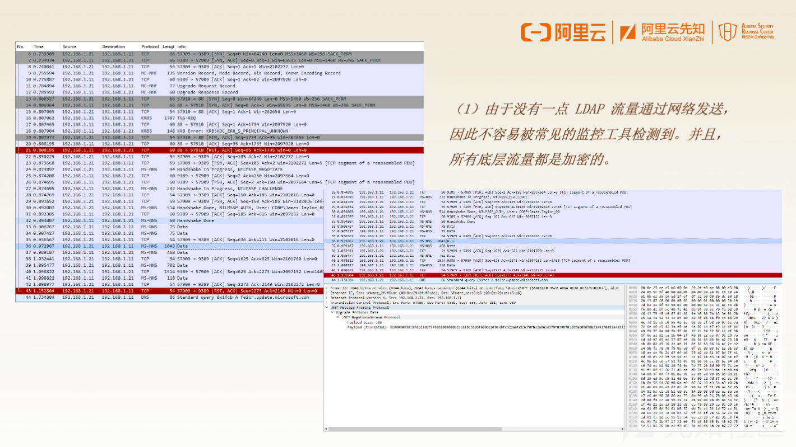​

​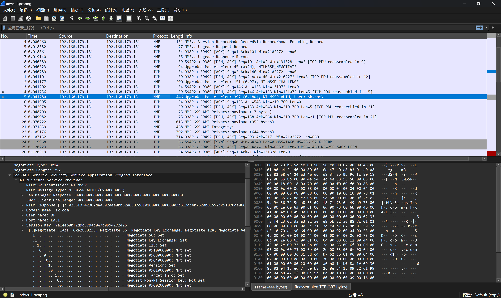​

使用了NetNTLMv2 协议 进行认证，尝试爆破sk用户的密码，可以参考2024强网杯的谍影重重

```Bash
$ tshark -n -r adws-1.pcapng -Y 'ntlmssp.messagetype == 0x00000003' -T fields -e ntlmssp.auth.username -e ntlmssp.auth.domain -e ntlmssp.ntlmv2_response.ntproofstr -e ntlmssp.auth.ntresponse
Warning: program compiled against libxml 212 using older 209
sk      sk.com  0233f3f42302daa392aee9bb52a6887c        0233f3f42302daa392aee9bb52a6887c01010000000000003c313dc4b762db01592cc51070da966d000000000200040053004b00010004004400430004000c0073006b002e0063006f006d0003001200440043002e0073006b002e0063006f006d0005000c0073006b002e0063006f006d00070008003c313dc4b762db0106000400020000000800300030000000000000000100000000200000a6b014bf8a1f09368502041ded7fceb82c8ed41c09c2d199ee04b8421f0b0e9c0a001000000000000000000000000000000000000900160068006f00730074002f0073006b002e0063006f006d000000000000000000
sk      sk.com  3d83dd54cff0f77715b97e7ae985813f        3d83dd54cff0f77715b97e7ae985813f01010000000000002d2c49c4b762db014a8fd14f8291865d000000000200040053004b00010004004400430004000c0073006b002e0063006f006d0003001200440043002e0073006b002e0063006f006d0005000c0073006b002e0063006f006d00070008002d2c49c4b762db0106000400020000000800300030000000000000000100000000200000a6b014bf8a1f09368502041ded7fceb82c8ed41c09c2d199ee04b8421f0b0e9c0a001000000000000000000000000000000000000900160068006f00730074002f0073006b002e0063006f006d000000000000000000
$ tshark -n -r adws-1.pcapng -Y 'ntlmssp.messagetype == 0x00000002'  -T fields -e ntlmssp.ntlmserverchallenge
Warning: program compiled against libxml 212 using older 209
a780092344838bb2
b7325db726cdddbe
$ cat ntlm_hash.txt
sk::sk.com:a780092344838bb2:0233f3f42302daa392aee9bb52a6887c:01010000000000003c313dc4b762db01592cc51070da966d000000000200040053004b00010004004400430004000c0073006b002e0063006f006d0003001200440043002e0073006b002e0063006f006d0005000c0073006b002e0063006f006d00070008003c313dc4b762db0106000400020000000800300030000000000000000100000000200000a6b014bf8a1f09368502041ded7fceb82c8ed41c09c2d199ee04b8421f0b0e9c0a001000000000000000000000000000000000000900160068006f00730074002f0073006b002e0063006f006d000000000000000000
$ hashcat -a 0 -m 5600 D:\Projects\MyCTFProjects\SU_AD\ntlm_hash.txt D:\Tools\Wordlists\rockyou.txt

Eminem01
```

制作keytab，可以参考[PTS2023-Talk-20-Decrypt_Kerberos_NTLM_with_Wireshark.pdf](https://archives.pass-the-salt.org/Pass%20the%20SALT/2023/slides/PTS2023-Talk-20-Decrypt_Kerberos_NTLM_with_Wireshark.pdf)

​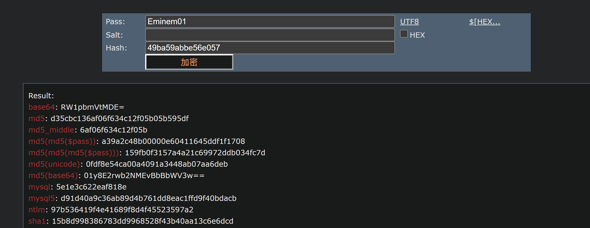​

```Python
from struct import unpack, pack
from impacket.structure import Structure
import binascii
import sys

# Keytab structure from http://www.ioplex.com/utilities/keytab.txt
  # keytab {
  #     uint16_t file_format_version;                    /* 0x502 */
  #     keytab_entry entries[*];
  # };

  # keytab_entry {
  #     int32_t size;
  #     uint16_t num_components;    /* sub 1 if version 0x501 */
  #     counted_octet_string realm;
  #     counted_octet_string components[num_components];
  #     uint32_t name_type;   /* not present if version 0x501 */
  #     uint32_t timestamp;
  #     uint8_t vno8;
  #     keyblock key;
  #     uint32_t vno; /* only present if >= 4 bytes left in entry */
  # };

  # counted_octet_string {
  #     uint16_t length;
  #     uint8_t data[length];
  # };

  # keyblock {
  #     uint16_t type;
  #     counted_octet_string;
  # };

class KeyTab(Structure):
    structure = (
        ('file_format_version','H=517'),
        ('keytab_entry', ':')
    )
    def fromString(self, data):
        self.entries = []
        Structure.fromString(self, data)
        data = self['keytab_entry']
        while len(data) != 0:
            ktentry = KeyTabEntry(data)

            data = data[len(ktentry.getData()):]
            self.entries.append(ktentry)

    def getData(self):
        self['keytab_entry'] = b''.join([entry.getData() for entry in self.entries])
        data = Structure.getData(self)
        return data

class OctetString(Structure):
    structure = (
        ('len', '>H-value'),
        ('value', ':')
    )

class KeyTabContentRest(Structure):
    structure = (
        ('name_type', '>I=1'),
        ('timestamp', '>I=0'),
        ('vno8', 'B=2'),
        ('keytype', '>H'),
        ('keylen', '>H-key'),
        ('key', ':')
    )

class KeyTabContent(Structure):
    structure = (
        ('num_components', '>h'),
        ('realmlen', '>h-realm'),
        ('realm', ':'),
        ('components', ':'),
        ('restdata',':')
    )
    def fromString(self, data):
        self.components = []
        Structure.fromString(self, data)
        data = self['components']
        for i in range(self['num_components']):
            ktentry = OctetString(data)

            data = data[ktentry['len']+2:]
            self.components.append(ktentry)
        self.restfields = KeyTabContentRest(data)

    def getData(self):
        self['num_components'] = len(self.components)
        # We modify the data field to be able to use the
        # parent class parsing
        self['components'] = b''.join([component.getData() for component in self.components])
        self['restdata'] = self.restfields.getData()
        data = Structure.getData(self)
        return data

class KeyTabEntry(Structure):
    structure = (
        ('size','>I-content'),
        ('content',':', KeyTabContent)
    )

# Add your own keys here!
# Keys are tuples in the form (keytype, 'hexencodedkey')
# Common keytypes for Windows:
# 23: RC4
# 18: AES-256
# 17: AES-128
# Wireshark takes any number of keys in the keytab, so feel free to add
# krbtgt keys, service keys, trust keys etc
keys = [
   (23, '97b536419f4e41689f8d4f45523597a2'),
]

nkt = KeyTab()
nkt.entries = []

for key in keys:
    ktcr = KeyTabContentRest()
    ktcr['keytype'] = key[0]
    ktcr['key'] = binascii.unhexlify(key[1])
    nktcontent = KeyTabContent()
    nktcontent.restfields = ktcr
    # The realm here doesn't matter for wireshark but does of course for a real keytab
    nktcontent['realm'] = b'sequel.htb'.upper()
    krbtgt = OctetString()
    krbtgt['value'] = 'krbtgt'
    nktcontent.components = [krbtgt]
    nktentry = KeyTabEntry()
    nktentry['content'] = nktcontent
    nkt.entries.append(nktentry)

data = nkt.getData()
if len(sys.argv) < 2:
    print('Usage: keytab.py <outputfile>')
    print('Keys should be written to the source manually')
else:
    with open(sys.argv[1], 'wb') as outfile:
        outfile.write(data)
```

​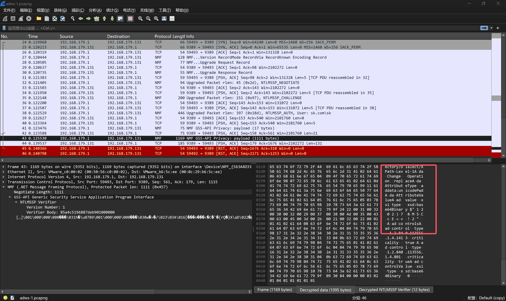​

熟悉 DACL 滥用的师傅们都知道，这是个强制改密的操作，可以参考https://www.thehacker.recipes/ad/movement/dacl/forcechangepassword

​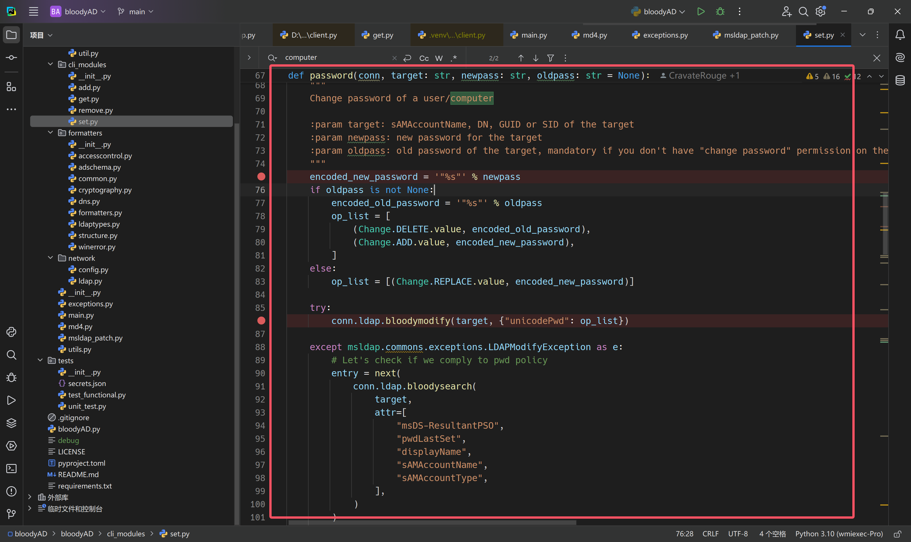​

参考bloodyAD项目，其实就是替换了关键属性unicodePwd的值

PS：

在 SharpADWS 项目中 不存在 强制改密的操作，我手动实现了一个

​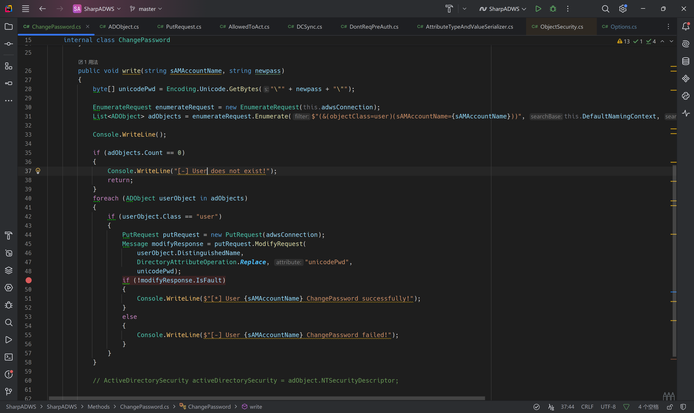​

至此获得administrator 密码 1202)78M5CcE\=+!2

​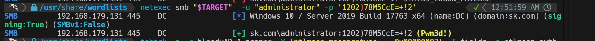​

## Psexec-kerbero

Impacket 我只能说伟大，无需多言！

不过我这里的psexec 脚本产生的smb流量，都是通过kerberos 协议认证过的，建议参考 [微软官方文档](https://learn.microsoft.com/en-us/archive/blogs/openspecification/smb-2-and-smb-3-security-in-windows-10-the-anatomy-of-signing-and-cryptographic-keys) ，获知kerberos 和 ntlm 身份认证协议 在 smb3 协议上的不同

​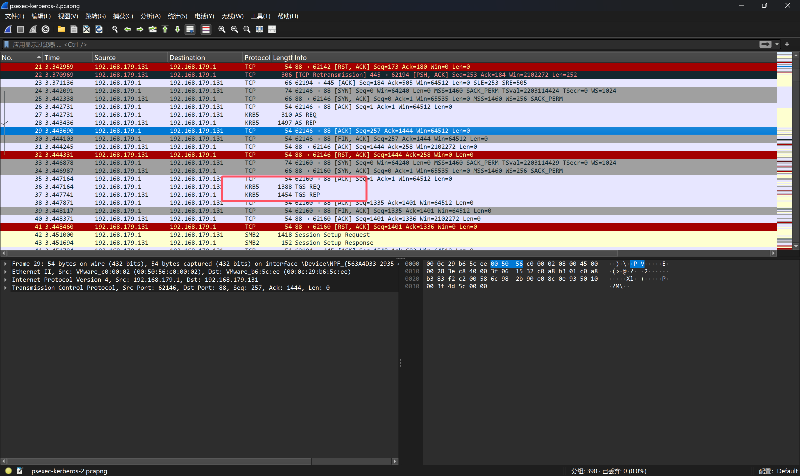​

继续制作keytab，用如下脚本生成administrator 用户 的 AES-256 密钥，主要参考[impacket脚本](https://github.com/fortra/impacket/blob/bfa7b939f8af47d4205531eddf0d5696be655d88/impacket/krb5/kerberosv5.py#L260)

```Python
import random

from impacket.krb5.crypto import _enctype_table

# Our random number generator
try:
    rand = random.SystemRandom()
except NotImplementedError:
    rand = random
    pass

if __name__ == '__main__':
    enctype = 18
    cipher = _enctype_table[enctype]
    key = cipher.string_to_key('1202)78M5CcE=+!2', b'SK.COMAdministrator', None)
    print(key.contents.hex())
```

​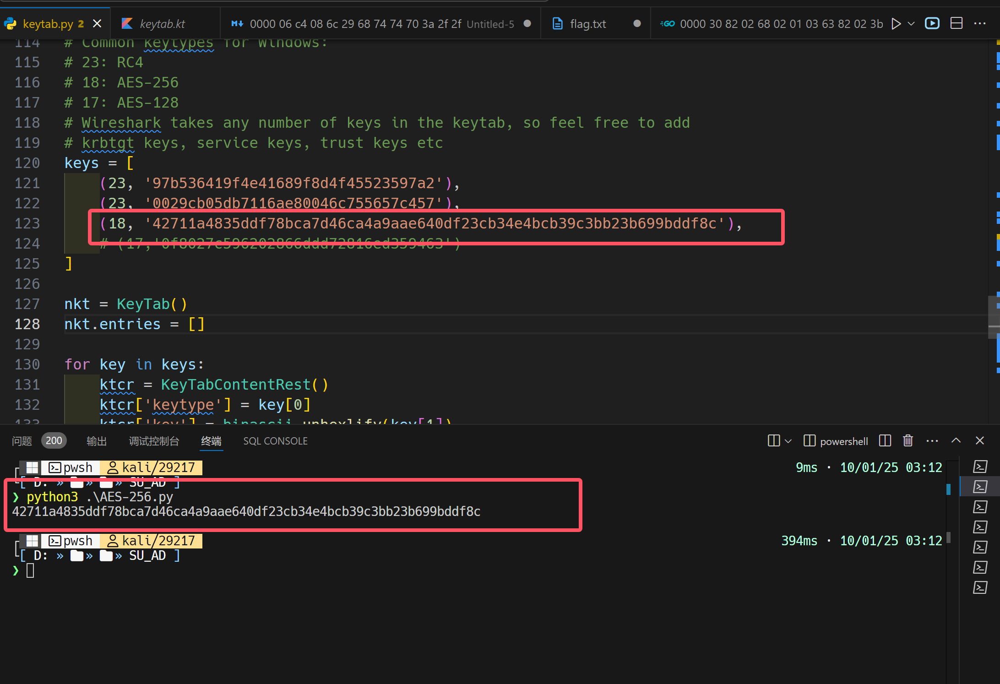​

​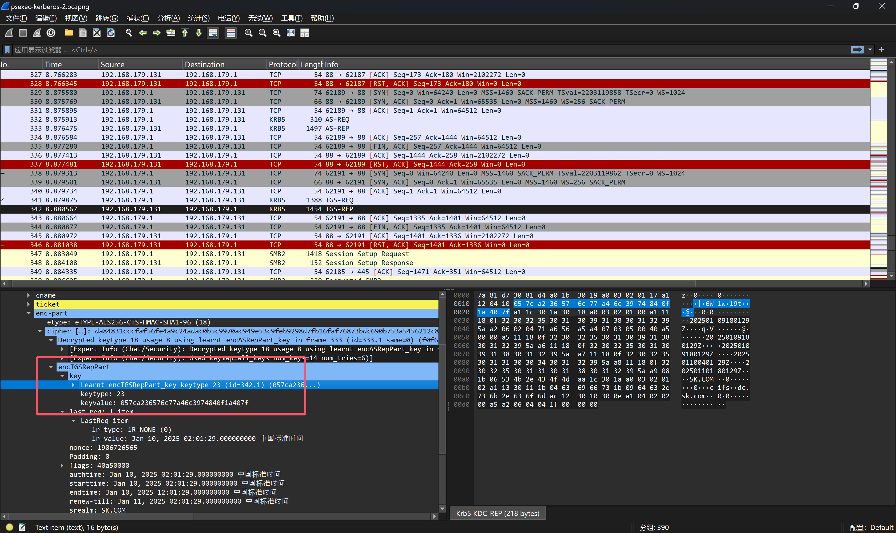​

此时终于能看见ServiceSessionKey了，但wireshark 并没有实现kerbeeros 认证下的 smb 流量自动解密，需要手动添加解开

​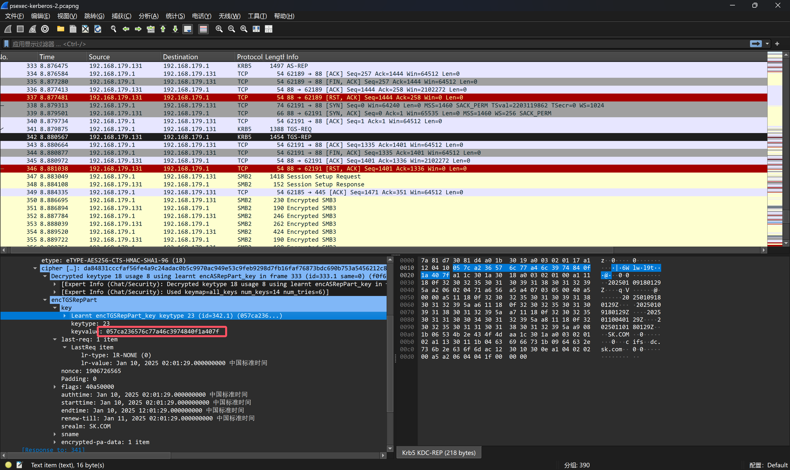​

​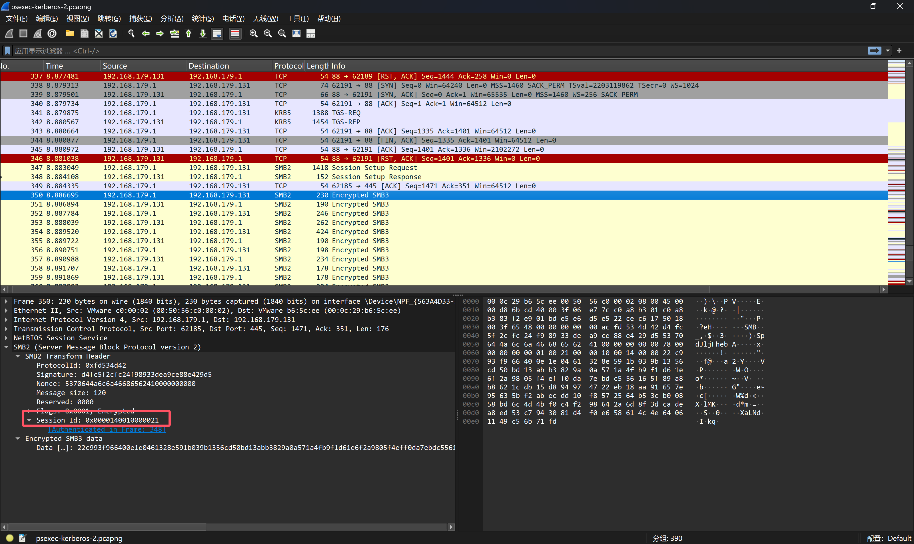​

​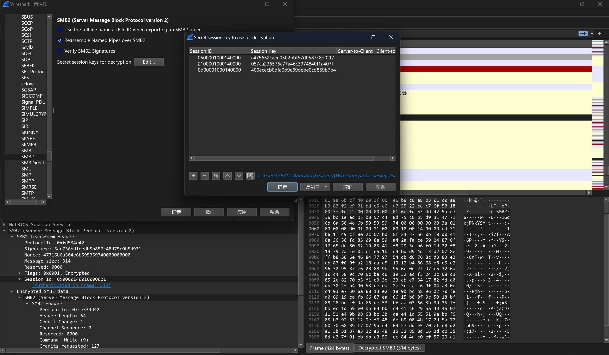​

​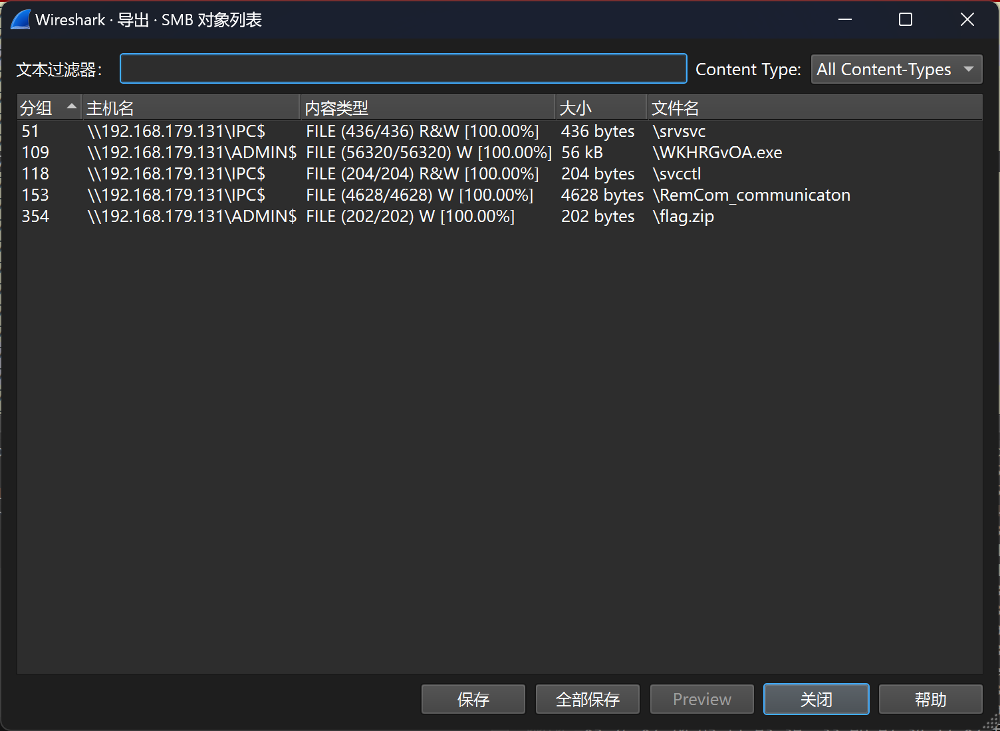​

## wmiexec-Pro

强烈推荐wmiexec-Pro ，横向移动绕过杀软，非常好使！！！

这里分析它如何执行命令的，可以清晰看到是通过WMI 事件订阅远程执行VBS脚本，此时VBS 脚本还没有进行混淆t

​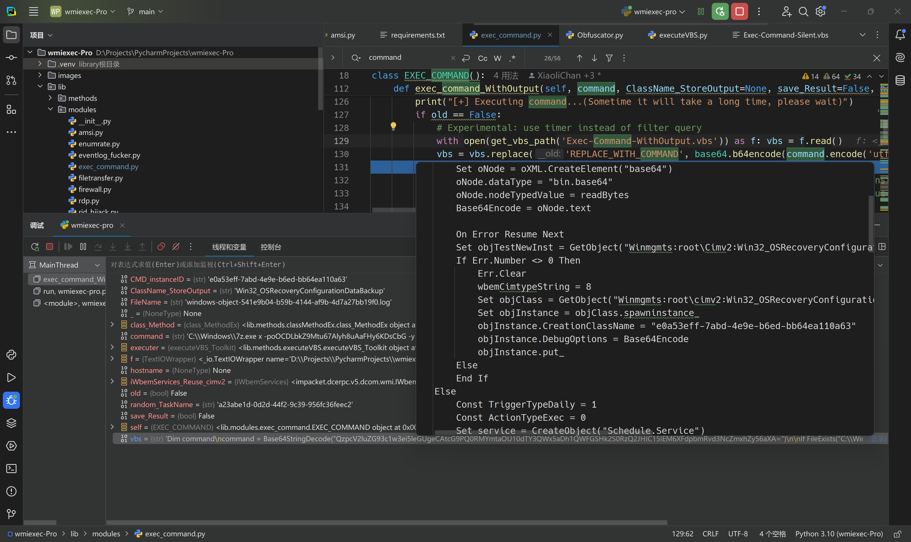​

通过generator 函数 进行 混淆

​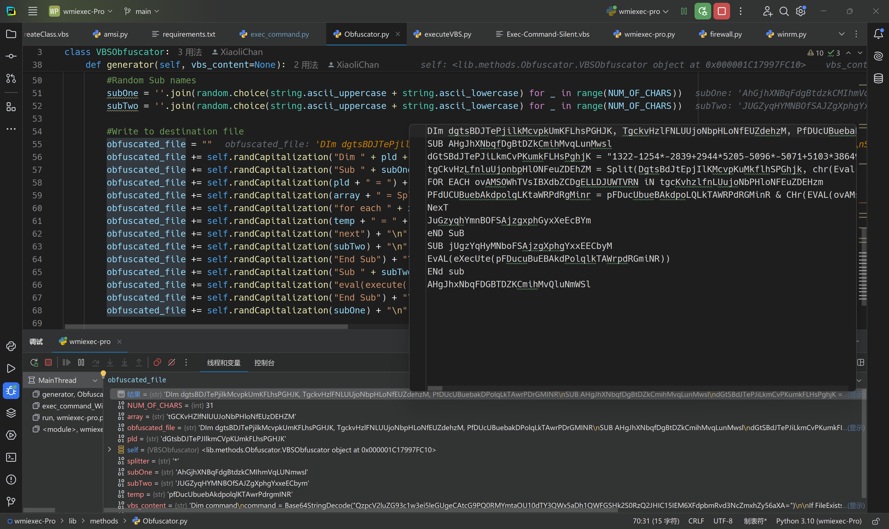​

用如下脚本逆出vbs原脚本内容

```Python
# 假设初始化的字符串
DgtsBdJtEpjIlKMcvpKuMkflhSPGhjk = "1322-1254*-2839+2944*5205-5096*-5071+5103*386496/3904*-5710+5821*763109/7001*-2581+2690*-9888+9985*-619+729*-3776+3876*-9158+9168*-255+354*370-259*-1522+1631*576719/5291*5191-5094*703230/6393*3203-3103*-3916+3948*240889/3949*75488/2359*-9089+9155*-3906+4003*238740/2076*5177-5076*-4429+4483*433836/8343*-7329+7412*514-398*-1511+1625*5522-5417*-1901+2011*832549/8083*4443-4375*617312/6112*-1231+1330*-8360+8471*211000/2110*4201-4100*1463-1423*240448/7072*-6456+6537*1159610/9505*-8195+8307*-1379+1478*10033-9947*281150/5623*-3541+3649*2091-1974*449010/4989*120771/1701*-6781+6838*3721-3670*-5900+5999*9003-8954*944503/7937*434214/8514*232401/2301*948-843*-2263+2316*-8909+9017*4969-4868*3547-3476*276930/3258*8333-8230*-2017+2118*-2956+3023*9853-9788*97556/841*594-495*-4244+4315*130701/2293*2896-2816*-6725+6806*-1818+1866*379086/4623*3649-3572*3116-3027*5138-5029*9815-9699*655235/6755*556555/7045*-417+502*1302-1253*4819-4771*920-820*-169+253*755343/8487*3679-3628*-6666+6747*-2592+2679*421320/3511*84853/1601*7924-7827*475728/6996*-3396+3500*375046/7654*4984-4903*149031/1713*201-131*319074/4494*-3731+3814*-7488+7560*275097/2571*-476+526*-4984+5067*-5917+5965*1406-1324*-9048+9170*-2940+3021*-804+854*709290/9585*358704/4982*5549-5476*578143/8629*-7490+7539*254506/4802*943-870*2823-2754*239393/3109*-7435+7489*108240/1230*-5762+5832*141200/1412*8701-8589*-4077+4175*-4559+4668*-7848+7930*-9676+9794*546600/5466*1234-1183*9555-9477*655479/6621*1098-1008*4977-4868*-8420+8540*5282-5178*360360/4004*904838/7478*474986/8962*385452/7138*-7075+7172*286352/3254*7588-7523*3009-2948*7832-7798*3140-3099*-8390+8400*73360/7336*-6545+6618*-9505+9607*4675-4643*-2049+2119*333-228*-3237+3345*246743/2443*440358/6382*5653-5533*-2423+2528*899185/7819*3999-3883*6821-6706*-9519+9559*-5853+5887*3449-3382*-3828+3886*908500/9875*5569-5482*8375-8270*-8854+8964*159000/1590*3185-3074*8204-8085*-7431+7546*107456/1168*2254-2170*536108/5308*-5823+5932*4636-4524*860108/9349*-8252+8371*5657-5552*-3715+3825*5148-5048*739815/6665*969731/8149*4367-4252*8235/183*3304-3193*4912-4814*-8148+8254*-2297+2398*7249-7150*218-102*-4409+4454*396016/7472*257140/4945*4428-4379*-7031+7132*-586+643*4833-4735*2093-2045*3267-3215*431100/9580*-8242+8340*190005/3585*-7641+7698*-6291+6389*162495/3611*309504/5952*1272-1223*1028-976*-9088+9140*3204-3159*802578/8274*5030-4928*3475-3418*805-707*-8804+8849*51116/983*4934-4834*534655/9721*-6630+6727*-2785+2835*184360/3352*248038/2531*-1788+1886*-1560+1609*-7513+7570*5148-5046*4654-4606*3752-3706*-112+220*776778/6998*707713/6871*9085-9051*-1208+1249*9031-8999*2062-1978*7030-6926*7138-7037*1974-1864*80420/8042*168928/5279*-1901+1933*5362-5330*8738-8706*-8391+8496*5861-5751*-2504+2616*-5762+5879*100920/870*85890/1227*-2044+2149*9678-9570*160287/1587*-5942+5974*3536-3475*-519+551*47362/1393*-4380+4447*-5000+5058*4782-4690*-6540+6627*-2869+2974*656260/5966*7778-7678*767343/6913*-9583+9702*3341-3226*97704/1062*178332/2123*403091/3991*-6156+6265*6510-6398*2408-2316*2182-2063*-5125+5230*1300-1190*-8017+8117*-2150+2261*-7910+8029*-9864+9979*9663-9618*1374-1263*394-296*-9577+9683*-90+191*-5943+6042*-9027+9143*209385/4653*3008-2955*4611-4559*2794-2745*1158-1057*4604-4547*763-665*35904/748*7055-7003*3822-3777*8010-7912*8509-8456*-386+443*5493-5395*324765/7217*-5777+5829*192521/3929*107744/2072*1291-1239*94275/2095*-7858+7955*3627-3525*-3175+3232*806050/8225*2123-2078*411216/7908*-4774+4874*8920-8865*-7789+7886*6721-6671*8130-8075*861518/8791*5307-5209*165718/3382*591-534*-3761+3863*6660-6612*344080/7480*7457-7349*361749/3259*-8537+8640*68510/2015*60570/6057*-2742+2774*9928-9896*122752/3836*297216/9288*2808-2725*-8357+8458*1070100/9225*4396-4364*212100/2020*556600/5060*243688/2936*-8091+8207*-5360+5474*526513/5213*9930-9833*867095/7955*5209-5177*-8792+8853*1369-1337*-4590+4657*-3342+3456*3033-2932*1557-1460*-5543+5659*211393/2093*-2879+2958*1632-1534*1413-1307*786083/7783*835362/8438*1049684/9049*99120/2478*251192/7388*277420/4268*6419-6351*-4323+4402*-5551+5619*-1954+2020*120336/2616*-6409+6492*-4265+4381*-4732+4846*-4736+4837*3816-3719*2064-1955*297092/8738*4813-4772*-450+460*60448/1889*-5092+5124*8365-8333*267872/8371*263655/2511*-1119+1229*-7337+7420*6749-6633*4084-3970*-2433+2534*615659/6347*8462-8353*392380/8530*4317-4238*455840/4070*1377-1276*9467-9357*67070/6707*-6460+6492*74208/2319*1326-1294*126656/3958*-727+832*-2056+2166*774888/9336*-8534+8650*-8533+8647*9641-9540*4901-4804*908297/8333*-5723+5769*7304-7188*-9294+9415*865-753*-7948+8049*-7573+7634*-2203+2235*-6455+6504*4283-4251*6447-6408*-4723+4807*118943/983*-7850+7962*3079-2978*-4930+4996*-8495+8600*-4270+4380*729925/7525*704406/6179*-8304+8425*63320/6332*1529-1497*105184/3287*7082-7050*-4329+4361*7916-7811*-7442+7552*5535-5452*4378-4262*1782-1668*4848-4747*-3902+3999*3402-3293*-5323+5369*5859-5783*1072038/9658*470353/4849*504300/5043*1409-1339*-3084+3198*1287-1176*5243-5134*82740/1182*885465/8433*4788-4680*2907-2806*-2439+2479*7228-7123*-2532+2642*-4205+4317*-6316+6433*-3308+3424*-4038+4108*6682-6577*-5218+5326*-6588+6689*41820/1020*-9818+9828*-1003+1035*42048/1314*-5145+5177*1420-1388*1094400/9600*7362-7261*-339+436*8086-7986*-6011+6077*394339/3259*178988/1543*411-310*-3095+3210*4324-4292*209291/3431*-2985+3017*-3106+3211*359370/3267*-3444+3527*-4462+4578*711018/6237*22624/224*-9703+9800*7981-7872*-3226+3272*7701-7619*2851-2750*4788-4691*-6018+6118*100400/2510*-114+155*8708-8698*-2004+2014*81952/2561*210592/6581*1037-1005*-4031+4063*9854-9771*-3189+3290*4835-4719*5733-5701*639138/5758*7054-6966*6853-6776*314108/4133*5493-5461*600057/9837*-629+661*2127-2060*582426/5109*-7454+7555*7863-7766*1004444/8659*-9027+9128*395-316*930216/9492*6265-6159*2276-2175*1875-1776*-8890+9006*-667+707*6612-6578*-7442+7519*6680-6565*710760/5923*152164/1396*785268/7271*-4294+4344*1336-1290*488852/7189*535146/6774*-627+704*9741-9673*5527-5416*2739-2640*757458/6474*-382+491*454904/4504*958650/8715*-7529+7645*2050-2016*-6051+6092*3178-3168*-9548+9580*-218+250*-342+374*8373-8341*626152/7544*-6920+7021*37700/325*310144/9692*-8344+8455*776412/9954*4791-4680*5907-5807*-8393+8494*295872/9246*-8929+8990*5279-5247*7941-7830*221-133*2504-2427*667280/8780*446936/9716*131923/1969*465576/4084*5460-5359*3550-3453*7276-7160*3610-3509*-6269+6338*-8038+8146*-6289+6390*370382/3398*-2785+2886*-2483+2593*3697-3581*181560/4539*-9335+9369*-6042+6140*483448/4984*-37+152*5958-5857*-9073+9127*-4533+4585*194990/5735*223040/5440*5156-5146*-9495+9527*9887-9855*240672/7521*-6408+6440*-4928+5039*-6793+6871*2197-2086*-1367+1467*98172/972*4441-4395*660600/6606*7576-7479*5517-5401*2726-2629*-3982+4066*8131-8010*5746-5634*-5473+5574*-633+665*-1872+1933*25376/793*7748-7714*455994/4653*1604-1499*7905-7795*8361-8315*-6837+6935*877753/9049*838120/7288*2915-2814*4616-4562*6632-6580*47532/1398*6993-6983*236544/7392*-1504+1536*-5067+5099*9152-9120*1017759/9169*257088/3296*754245/6795*-1826+1926*6605-6504*-5077+5123*1059190/9629*-8313+8424*655700/6557*480760/4760*335160/3990*480975/3975*-7257+7369*7772-7671*1416-1316*7112-7026*5694-5597*2675-2567*-9157+9274*634179/6279*242624/7582*129137/2117*-4294+4326*2935-2821*-8171+8272*-8456+8553*-3769+3869*366564/5554*-631+752*1075204/9269*-2094+2195*-1195+1310*9019-9009*-3477+3509*8147-8115*288640/9020*764-732*-2215+2281*562406/5798*314870/2738*9824-9723*311094/5761*3861-3809*233013/3377*-9186+9296*-8251+8350*116550/1050*-6371+6471*5430-5329*302272/9446*-4026+4087*-7898+7930*-9488+9599*3202-3124*-1799+1910*-1494+1594*217251/2151*8044-7998*-8483+8599*8993-8892*-7996+8116*-4167+4283*6270-6260*-6512+6544*6156-6124*5469-5437*251904/7872*12000/1200*-5781+5813*285952/8936*-2876+2908*1733-1701*145360/1840*-2856+2966*1685-1653*-4742+4811*1665-1551*565896/4964*-2868+2979*107502/943*-3957+3989*2281-2199*3570-3469*409860/3564*76401/653*1640-1531*479952/4752*145248/4539*6142-6064*-895+996*-3468+3588*8884-8768*1133-1123*1903-1871*81824/2557*166080/5190*9886-9854*741605/8935*1158-1057*423284/3649*7867-7835*1102-991*5929-5831*5918-5812*498288/5932*590547/5847*1074905/9347*749708/6463*51012/654*-8642+8743*-1113+1232*16863/231*233970/2127*7151-7036*775460/6685*-1499+1531*-4891+4952*-459+491*46434/654*191900/1900*5709-5593*3818-3739*671790/6855*631124/5954*281891/2791*-9802+9901*9073-8957*6084-6044*37672/1108*-9044+9131*-5913+6018*-9880+9990*995-886*-138+241*-2776+2885*-177+293*249090/2166*10024-9966*946656/8304*-1435+1546*730-619*3667-3551*2328-2236*8882-8815*430185/4097*-6678+6787*758622/6429*-4338+4388*130442/2249*6874-6787*-8067+8172*-6245+6355*5938-5887*-3476+3526*6966-6871*6671-6592*6909-6826*-7423+7505*-5803+5904*5434-5335*-2705+2816*363086/3077*550248/5448*9929-9815*-4837+4958*-3877+3944*-5648+5759*-6048+6158*6200-6098*6736-6631*583-480*448695/3835*-6211+6325*518368/5344*6012-5896*144900/1380*-8960+9071*372350/3385*-4800+4868*676187/6971*714096/6156*296626/3058*35640/540*797825/8225*661320/6680*-5883+5990*-5823+5940*3736-3624*-2643+2689*543370/8110*837330/7345*899102/8902*354729/3657*799-683*7131-7026*-5114+5225*-2353+2463*480189/7167*-3562+3670*-6095+6192*-2939+3054*-3262+3377*451386/5787*-7070+7167*1058499/9711*-2854+2955*228-167*6338-6304*280602/8253*745683/7383*8736-8688*4335-4238*31005/585*92259/1809*-2947+3048*-9144+9246*-1853+1955*210285/4673*-5873+5928*-2164+2261*-2569+2667*865200/8652*6716-6671*6234-6182*1131-1030*-514+571*-8371+8472*7782-7737*8576-8478*49356/914*-925+1026*379700/3797*-6533+6578*-1708+1806*7114-7016*3847-3793*8161-8109*9464-9363*934886/9638*-7065+7114*111475/2275*364368/7591*-4655+4752*1116-1062*4141-4090*-7979+8013*1860-1826*600-566*5849-5808*7461-7451*-2298+2330*10176/318*154720/4835*6520-6488*9485-9412*-5971+6073*102432/3201*9869-9800*8349-8235*3881-3767*-4446+4492*-2189+2267*-255+372*7109-7000*565754/5773*740330/7330*-3272+3386*7355-7323*459120/7652*49972/806*6870-6838*168240/3505*6267-6235*2789-2705*127712/1228*317342/3142*9741-9631*97220/9722*201600/6300*48736/1523*9447-9415*6997-6965*-4287+4319*-6915+6947*130336/4073*-2301+2333*8153-8084*9767-9653*805410/7065*7590/165*-2312+2379*327-219*-7390+7491*9564-9467*-7448+7562*11340/1134*300608/9394*228096/7128*6223-6191*-7767+7799*7278-7246*-1915+1947*-7358+7390*-815+847*9856-9737*-382+480*372084/3684*-6414+6523*159594/2382*7921-7816*-8097+8206*-9850+9966*-771+892*4591-4479*2890-2789*8302-8219*-8981+9097*174876/1534*5377-5272*477840/4344*8353-8250*-9312+9344*241621/3961*-5831+5863*4700-4644*5691-5681*3684-3652*-4280+4312*4633-4601*140608/4394*-7763+7795*4526-4494*52160/1630*-9206+9238*585648/7056*4505-4404*-2283+2399*75776/2368*857475/7725*436982/4459*2607-2501*7595-7528*-79+187*-2744+2841*-4947+5062*4433-4318*-6851+6883*-5616+5677*188384/5887*7373-7302*840724/8324*-2268+2384*552763/6997*289492/2954*-4280+4386*8850-8749*6278-6179*5155-5039*142360/3559*-4169+4203*3560-3473*2471-2366*727760/6616*-3860+3969*-5762+5865*652910/5990*297888/2568*1123-1008*570662/9839*666558/5847*133755/1205*220113/1983*7650-7534*9288-9196*-8764+8863*333165/3173*553393/5077*464212/3934*362550/7251*52896/912*-1493+1580*8453-8348*5072-4962*189618/3718*466700/9334*-7046+7141*263070/3330*-2602+2685*457642/5581*-4557+4658*877833/8867*4494-4383*7927-7809*-6715+6816*1033410/9065*-8768+8889*512349/7647*459540/4140*-4147+4257*1142-1040*650160/6192*403966/3922*1361-1244*6501-6387*328539/3387*556104/4794*144375/1375*-7727+7838*-6654+6764*-4459+4527*575-478*-5587+5703*28033/289*3849-3783*-7726+7823*3243-3144*7901-7794*-9141+9258*-8387+8499*53142/1563*133578/3258*-9268+9278*3514-3482*2549-2517*5582-5550*-382+414*101632/3176*-548+580*217120/6785*66976/2093*574360/6920*874660/8660*549840/4740*6784/212*688866/6206*7561-7463*-9857+9963*7071-6998*391710/3561*4332-4217*3572-3456*649124/6692*2081-1971*9166-9067*9135-9034*258304/8072*7769-7708*-1067+1099*2116-2005*-273+371*7779-7673*-4164+4231*7946-7838*-2537+2634*1117915/9721*251390/2186*7242-7196*996820/8668*5172-5060*-9107+9204*3057-2938*930160/8456*6950-6845*-9274+9384*-1652+1767*1064764/9179*-9744+9841*824670/7497*845658/8542*525705/5205*130910/1378*93920/9392*-2703+2735*235200/7350*3579-3547*4645-4613*323-291*-8859+8891*-6470+6502*85216/2663*427017/3847*5326-5228*-4455+4561*-8963+9036*432300/3930*6734-6619*54520/470*-5806+5903*-2724+2834*584892/5908*130593/1293*309-263*575195/8585*1044240/9160*-7091+7192*839050/8650*-1860+1976*8089-7984*4874-4763*-2636+2746*398047/5941*931932/8629*953-856*378005/3287*-7024+7139*9164-9086*303513/3129*-167+276*-7512+7613*-560+592*-488+549*-6278+6310*-6968+7002*-1515+1616*383040/7980*4882-4785*-7969+8022*-6160+6211*4974-4873*98022/961*113526/1113*253530/5634*5849-5794*720904/7432*1575-1477*453700/4537*-1236+1281*-1103+1155*-8070+8171*62130/1090*960308/9508*-1774+1819*776552/7924*309744/5736*1761-1660*552100/5521*-4258+4303*-9604+9702*-6937+7035*-6581+6635*-8538+8590*9953-9852*340761/3513*-9205+9254*6777-6728*4244-4196*9358-9261*497124/9206*16065/315*-5434+5468*-5804+5814*-2524+2556*-4576+4608*254656/7958*154720/4835*-4696+4728*274912/8591*9942-9910*-4654+4686*4135-4024*483924/4938*761610/7185*9695-9622*-1819+1929*371105/3227*389992/3362*-228+325*-2273+2383*-133+232*328755/3255*1567-1521*612204/9003*-8517+8618*-4999+5097*-2403+2520*4731-4628*4791-4712*-7865+7977*-1286+1402*-3379+3484*-3843+3954*-3471+3581*-9285+9400*162592/5081*-9046+9107*182688/5709*-2463+2529*9726-9629*-2177+2292*9783-9682*390744/7236*-8846+8898*1166-1097*456-346*-3152+3251*-9177+9288*-1711+1811*2674-2573*6789-6779*74080/2315*264256/8258*-7121+7153*2767-2735*7308-7276*183808/5744*21088/659*51712/1616*1478-1367*743330/7585*943188/8898*5301-5228*8652-8542*-1530+1645*-2257+2373*-1984+2081*6825-6715*4324-4225*1362-1261*422786/9191*-3123+3235*-2665+2782*-3624+3740*207005/2179*-507+517*196000/6125*47616/1488*250144/7817*3931-3899*529506/7674*6657-6549*923565/8031*-2868+2969*23120/2312*176352/5511*-1086+1118*-8995+9027*19712/616*-7611+7680*278-168*-4694+4794*6456-6424*548011/7507*674730/6615*32930/3293*-6660+6729*661176/6122*5275-5160*589840/5840*-275+285*-407+439*2846-2814*3072-3040*215168/6724*-5695+5762*5616-5505*-1844+1954*-4219+4334*607956/5241*-9361+9393*3398-3314*-1010+1124*487620/4644*-8266+8369*567324/5508*6129-6028*598-484*-5082+5166*-3329+3450*7964-7852*-4110+4211*104448/1536*260542/2686*2031-1926*563760/5220*345818/2858*5307-5275*-3083+3144*-9136+9168*241521/4929*62780/6278*-2438+2470*36768/1149*-6312+6344*295520/9235*5771-5704*-5929+6040*5798-5688*-7824+7939*263784/2274*195392/6106*3875-3810*881595/8905*4359-4243*2930-2825*6051-5940*1008260/9166*-8504+8588*-7290+7411*8844-8732*-1859+1960*889-820*-9248+9368*-7272+7373*-6845+6944*6060-6028*394975/6475*298624/9332*-4067+4115*8740-8730*100064/3127*220544/6892*-3211+3243*-4603+4635*399562/4814*310373/3073*9455-9339*-4672+4704*3055-2940*-3860+3961*-8921+9035*5010-4892*-663+768*-9532+9631*7437-7336*1338-1306*3270-3209*6480-6448*209509/3127*9747-9633*4185-4084*-6404+6501*1142716/9851*-1332+1433*202714/2566*3898-3800*-4908+5014*673569/6669*-7210+7309*-7146+7262*7488-7448*300764/8846*6750-6667*8048-7949*395304/3801*895870/8870*999600/9996*959985/8205*-2089+2197*3031-2930*-3619+3665*7392-7309*766893/7593*3303-3189*982350/8325*6586-6481*657657/6643*-7841+7942*-598+632*40385/985*6004-5994*-9953+9985*-3277+3309*9376-9344*-3336+3368*7376-7309*-5504+5601*1026864/9508*9716-9608*-1376+1408*6271-6156*-2171+2272*926-812*8215-8097*29505/281*9279-9180*438239/4339*9819-9773*-1040+1107*-2723+2834*781880/7108*-4541+4651*8400-8299*-912+1011*-5403+5519*-8384+8394*-7275+7307*29216/913*-9835+9867*9922-9890*-5938+6006*3116-3011*275661/2529*3385-3353*3271-3157*3580-3469*8683-8572*387-271*-2104+2174*623265/5615*-5721+5829*456-356*6648-6547*3664-3550*2818-2808*-2747+2779*-6042+6074*19872/621*535-503*-6958+7041*577215/5715*-4999+5115*7683-7651*1116972/9798*-9225+9336*521478/4698*-8249+8365*1062-992*6421-6310*-651+759*497800/4978*446622/4422*-9027+9141*237216/7413*464759/7619*268736/8398*438-323*-1396+1497*-2531+2645*65844/558*4910-4805*-3279+3378*-2396+2497*-3216+3262*-5676+5747*991214/9814*5390-5274*304640/4352*2277-2166*270000/2500*8872-8772*6862-6761*104994/921*343360/8584*3187-3153*3916-3824*223142/6563*5897-5856*26750/2675*-2622+2654*7885-7853*14240/445*-7602+7634*-5798+5866*5684-5579*1060788/9732*-2423+2455*-2969+3085*-2923+3020*-4052+4167*-3779+3886*17952/264*2805-2704*4805-4703*102165/973*645480/5868*5209-5104*60784/524*585795/5579*-9044+9155*-6333+6443*94890/9489*8043-8011*214080/6690*1314-1282*8304-8272*5199-5116*580952/5752*-4257+4373*-9117+9149*449848/3878*7519-7422*2043-1928*972630/9090*-8356+8424*204929/2029*7065-6963*998445/9509*3337-3227*669480/6376*1113136/9596*346710/3302*8540-8429*441760/4016*-2593+2625*-7408+7469*3921-3889*-9356+9471*-3831+3932*7528-7414*-4598+4716*453180/4316*597762/6038*478538/4738*2147-2101*705510/9045*-2533+2634*5449-5330*9545-9461*4846-4749*8410-8295*6066-5959*3805-3765*-147+195*207214/5054*-925+935*-4859+4891*-807+839*-4333+4365*-9927+9959*6229-6161*244020/2324*9726-9617*-8312+8344*573990/5035*1315-1214*841304/8168*3226-3153*591140/5374*8330-8228*127095/1145*49200/4920*232096/7253*-2737+2769*-7237+7269*5012-4980*-352+435*4141-4040*-1128+1244*21952/686*-2753+2867*-7351+7452*501816/4872*-766+839*640970/5827*-5015+5117*1937-1826*1144-1112*-4242+4303*-6652+6684*-6180+6296*-2884+2981*964045/8383*2456-2349*856-788*7117-7016*-8045+8147*4591-4486*156860/1426*-7801+7906*829632/7152*-9460+9565*1080918/9738*-8031+8141*7788-7742*619920/7560*736795/7295*579581/5627*-6972+7077*8097-7982*-8014+8130*-5452+5566*269951/2783*-8595+8711*903945/8609*1226-1115*-4428+4538*4081-4008*3452-3342*-2803+2905*2003-1892*7592-7582*-4073+4105*248192/7756*-4240+4272*-5401+5433*1962-1848*-2951+3052*657861/6387*999-926*524-414*545700/5350*2043-1932*9758-9712*79764/1173*7983-7882*7217-7102*-7376+7475*412110/3615*905520/8624*-4640+4752*4293-4177*977760/9312*6186-6075*532620/4842*712-680*79056/1296*49248/1539*-8622+8656*781490/9194*568736/5078*135500/1355*212915/2195*-6732+6848*3769-3668*-517+551*-4169+4179*-3688+3720*-9286+9318*-9450+9482*-1943+1975*-9882+9996*7808-7707*674032/6544*743-670*-2155+2265*931464/9132*127761/1151*-1403+1449*2357-2292*452439/3867*8697-8581*6374-6270*8066-7955*-9849+9963*-680+712*-6427+6488*-7796+7828*2382-2348*620004/8052*710115/6763*619-520*7732-7618*67488/608*99935/869*8835-8724*10013-9911*436972/3767*291924/8586*2584-2574*220704/6897*-9541+9573*220352/6886*1493-1461*3605-3537*5697-5592*102569/941*140640/4395*6104-5989*8243-8142*4585-4469*-7386+7502*-7759+7864*410740/3734*3632-3529*-2086+2201*12070/1207*-5023+5055*297184/9287*-2820+2852*6805-6773*8057-7974*319362/3162*8369-8253*-6601+6633*2374-2259*712454/7054*4498-4382*603-487*411390/3918*951060/8646*506-403*764175/6645*155552/4861*608109/9969*-5108+5140*-2147+2263*8089-7992*9589-9474*2305-2198*283152/4164*9372-9271*-9295+9397*-3436+3541*-5736+5846*853440/8128*87696/756*-8343+8448*295482/2662*-5521+5631*-9698+9744*325450/2830*3348-3247*2170-2054*-4524+4640*-9433+9538*1051160/9556*-6172+6275*765785/6659*88580/8858*-6749+6781*6681-6649*7504-7472*169664/5302*-126+241*533886/5286*-1338+1454*484880/4180*-6357+6462*-6412+6522*723060/7020*985665/8571*232668/5058*685998/9942*929390/8449*-7449+7546*231476/2362*366444/3393*151096/1496*-6355+6455*-3912+3944*103456/1696*-7113+7145*-107+191*-3402+3516*117468/1004*-6927+7028*-3812+3822*68960/2155*-6625+6657*95680/2990*2126-2094*-5468+5583*-614+715*-2707+2823*-9839+9955*-6488+6593*6466-6356*-1846+1949*-6139+6254*6093-6047*-2644+2727*1952-1836*-1903+2000*2534-2420*34568/298*733149/8427*143728/1382*677912/6712*-6089+6199*506870/7798*946-828*-8220+8317*9920-9815*408132/3779*739-642*-5510+5608*495072/4584*-7339+7440*4779-4747*370392/6072*318656/9958*392028/4667*-9525+9639*775944/6632*-6181+6282*-5227+5237*6704-6672*323-291*5698-5666*159584/4987*338675/2945*658015/6515*7537-7421*6346-6230*-6616+6721*351450/3195*339179/3293*-2400+2515*1237-1191*6629-6557*408030/3886*2020-1920*-1241+1341*-2565+2666*2906-2796*50400/1575*339831/5571*3494-3462*-1108+1178*4813-4716*-8599+8707*4634-4519*-253+354*2384-2374*4513-4481*7116-7084*-5477+5509*3754-3722*-3466+3581*691446/6846*21344/184*6318-6202*-6238+6343*-3846+3956*3784-3681*849735/7389*-5102+5148*-4443+4511*4801-4696*-2585+2700*9411-9314*-6497+6605*710964/6583*714618/6438*-6920+7039*363623/4381*5367-5251*1772-1675*297996/2614*489984/4224*1149-1076*1217-1115*6280-6201*-8948+9058*-5020+5086*7425-7328*836824/7214*-6354+6470*244521/2421*4136-4022*1041915/9923*-7232+7333*1040405/9047*5645-5613*-353+414*129664/4052*6807-6737*-9065+9162*169884/1573*-8666+8781*4731-4630*13240/1324*7677-7645*-3368+3400*6770-6738*4983-4951*589288/8666*-4287+4392*-9567+9676*160864/5027*-3369+3485*-4485+4599*133035/1267*7479-7376*744-641*466620/4620*-3125+3239*7867-7752*-2030+2040*-7154+7186*5561-5529*-8362+8394*-1876+1908*5344-5261*604889/5989*-939+1055*-1669+1701*433028/3733*37392/328*-9874+9979*322699/3133*-1017+1120*182608/1808*1056-942*-1968+2083*66016/2063*206851/3391*254304/7947*964-848*7215-7118*-7535+7650*-2761+2868*-1263+1331*1517-1416*3872-3770*2742-2637*-159+269*271-166*4728-4612*990990/9438*-2618+2729*381150/3465*366482/7967*9213-9097*4578-4464*-7044+7149*732124/7108*264504/2568*894456/8856*1747-1633*-1306+1421*2142-2132*5835-5803*9874-9842*39744/1242*-8302+8334*674152/9914*3220-3115*-9379+9488*1440-1408*-8748+8864*4558-4444*259980/2476*-8799+8902*6259-6156*9993-9892*8025-7911*96930/9693*-1609+1641*163136/5098*-9223+9255*7240-7208*88644/1068*902536/8936*-2985+3101*169024/5282*43268/373*2861-2747*644280/6136*-6276+6379*608833/5911*-1321+1422*-3280+3394*99744/3117*8017-7956*28928/904*806548/6953*-8922+9036*8094-7989*996628/9676*-2526+2629*-6342+6443*491682/4313*76705/667*1677-1631*-4687+4754*9973-9859*9181-9080*2087-1990*184556/1591*202404/2004*-1516+1556*913-858*-4149+4190*-4980+4990*8644-8612*82784/2587*291584/9112*-5861+5893*9929-9861*-8390+8495*356-247*3236-3204*60255/927*648846/6554*4125-4009*7069-6964*4375-4264*81950/745*-9925+9935*297216/9288*-8847+8879*9878-9846*8472-8440*-42+125*9526-9425*4724-4608*305248/9539*-5207+5272*6941-6842*3157-3041*762090/7258*3845-3734*48070/437*-8323+8355*-6411+6472*-8087+8119*-8786+8902*563085/5805*113735/989*832888/7784*-9740+9808*352187/3487*5058-4956*-3765+3870*-6848+6958*7964-7859*1120908/9663*358995/3419*637695/5745*246950/2245*9647-9601*849-784*-1337+1436*5814-5698*-974+1079*3431-3320*1523-1413*-5386+5501*459448/9988*-3966+4033*4227-4113*323099/3199*518659/5347*864548/7453*9446-9345*359480/8987*-9918+9983*-6185+6284*-6323+6439*4155-4050*-1752+1863*686950/6245*9690-9606*1018578/8418*-1329+1441*1339-1238*340239/4931*-3929+4049*-8224+8325*-895+994*6307-6266*-7280+7290*147232/4601*-3422+3454*-1392+1424*315232/9851*376610/5794*-5904+6003*434536/3746*791385/7537*733599/6609*391490/3559*5019-4973*473200/5915*803936/8288*6221-6105*818688/7872*3508-3476*390-329*118720/3710*203456/5984*4719-4620*4415-4357*298448/3244*-3989+4108*92505/881*795190/7229*-3776+3876*9952-9841*-463+582*4670-4555*54556/593*384445/3343*643-522*282785/2459*532092/4587*-1438+1539*59296/544*-4756+4807*-6752+6802*-6918+7010*110979/1121*589254/5406*-364+464*412804/8974*5997-5896*-5600+5720*-8562+8663*288796/8494*19260/1926*5324-5292*-70+102*8667-8635*6093-6061*-8723+8788*6847-6748*7036-6920*400890/3818*217782/1962*-1475+1585*-9645+9691*6549-6452*703836/6174*-868+971*-8096+8213*-3055+3164*2534-2433*-9021+9131*693680/5980*1075250/9350*144352/4511*-1680+1741*122048/3814*18156/534*118346/2518*-3509+3590*5387-5355*3994-3947*-9351+9450*7363-7331*-4501+4535*-1141+1173*629-591*304544/9517*8528-8429*788988/7108*-2603+2712*-8860+8969*-1688+1785*5346-5236*275400/2754*2240-2208*1894-1856*3522-3490*-7319+7353*279680/8740*126763/2587*-3275+3337*3872-3840*3864-3797*-9346+9404*2527-2435*123888/1424*-2066+2171*3169-3059*-7670+7770*5075-4964*5076-4957*758425/6595*-6148+6240*1847-1763*797-696*6039-5930*-4804+4916*-287+379*607614/5106*4514-4409*208450/1895*5290-5190*6831-6720*-7873+7992*33810/294*-7642+7687*485736/4376*268520/2740*-3680+3786*-1844+1945*1435-1336*-4550+4666*-9217+9262*7053-7000*-6767+6819*-1877+1926*960712/9512*15846/278*-1662+1760*6690-6642*336544/6472*-1021+1066*81830/835*6410-6357*4032-3975*52038/531*2911-2866*1466-1414*235445/4805*7653-7601*-2828+2880*4306-4261*-8977+9074*-9328+9430*-8837+8894*724220/7390*-8540+8585*467168/8984*5549-5449*8673-8618*7612-7515*8405-8355*-706+761*465402/4749*-7714+7812*3243-3194*6075-6018*442-340*3072-3024*129950/2825*-8897+9005*-2140+2251*-1767+1870*196512/6141*411150/8223*392088/6324*377-339*1193-1144*4116-4082*4335-4325*3605-3573*4147-4115*9067-9035*-1121+1153*7075-7007*724710/6902*-8030+8139*-636+668*458763/4133*-105+203*5787-5681*-1836+1914*244723/2423*4085-3969*-1124+1168*4832-4800*6477-6401*807747/7277*6435-6332*936390/8918*983-873*130475/1535*-3663+3778*-2889+2990*-9182+9296*2086-2076*4430-4398*-2684+2716*8336-8304*114528/3579*-9699+9782*1232-1131*-559+675*7402-7370*-6643+6754*-7398+7496*-5820+5926*-6420+6498*-1330+1431*-7862+7978*316224/9882*3772-3711*-6289+6321*-3881+3948*-8254+8368*3521-3420*58685/605*838100/7225*829412/8212*81370/1030*669242/6829*1211-1105*-811+912*2632-2533*1925-1809*-5719+5759*7393-7359*-4303+4390*4394-4311*319-220*51984/456*-5030+5135*369824/3302*352756/3041*2081-2035*-4489+4567*-8030+8131*-4352+4468*-1740+1859*3321-3210*8557-8443*2792-2685*-1268+1302*-3644+3685*84970/8497*-5507+5539*7789-7757*-3167+3199*2057-2025*5209-5133*4995-4884*377186/3662*9381-9276*-3508+3618*9537-9452*9827-9712*7809-7708*9428-9314*-9741+9773*-5185+5246*155424/4857*6301-6190*1559-1461*4905-4799*-2785+2863*-1008+1109*-224+340*3260-3214*3434-3349*9951-9836*-6382+6483*3352-3238*276822/3549*3290-3193*4645-4536*5538-5437*12550/1255*287072/8971*3474-3442*-527+559*-3808+3840*-5065+5138*1220-1118*108768/3399*197115/2319*2493-2426*709167/7311*349715/3041*810-709*7218-7178*449084/5909*617-506*1059-956*-5137+5242*992970/9027*682295/8027*4805-4690*-2233+2334*961590/8435*9177-9136*-1449+1481*-1950+2011*274368/8574*6941-6907*-6773+6856*4215-4126*527880/6360*-1023+1107*-7615+7684*187957/2441*1416-1382*1259-1227*8107-8023*141648/1362*-3361+3462*7133-7023*4331-4321*1694-1662*246912/7716*42752/1336*-2389+2421*-5957+6026*680076/6297*334650/2910*-7457+7558*3638-3628*-5655+5687*55232/1726*4330-4298*-1914+1946*472340/6215*670329/6039*9095-8992*-9313+9418*6820-6710*62305/733*409055/3557*-2098+2199*1064988/9342*88288/2759*63440/1040*1250-1218*-9873+9942*-652+761*-5660+5772*242788/2093*1198263/9903*-408+418*-7386+7418*-3696+3728*48128/1504*7884-7852*1803-1734*5080-4970*7638-7538*3077-3045*283094/3878*728280/7140*50300/5030*-2815+2847*180064/5627*-5130+5162*-6798+6830*9189-9122*378882/3906*2639-2531*-9021+9129*315104/9847*449046/3939*491730/4430*5694-5583*-8637+8753*3918-3848*-387+498*-1255+1363*207100/2071*572670/5670*422256/3704*-5788+5834*-3692+3774*-9760+9861*455775/4425*-936+1041*2827-2712*1158492/9987*-5881+5982*872100/7650*489720/5830*-8256+8353*-7937+8052*1237-1130*-8648+8716*858904/8504*7201-7099*-293+398*935440/8504*6073-5968*-3797+3913*4467-4362*-3388+3499*5024-4914*-6729+6769*-9341+9375*2228-2131*-5420+5470*-1261+1312*-6946+7043*-6887+6985*1001011/9911*1224-1175*7252-7152*375705/8349*4177-4129*-8385+8485*-1403+1453*7390-7290*7539-7494*424424/8162*-6199+6251*-8339+8441*-5416+5466*1907-1862*5011-4954*2512-2413*9902-9851*513456/9008*1117-1072*-2692+2749*5125-5072*4600-4546*393210/3855*109197/1103*100929/1979*-4936+4990*290-188*6914-6813*-8116+8217*7285-7186*6452-6402*-886+920*166364/3781*110752/3461*-8891+9007*5265-5168*8076-7961*-747+854*-3937+4005*157156/1556*-8256+8358*654-549*394020/3582*9070-8965*-3053+3169*138600/1320*482628/4348*364320/3312*-8839+8883*-2896+2928*9354-9300*3604-3560*49824/1557*393908/5183*8045-7934*2454-2351*2597-2492*-9361+9471*461210/5426*-889+1004*9254-9153*9887-9773*336644/7651*-5656+5688*269456/6124*-6069+6101*246279/4829*4139-4098*51070/5107*289792/9056*-132+164*-4378+4410*173376/5418*-4847+4914*794042/8186*-5396+5504*309744/2868*288224/9007*1080150/9475*1033521/9311*3539-3428*-4341+4457*290-220*408480/3680*362880/3360*8012-7912*4442-4341*7156-7042*-9891+9937*72896/1072*3146-3045*736668/6821*983235/9735*321320/2770*-8039+8140*3969-3885*6835-6738*2685-2570*-9056+9163*133280/3332*5856-5822*-4168+4265*-3236+3286*400707/7857*-5721+5818*618380/6310*195839/1939*233583/4767*-4598+4698*509-464*9515-9467*638200/6382*416300/8326*-5132+5232*329580/7324*377-325*-1698+1750*265302/2601*-290+340*-1305+1350*499662/8766*6878-6779*414324/8124*294747/5171*3325-3280*3352-3295*140238/2646*9513-9459*4618-4516*853776/8624*6703-6652*6202-6148*-8556+8658*4434-4333*514696/5096*170577/1723*496500/9930*49776/1464*-4722+4766*47712/994*219719/5359*-5115+5125*47265/685*6353-6243*817800/8178*4160/130*125487/1719*198492/1946*-138+148*-9383+9393*4793-4723*-6384+6501*-7963+8073*-6762+6861*344056/2966*2021-1916*-4759+4870*7704-7594*-5404+5436*5678-5608*7087-6982*5444-5336*-2544+2645*12972/188*-955+1075*1024-919*8960-8845*-2458+2574*1985-1870*37440/936*-8450+8520*8947-8842*888732/8229*-7524+7625*6987-6907*481702/4966*6337-6221*2236-2132*-8374+8415*69320/6932*-2172+2204*-4726+4758*229-197*-2886+2918*717618/8646*949198/9398*1000732/8627*5913-5881*6554-6452*5915-5800*9267-9156*243008/7594*165249/2709*2605-2573*644674/9622*-885+999*4274-4173*1248-1151*259028/2233*-5476+5577*200186/2534*7793-7695*-7714+7820*740532/7332*-7278+7377*925796/7981*1159-1119*10033-9999*6224-6141*9621-9522*450642/3953*8192-8087*-8921+9033*521420/4495*7623-7518*-2036+2146*-4546+4649*318458/6923*79730/1139*-6110+6215*928584/8598*-9465+9566*9725-9642*8518-8397*-1160+1275*1132624/9764*183214/1814*813794/7466*8552-8473*-9108+9206*363262/3427*667307/6607*-3707+3806*-1349+1465*-8877+8911*-5013+5054*43980/4398*2815-2783*287872/8996*-5118+5150*2900-2868*330690/4530*4101-3999*8410-8378*9079-8977*40135/349*322011/2901*142278/3093*35840/512*240975/2295*2231-2123*-9625+9726*990-921*-1205+1325*-8166+8271*759690/6606*-2983+3099*4905-4790*-5144+5184*2138-2068*842520/8024*-4879+4987*-7629+7730*732160/9152*418361/4313*-7083+7199*-1622+1726*-3140+3181*5287-5255*423192/5038*2693-2589*7775-7674*-9463+9573*-4825+4835*8414-8382*75744/2367*-3210+3242*1415-1383*1663-1631*124992/3906*28064/877*5894-5862*7044-6974*313215/2983*-7973+8081*3910-3809*638802/9258*-149+269*3992-3887*7541-7426*-3852+3968*-1490+1605*-9728+9789*617874/9222*460614/6979*2276-2165*-8568+8679*-5547+5655*464-424*45668/932*218530/5330*3870-3860*-4096+4128*5254-5222*-1251+1283*5905-5873*8680-8611*-4402+4510*534405/4647*868701/8601*6340-6330*180544/5642*268928/8404*-8639+8671*-5555+5587*4679-4647*-5562+5594*-9818+9850*2392-2360*-1593+1663*-3623+3728*-8445+8553*2882-2781*-7971+8040*-7938+8058*700980/6676*6820-6705*7664-7548*-3447+3562*-8225+8286*4172-4105*2257-2191*6147-6036*-4613+4724*3329-3221*3339-3299*-4288+4336*163221/3981*71550/7155*24800/775*9106-9074*6782-6750*7541-7509*37605/545*-4454+4564*350300/3503*4873-4841*-4547+4620*-474+576*50080/5008*-9463+9532*589050/5355*836400/8364*-9477+9509*521640/7452*4038-3921*-6194+6304*-5880+5979*-7578+7694*275730/2626*555111/5001*266200/2420*8644-8634*-3230+3240*2703-2633*-574+691*-9437+9547*141867/1433*530816/4576*397845/3789*527-416*-4522+4632*1418-1386*5297-5231*-8654+8751*153870/1338*428846/4246*-5328+5382*29276/563*7649-7566*8675-8559*-5607+5721*-2138+2243*219670/1997*8484-8381*-6437+6505*718817/7117*-1577+1676*235320/2120*808800/8088*132815/1315*1262-1222*4779-4713*5922-5801*85312/992*117370/1210*-1795+1903*298464/9327*4310-4192*1141-1074*7526-7415*1010-910*5269-5168*6696-6655*27420/2742*-777+809*-4466+4498*2877-2845*-1456+1488*259375/3125*940007/9307*3238-3122*2852-2820*-2483+2594*1865-1777*8048-7971*-2357+2433*7364-7332*89243/1463*-5186+5218*490239/7317*-6630+6744*4712-4611*-776+873*2210-2094*2893-2792*-5334+5413*860538/8781*-6558+6664*8807-8706*-1247+1346*8066-7950*282560/7064*273190/8035*-2616+2693*229-114*-5323+5443*-8080+8189*5231-5123*-8547+8597*2649-2603*173-105*625-546*238084/3092*906-838*2753-2642*-9182+9281*-9142+9259*233151/2139*2175-2074*9029-8919*9474-9358*68952/2028*267853/6533*-1654+1664*-172+204*4096/128*-7865+7897*7122-7090*-857+940*193516/1916*781376/6736*5572-5540*2535-2424*-8422+8500*5811-5700*228300/2283*-9792+9893*1001-969*-6878+6939*1136-1104*9129-9018*9343-9255*-6423+6500*-7534+7610*228252/4962*-4776+4843*-7727+7841*988992/9792*-5700+5797*895288/7718*-3096+3197*363-294*-5638+5746*6254-6153*2115-2006*862-761*867570/7887*5246-5130*378360/9459*4262-4228*-8385+8483*-6387+6484*5049-4934*-4869+4970*7533-7479*-3053+3105*307224/9036*-9130+9171*-2323+2333*-6705+6737*205216/6413*158624/4957*2832-2800*-3236+3347*-163+241*-5647+5758*4925-4825*8214-8113*-8224+8270*5232-5132*502654/5182*1756-1640*-1290+1387*-4644+4728*5697-5576*470288/4199*-4948+5049*9938-9906*-5157+5218*6709-6677*67864/1996*5789-5691*-9149+9254*9448-9338*6745-6699*83692/854*1683-1586*9524-9409*784871/7771*2747-2693*-6153+6205*-5494+5528*-7376+7386*-7341+7373*-6073+6105*-4692+4724*219328/6854*-1897+2008*328614/4213*-330+441*-6925+7025*4903-4802*-7302+7348*815016/7026*1824-1723*1857-1737*9237-9121*25280/790*7090-7029*-2864+2896*-8746+8864*482-415*3100-2989*-1371+1471*692456/6856*4419-4409*-6149+6181*143872/4496*-5587+5619*2570-2538*-8229+8312*95243/943*-3472+3588*84352/2636*-2793+2859*729645/6949*171050/1555*-1502+1599*8675-8561*109626/906*1786-1703*-2023+2139*794124/6966*349864/3464*-2105+2202*970318/8902*297632/9301*371795/6095*-1885+1917*-1347+1414*-2855+2969*-4017+4118*86039/887*9929-9813*4253-4152*3677-3598*7870-7772*344076/3246*-7407+7508*841104/8496*8524-8408*3732-3692*290904/8556*-4248+4313*300900/4425*-4639+4718*9874-9806*9602-9536*-5545+5591*15604/188*395-279*4885-4771*713464/7064*-9811+9908*654872/6008*5466-5432*7804-7763*18580/1858*5158-5126*370-338*1251-1219*-4436+4468*-9121+9187*5721-5616*-6633+6743*-9562+9659*1068750/9375*-2324+2445*385784/4648*1036-920*671118/5887*-2876+2977*-2305+2402*406788/3732*2151-2105*9603-9519*-6412+6533*-7256+7368*1366-1265*-5777+5809*575413/9433*162112/5066*86730/1770*726-716*2085-2053*-5509+5541*281696/8803*151008/4719*2847-2781*540015/5143*10061-9951*918493/9469*815100/7150*60863/503*2401-2318*712356/6141*-4053+4167*403394/3994*-3576+3673*5104-4995*4160-4114*6998-6919*7209-7097*392991/3891*9058-8948*8086-8076*7299-7267*-7880+7912*3253-3221*1921-1889*386100/5850*3268-3163*-1853+1963*4123-4026*709992/6228*1313-1192*-7443+7526*2988-2872*-819+933*-861+962*3285-3188*-7459+7568*6288-6242*-9565+9652*-8511+8625*337050/3210*-170+286*7075-6974*-7917+7949*4611-4500*555048/7116*576756/5196*695300/6953*9061-8960*-4410+4456*19140/174*-484+595*-5660+5760*-5441+5542*-4893+4977*12342/102*9213-9101*5301-5200*357-257*813130/9455*3494-3397*-4573+4681*-1709+1826*1776-1675*7619-7609*7989-7957*147488/4609*151936/4748*5737-5705*228558/3463*-5515+5620*-7324+7434*-4624+4721*-6835+6949*809369/6689*1164-1081*5876-5760*9939-9825*-8045+8146*6570-6473*-1414+1523*180734/3929*8768-8688*673-562*455745/3963*431655/4111*800864/6904*3646-3541*-7605+7716*538670/4897*3746-3714*61183/1003*-4834+4866*28368/591*-1402+1412*158656/4958*6357-6325*-8733+8765*2106-2074*580668/8798*223335/2127*-7120+7230*824-727*563958/4947*6098-5977*-1198+1281*381756/3291*6797-6683*8148-8047*9185-9088*-4378+4487*5525-5479*339612/4043*-8023+8144*1435-1323*458540/4540*-539+571*6850-6789*5321-5289*276650/5533*-1811+1821*-7722+7754*-4440+4472*214-182*29824/932*231504/5936*-3888+3920*2023-1958*-2528+2636*484488/4486*118336/3698*-2593+2663*594738/5358*36822/323*-9773+9882*935468/9644*9407-9291*66592/2081*5903-5842*475912/7676*264928/8279*8275-8243*231309/1977*205436/1771*-3987+4089*392-347*450016/9184*4908-4854*1356-1248*102515/1015*36000/1125*2187-2142*152448/4764*-4482+4599*1586-1470*4939-4837*9372-9327*-3990+4046*247776/7743*-2757+2802*5824/182*-9456+9573*732656/6316*-6192+6294*-4624+4669*319284/6516*283230/5245*-4311+4419*-7364+7465*1327-1317*309152/9661*9723-9691*-6194+6226*4093-4061*6062-5996*1937-1832*981-871*-9410+9507*-7615+7729*6199-6078*-1433+1516*-6084+6200*-8523+8637*730331/7231*821687/8471*-2265+2374*2286-2240*8930-8863*-4048+4152*9711-9614*1243-1129*221361/2667*-2865+2966*758176/6536*7216-7184*366610/6010*8588-8556*169082/4973*-7442+7559*4160-4044*-1229+1331*7713-7668*466-410*-5244+5278*4159-4149*7479-7447*105952/3311*3504-3472*123232/3851*3735-3669*9520-9423*-9402+9517*242804/2404*7530-7476*3186-3134*8814-8731*1398-1282*5631-5517*418425/3985*5571-5461*9708-9605*-7509+7577*430967/4267*3179-3080*1485-1374*-3082+3182*714777/7077*2580-2548*234057/3837*114688/3584*310992/4712*-4749+4854*-3606+3716*405460/4180*63954/561*6878-6757*6688-6605*523276/4511*632244/5546*-4487+4588*9291-9194*8676-8567*-7882+7928*6127-6045*3572-3471*-1455+1552*8803-8703*11676/139*3189-3088*455520/3796*8275-8159*7488-7478*1638-1606*2982-2950*-77+109*6788-6756*427035/5145*100091/991*609812/5257*-2596+2628*17226/261*1700-1595*467280/4248*705384/7272*6508-6394*8751-8630*2746-2663*5403-5287*6219-6105*74235/735*1123-1026*-7196+7305*22080/690*121268/1988*-854+886*-2508+2586*409368/3688*285360/2460*-2667+2771*-4863+4968*742280/6748*7915-7812*55170/5517*216512/6766*-4190+4222*-394+426*248704/7772*-3551+3634*-1838+1939*544-428*82880/2590*-4743+4854*500370/6415*-3757+3868*1165-1065*724877/7177*4916-4884*6864-6803*1632-1600*-2924+3002*328449/2959*-7324+7440*3892-3788*520800/4960*227-117*-848+951*71210/7121*1775-1706*559680/5088*-1128+1228*3551-3519*505400/7220*611676/5228*-3066+3176*3364-3265*8531-8415*-2188+2293*990342/8922*622380/5658*-8410+8420"
# 分割符号，先进行计算，再转换为字符
delimiter = chr(int(412650 / 9825))  # 强制转换为整数

# 使用 Python 的 split 方法来模拟 VBScript 的 Split
tgCkvHzLfnluUjonbpHlONFeuZDEhZM = DgtsBdJtEpjIlKMcvpKuMkflhSPGhjk.split(delimiter)

PFdUCUBuebAkdpolqLKtaWRPdRgMinr = ""
# 遍历数组并拼接字符串
for ovAMSOWhTVsIBXdbZCDgELLDJUWTVRN in tgCkvHzLfnluUjonbpHlONFeuZDEhZM:
    PFdUCUBuebAkdpolqLKtaWRPdRgMinr = PFdUCUBuebAkdpolqLKtaWRPdRgMinr + chr(int(eval(ovAMSOWhTVsIBXdbZCDgELLDJUWTVRN)))

# 输出最终结果
print(PFdUCUBuebAkdpolqLKtaWRPdRgMinr)
```

​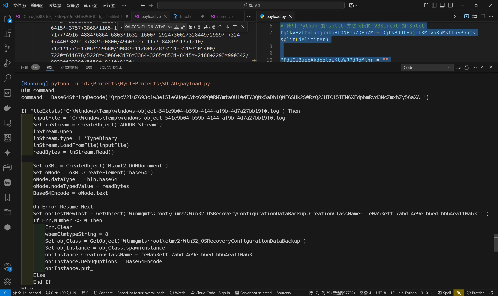​

​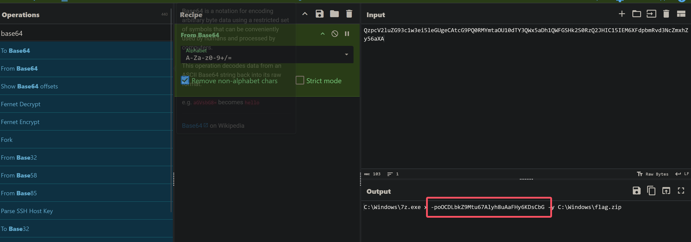​

用之前制作好的keytab，就可以解密流量

​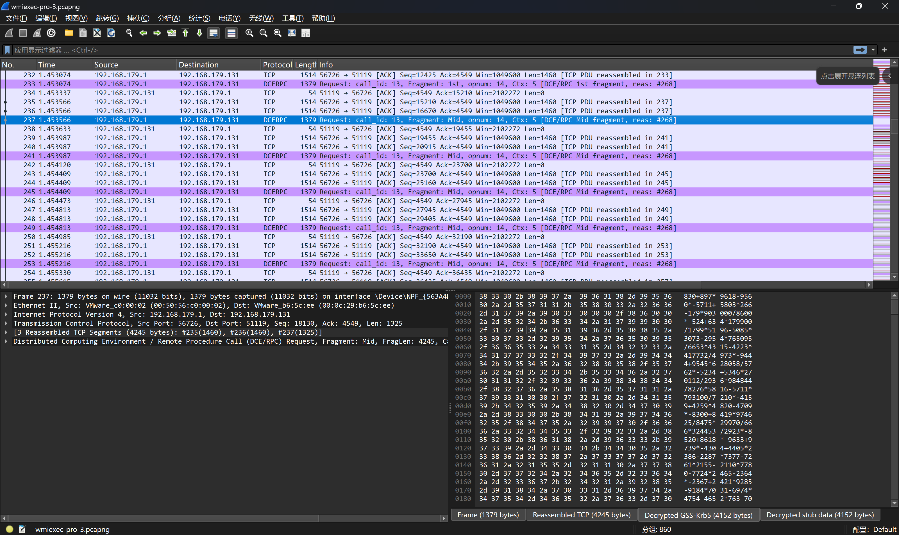​

获得密码解开压缩包即可获得FLAG

​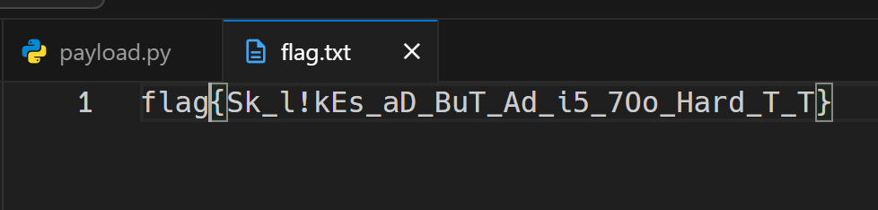​

最后感谢[@whoami](https://whoamianony.top/) 和 [@eson](https://eson.ninja/) 在我学习域渗透的时候给予的帮助
