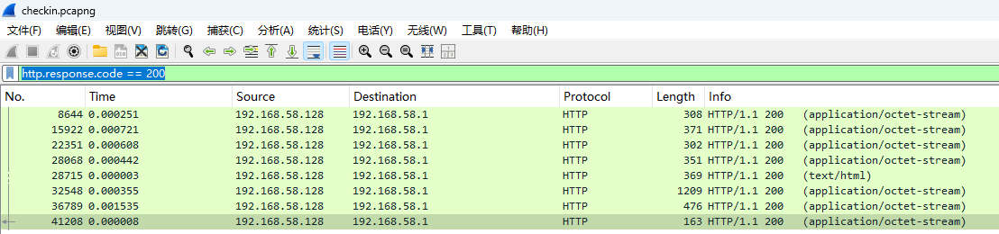
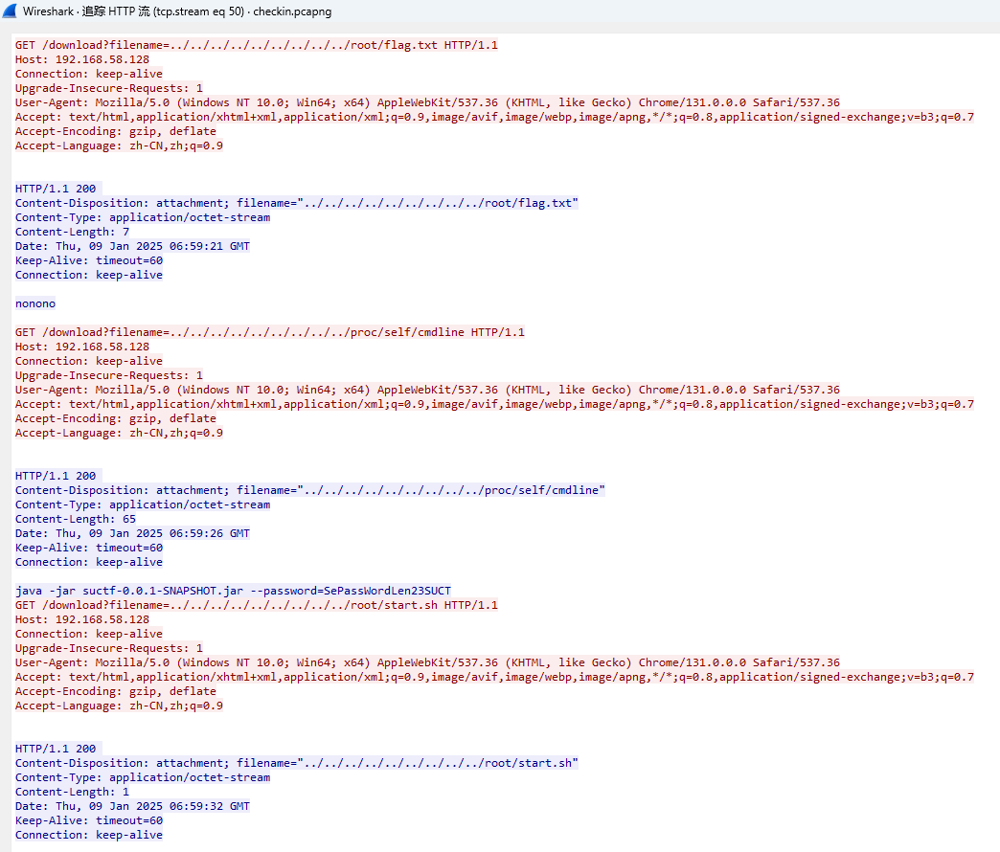
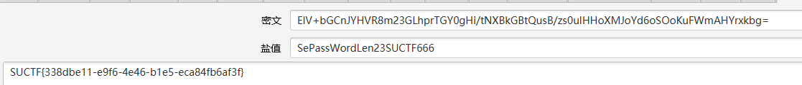

# 题目描述

```
这是一道签到题。
This is a check-in question.
```

# 解题思路

筛选状态码是200的请求

```
http.response.code == 200
```



追踪流，发现是tcp.stream eq 50



去除系统中默认的文件，取出来有用的信息

```
filename="../../../../../../../../../proc/self/cmdline"
响应结果如下
java.-jar.suctf-0.0.1-SNAPSHOT.jar.--password=SePassWordLen23SUCT
```

```
filename="../../../../../../../../../proc/self/cwd/BOOT-INF/classes/hint"
响应结果如下
algorithm=PBEWithMD5AndDES
```

```
filename="../../../../../../../../../proc/self/cwd/BOOT-INF/classes/application.properties"
响应结果如下
spring.application.name=suctf
server.port = 8888
OUTPUT=ElV+bGCnJYHVR8m23GLhprTGY0gHi/tNXBkGBtQusB/zs0uIHHoXMJoYd6oSOoKuFWmAHYrxkbg=
```

可以根据hints知道是java加密，然后cmdline中可以看到password的长度是23位，但是发现没有23位，因为cmdline的保护机制被截断，所以我们需要爆破一下password，现在已经知道有19位，需要爆破4位，爆破最后得到password为SePassWordLen23SUCTF666，解密得到flag



# flag值

SUCTF{338dbe11-e9f6-4e46-b1e5-eca84fb6af3f}