# SU_forensics

## 题目描述

bkfish在自己的虚拟机里运行了某些命令之后用"sudo reboot"重启了主机，接着他按照网上清除入侵记录的方法先"rm -rf .bash_history"然后"history -c"删除了所有的命令记录。

在现实世界中，消失的东西就找不回来了，但在网络世界里可未必如此，你能找到bkfish消失的秘密吗?

flag提交格式：全大写的SUCTF{XXXX}

附件链接:
https://pan.baidu.com/s/1v_HcyaFZLSzCV2A4WrjrLA?pwd=cdcp
https://1drv.ms/u/c/6de0e327b7a135f3/EVx4BxJ6beZJl8tMStRZhgYBKM0EE3vgbSVHx_6fImJFRQ?e=vFAN1U

------

After running some commands in his virtual machine, bkfish restarted the host with “sudo reboot”. Then he followed the method of clearing intrusion records on the Internet, first “rm -rf .bash_history” and then “history -c” to delete all command records.

In the real world, things that disappear can never be found again, but this may not be the case in the online world. Can you find bkfish’s lost secret?

Flag submission format: all uppercase SUCTF{XXXX}

Attachment link:
https://pan.baidu.com/s/1v_HcyaFZLSzCV2A4WrjrLA?pwd=cdcp
https://1drv.ms/u/c/6de0e327b7a135f3/EVx4BxJ6beZJl8tMStRZhgYBKM0EE3vgbSVHx_6fImJFRQ?e=vFAN1U


## 题目难度

中等

## 解题思路

解压后得到一个vmware镜像，用vmware打开

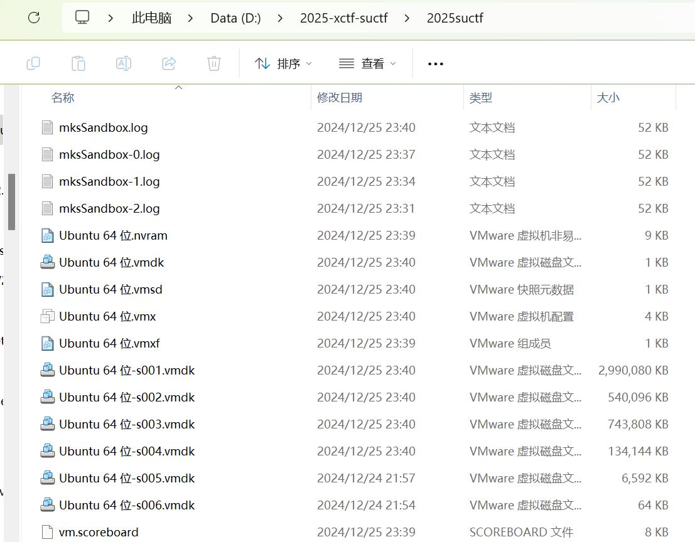

登录主机需要密码

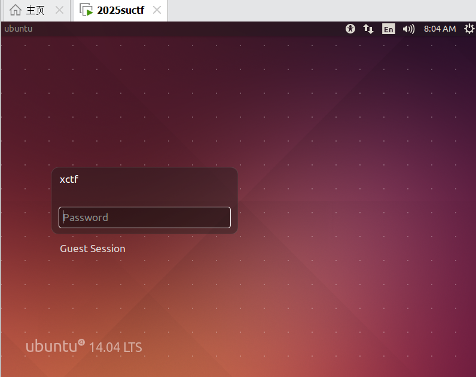

无论是centos还是ubuntu，都有经典的通过grub进入root命令行的方法，我们这里先改密码。首先，点击开启虚拟机之后立刻再点击一下屏幕重定向至虚拟机然后长按Esc键，注意一定要在配置加载之前就按Esc，这样才能进入GRUB界面，然后光标移动到第二个advanced option那里，键盘按e


接着会进入配置页面，光标一直向下移动，移动到底部

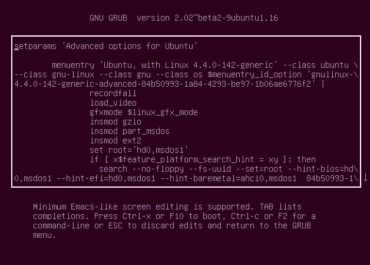

可以找到有一句ro recovery nomodeset啥啥啥的

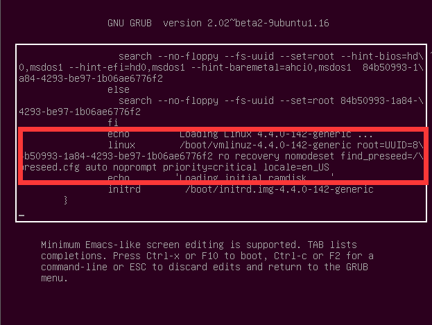

把ro后面的内容改成ro quiet splash rw init=/bin/bash

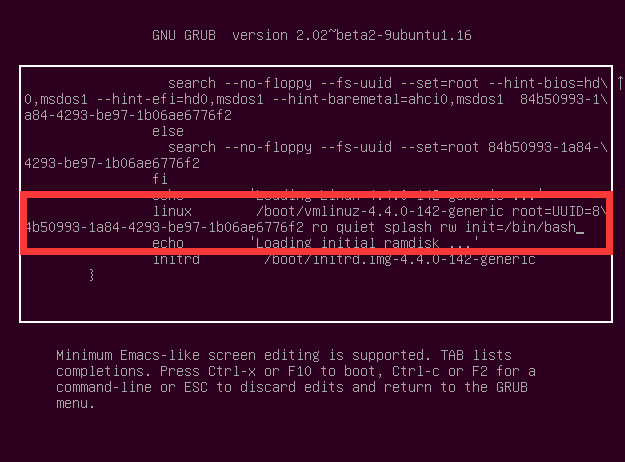

接下来键盘按Ctrl X回到grub界面，然后选择recovery mode，回车

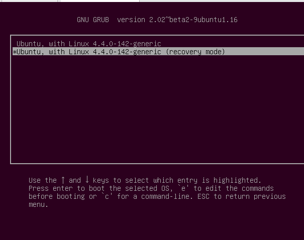

接下来成功进入root命令行，cat /etc/passwd后可以发现主页面那个xctf用户起始就是bkfish

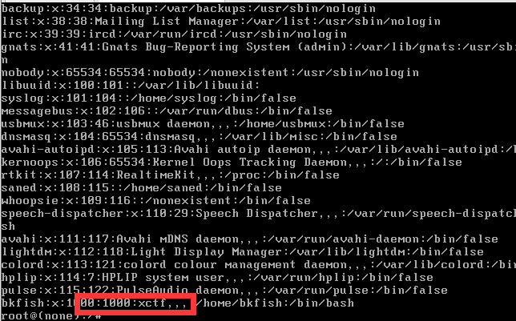

接下来把root和bkfish密码都改成123456之类的，就能回主页面登录了

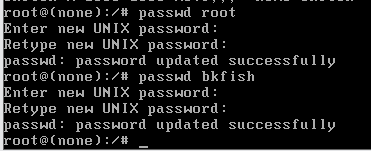

命令行里查看可以发现，history记录都没了，.bash_history也被删了

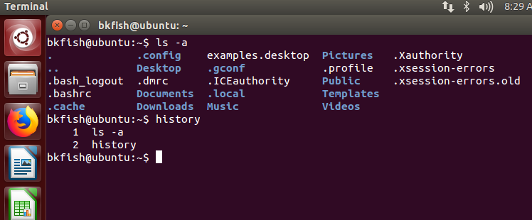

虽然看起来我们的命令记录完全消失了，实际上如果运气比较好，对应的内容没有被覆盖，磁盘里可能还保留了.bash_history的文件内容，首先用df -h查看一下磁盘分区

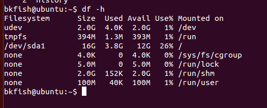

可以看到我们的filesystem是/dev/sda1，接下来用grep匹配一下sda1的内容

```
sudo grep -a -B 50 -A 50 'sudo reboot' /dev/sda1 | tr -cd '\11\12\15\40-\176' > result.txt
```

命令的意思大概是用 `grep` 从 `/dev/sda1` 中查找包含 `sudo reboot` 的行，并显示其上下 50 行的内容，然后通过 `tr` 过滤掉除 ASCII 可打印字符、空白符和换行符/回车符以外的所有字符，清理输出内容。最后，将处理后的内容保存到 `result.txt` 文件中。


接着直接cat result.txt，定位到sudo reboot的上下文

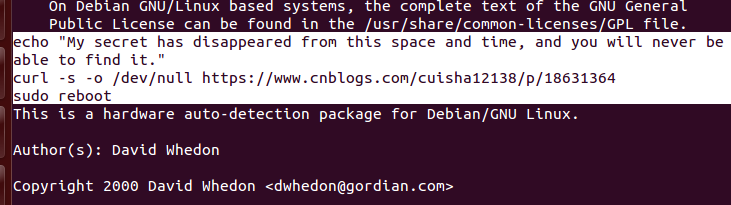

当然，用DiskGenius这种高级工具也是能恢复出来的，实际上大部分队伍都是用DiskGenius恢复的或者直接搜string😂，甚至连登录都不用登录用磁盘数据就搜到了。这个和我的预期完全不一样，可能还是因为直接把虚拟机镜像给了的缘故，我出一步的时候是因为确实遇到过差不多的应急响应场景，当时就是靠grep去磁盘里搜索的，就把攻击者删了的history记录恢复出来了，要是不给镜像而是一台真实的服务器，就只能用grep或者用一些命令行里的数据恢复工具了，不过用grep的缺点就是内存容易爆。

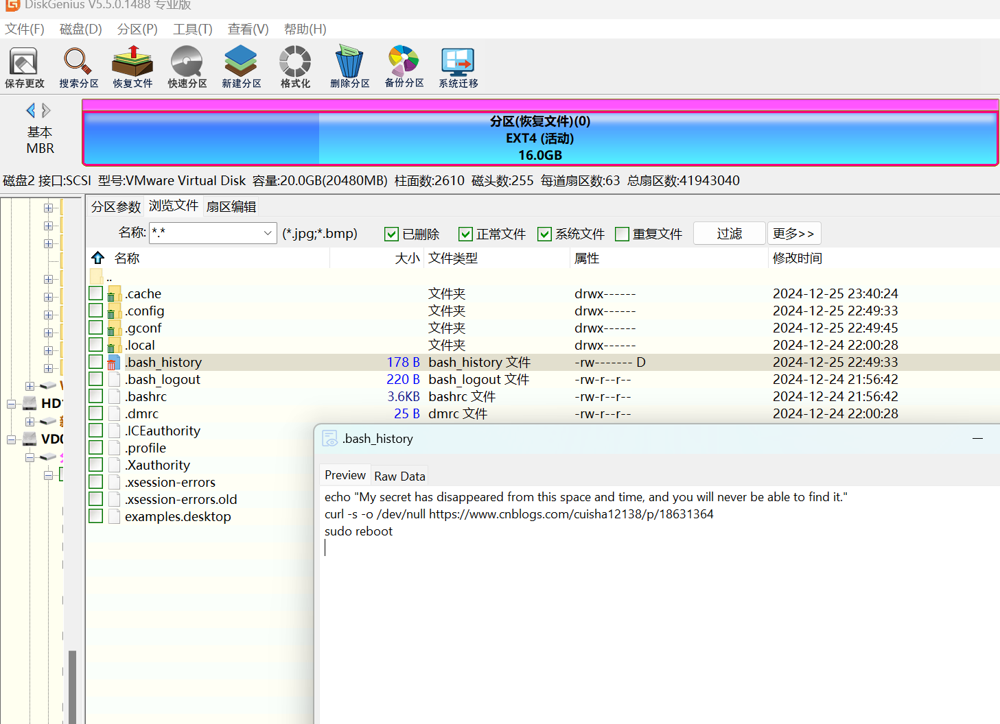

成功恢复了.bash_history的文件的内容，可以看到被删除的命令是

```
echo "My secret has disappeared from this space and time, and you will never be able to find it."
curl -s -o /dev/null https://www.cnblogs.com/cuisha12138/p/18631364
```

第一句话输出了"我的秘密已经从这个时空消失了，你永远也找不到它"，其实是对接下来题目的提示，秘密已经从这个**时空**消失了。接着访问攻击者访问的这个地址，可以发现这个网页已经没有了

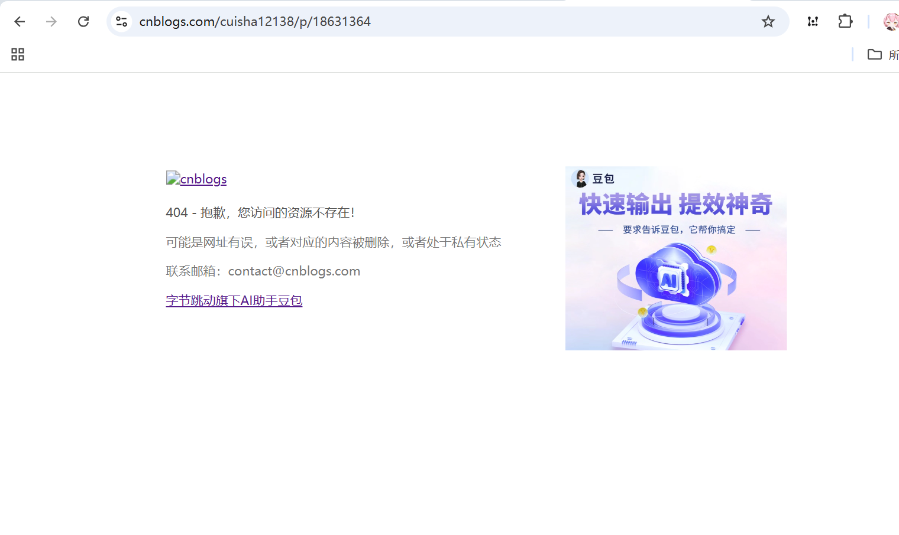

联系到秘密已经从这个**时间**和**空间**消失了，不难想到网页快照里可能还有这个网页的内容，因为时间这个词其实已经暗示了快照可能在Wayback Machine，秘密现在找不到，就只能回到过去找到了，我们访问Wayback Machine，查找"https://www.cnblogs.com/cuisha12138/p/18631364"的快照，可以发现确实存在快照。出这一步是因为我之前翻一些早年的漏洞文章，总是发现他们已经404了，但在快照里还能找到，希望大家养成用快照找消失了的网页或者文章的好习惯。

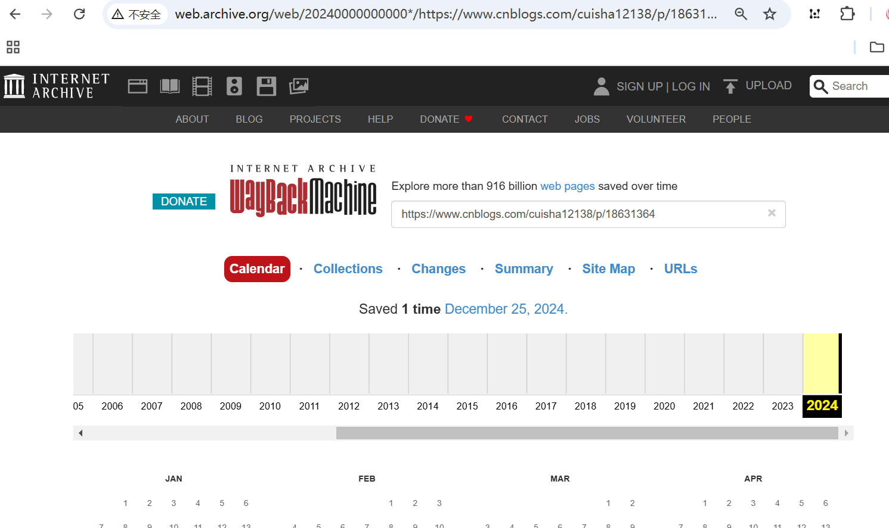

打开保存的快照，可以发现那个博客里其实只有一张图片

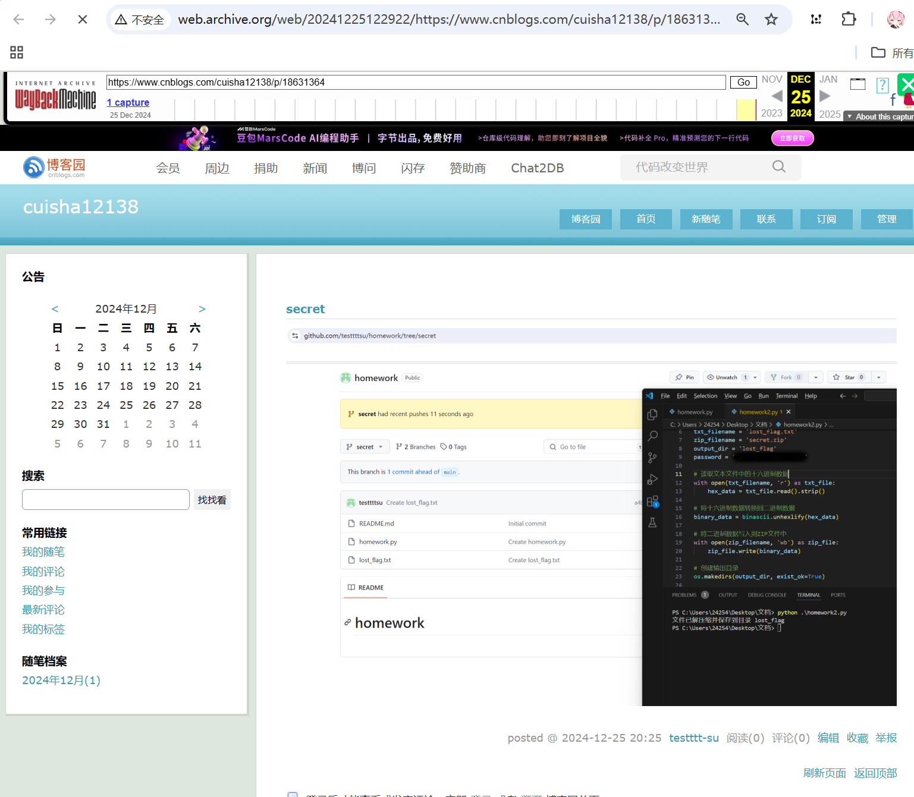

图片里有许多关键信息，首先可以发现这个homework.py的作用其实是读取lost_flag.txt的内容然后保存为secret.zip，接着用password解压到本地lost_flag目录。接着代码左边是一个github.com/testtttsu/homework/tree/secret的链接，访问可以发现，这个secret分支已经消失了


不过main还在，但main分支里没有了lost_flag.txt


并且homework.py的代码具体内容里password也是没有的

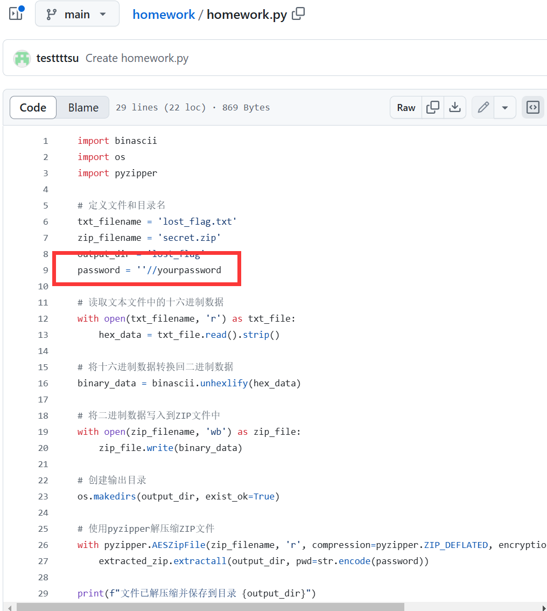

这里应该会联想到最近关于github分支删除一篇文章[安全研究员强调，已删除的GitHub数据仍可被访问](https://mp.weixin.qq.com/s?__biz=MjM5NTc2MDYxMw==&mid=2458565034&idx=2&sn=89488491977b474f61606489d3272e75&chksm=b059c2dcccad3ce78b2bd89b97e456eec3af3287fad19b1bb82ef9e0b1e7ef7b9b9a3cff1982&mpshare=1&scene=23&srcid=0728PLY9n2eswUOyROgQQ2n1&sharer_shareinfo=3d8dfc3962f2c8561e04548b300d0a5e&sharer_shareinfo_first=c39146154674d1ffea87c78b470a2a54#rd)，简单来说只要一个分叉存在，对该存储库网络的任何提交（即上游存储库或下游分叉上的提交）都将永远存在，访问这个提交理论上需要用户提供完整SHA-1提交哈希，但git协议允许在引用提交时使用短 SHA-1值，因此只需要四位就可以访问到哪怕是被删除了的分支中的提交，这里为了减轻难度，图片里其实已经给出了前三位是a4b，所以只需要再尝试一位即可

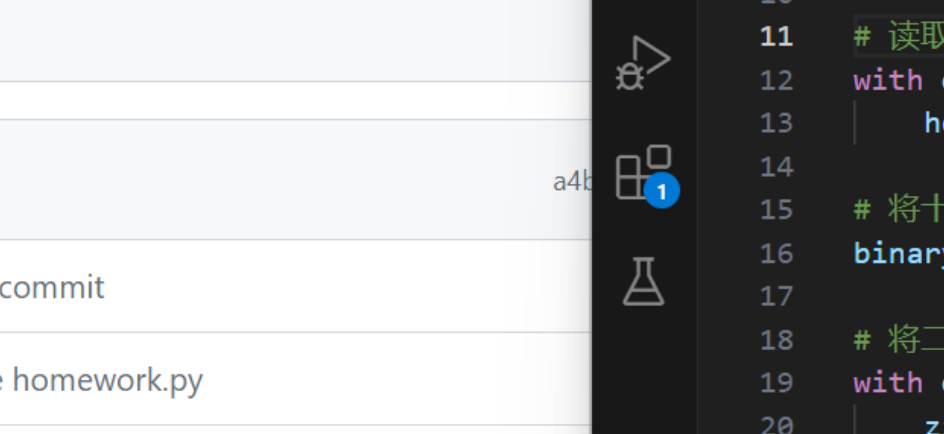

手动尝试一下可以发现，lost_flag.txt这次提交记录其实在https://github.com/testtttsu/homework/commit/a4be，把这里面的lost_flag.txt下载到本地


当然，除此之外还有一种更简便的方法，我也是看选手们的wp学的，甚至于这个漏洞的原发现者都没有发现，github其实自带activity，其实完全不需要爆那个四位哈希，访问https://github.com/testtttsu/homework/activity


可以看到activity这里直接就有全部的修改记录，然后点击右边那个**...**，选择compare change，在这里直接就能翻到我那个创建lost_flag.txt的记录了


这个其实就是压缩包的二进制数据，但是我们还缺一个压缩包密码。回看那个图片，其实压缩包密码就在图片里。这个就是那个苹果马赛克，过去iOS照片编辑的画笔功能只有97%半透明，用画笔看起来把隐私数据涂掉了，实际上在PS里改一下对比度就能恢复出来，密码其实是2phxMo8iUE2bAVvdsBwZ

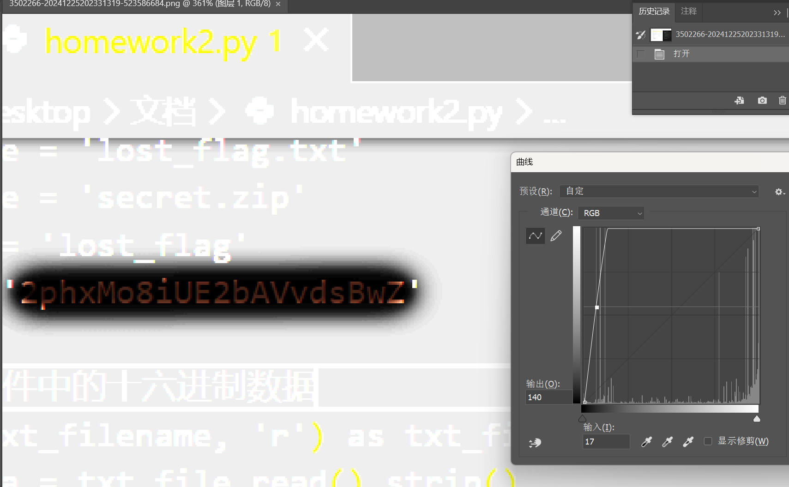

把密码替换到代码里，本地运行一下

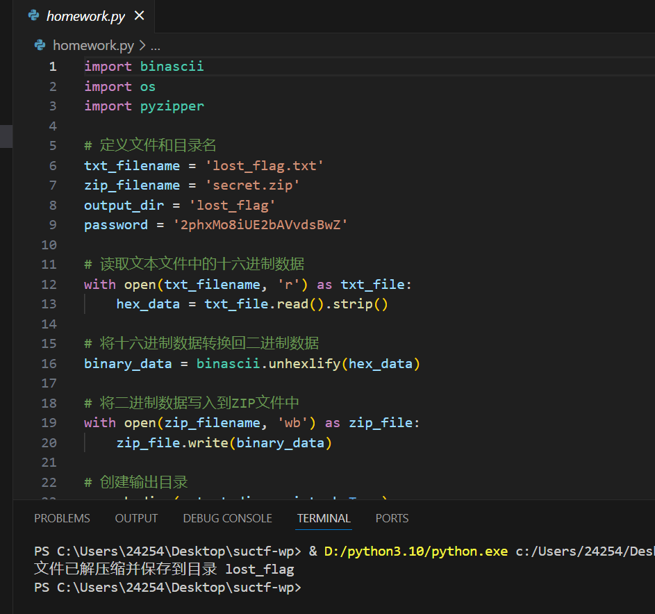

解压后可以看到一张lost_flag.png图片，里面是一个神奇的密文

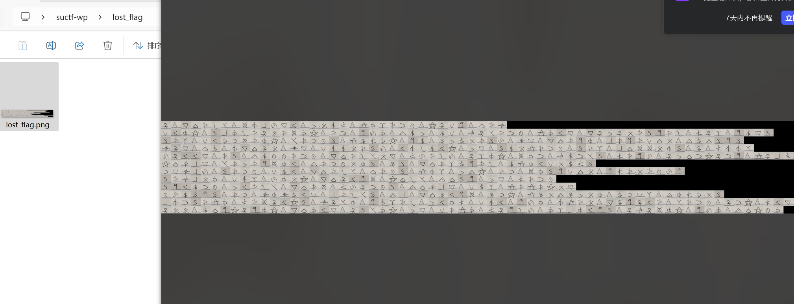

这个密文是我自己手写的，我随便手写了27个字符，我自己都不知道是啥，网上也不可能找到，不会真有人去网上找这是啥密码吧。统计一下，可以发现密文只有27种，可以联想一下会不会是26个英语字母加一个标点符号之类的，应该可以想到是一种单表替换，但很多的队伍都是选择去网上找这是什么文字或者密码，比如原神里的提瓦特文或者月圆之夜里的文字，很明显网上是找不到的，因为看这个图很明显我是手写的，要是能直接找到字符我还手写干啥，直接用现成的图不就行了。对于这种单表替换类型的密码，很显然是可以通过词频分析把字母的对应关系找到的，就是SU_RealCheckin这道签到的PLUS版，甚至我感觉那道题如果第一行不给出hello ctf的对应关系，单分析词频都能做出来。

这种思路其实很早就有了，最早出自福尔摩斯的跳舞小人密码或者爱伦·坡的《金甲虫》，这两部小说的情节和这个基本上一样的，就是给了类似的单表替换过的句子，然后主角分析词频找对应关系最后恢复出来整段话。大部分人可能打ctf的时候遇到过这种密码，但大部分人基本上都是直接去网上找表，而不是真的跟着福尔摩斯的思路用词频分析找到字母的对应关系，所以我专门设计了一个网上不可能找到对应关系的密码，让大家自己找到**消失**的对应表。我本来以为这个应该不算难的，结果被喷成傻逼了，主要我很早之前在学校给新生出过差不多的题，当时有很多大一新生都做出来了，解出率还是挺高的，但可能因为放到xctf之后大家往往会联想到一些我完全没预想到的很抽象的方向所以解出率不高，比如觉得这是什么图片隐写。*希望大家明白，这种单表替换的密码，比如恺撒密码或者游戏文字，不需要找到对应表，用词频就能分析出来对应表。*

由于是单表替换，所以其实每个图片里的字符本身是没有意义的，我后面也提示过了，唯一的作用就是标识他们是不同的字符，因此我们随便用27种不同的字符代替一下就行了。用万能的chatgpt写脚本提取一下

```
from PIL import Image
import numpy as np
import os


def crop_symbols(image, symbol_width, symbol_height):
    """
    从拼接图片中切割出每个符号。
    """
    img_width, img_height = image.size
    symbols = []
    for y in range(0, img_height, symbol_height):
        row = []
        for x in range(0, img_width, symbol_width):
            # 剪裁单个符号
            box = (x, y, x + symbol_width, y + symbol_height)
            cropped = image.crop(box).convert('L')  # 转换为灰度图
            row.append(cropped)
        symbols.append(row)
    return symbols


def generate_templates(symbols, max_templates=28):
    """
    自动生成模板：将符号进行分类，挑选出指定数量的不同符号。
    """
    templates = {}
    template_index = 0

    for row in symbols:
        for symbol in row:
            # 将符号转换为 numpy 数组以便计算差异
            symbol_array = np.array(symbol)

            # 尝试与已有模板匹配
            matched = False
            for char, template in templates.items():
                template_array = np.array(template)
                diff = np.sum((symbol_array - template_array) ** 2)  # 差异平方和
                if diff < 1000:  # 如果差异很小，视为同类符号
                    matched = True
                    break

            # 如果没有匹配到，作为新模板
            if not matched:
                char = chr(ord('a') + template_index) if template_index < 26 else ('+' if template_index == 26 else '{')
                templates[char] = symbol
                template_index += 1
                if template_index >= max_templates:  # 停止模板生成（已找到 max_templates 种符号）
                    break
        if template_index >= max_templates:
            break

    return templates


def match_symbol(cropped_symbol, templates):
    """
    匹配单个符号到模板。
    """
    cropped_array = np.array(cropped_symbol)
    best_match = None
    min_diff = float('inf')
    for char, template in templates.items():
        template_array = np.array(template.resize(cropped_symbol.size))
        diff = np.sum((cropped_array - template_array) ** 2)
        if diff < min_diff:
            min_diff = diff
            best_match = char
    return best_match


def recognize_image(image_path, symbol_width, symbol_height):
    """
    主函数：识别图片，并输出每行符号值。
    """
    image = Image.open(image_path).convert('L')  # 加载并转换为灰度图
    symbols = crop_symbols(image, symbol_width, symbol_height)  # 切割符号

    # 自动生成模板
    print("Generating templates...")
    templates = generate_templates(symbols, max_templates=28)

    # 显示生成的模板字符
    print("Generated templates:")
    for char, template in templates.items():
        template.save(f'template_{char}.png')  # 保存模板图片（可用于校验）
        print(f"Template for {char} saved as template_{char}.png")

    # 识别每个符号
    result = []
    for row in symbols:
        row_result = ''.join(match_symbol(symbol, templates) for symbol in row)
        result.append(row_result)

    return result


if __name__ == "__main__":
    # 配置参数
    image_path = "lost_flag.png"  # 上传的图片
    symbol_width = 138  # 每个符号的宽度（需根据图片调整）
    symbol_height = 108  # 每个符号的高度（需根据图片调整）

    # 执行识别
    results = recognize_image(image_path, symbol_width, symbol_height)

    # 输出每一行的符号值
    for i, line in enumerate(results):
        print(f"Line {i + 1}: {line}")
```

```
abcdefgbhijklmbnopqbrisetubvawxbyez
wmivb{jifeaoehivbetbxkibypnbpwbzagetubrimlbcanaoe{xefbqasbxpl{
{esbwmitheivbgetu{brpqivbxpbanpoe{kbzlbcdexibjexewdobypd{x{
zalbypbicdaobzlbwppoe{kbmifpmvbnlb{poretub{esbjdhhoi{babqiig
kammlbe{bypuuetubcdefgolbqkefkbasivbhitbzptg{bqexkbandtvatxbrajpm
vdzjlbgenexhimbyetuoi{ba{bcdespxefbprimwopq{
tlzjkb{etubwpmbcdefgbyeu{brisbndvbetbhi{xwdobxqeoeukx
{ezjoibwpsbkiovbcdamxhbvdfgbyd{xbnlbqetu
{xmptubnmefgbcdehbqkatu{bydzjlbwpsbrerevol
ukp{x{betbzizpmlbjefg{bdjbcdamxhbatvbraodanoibptlsbyiqio{
jit{eribqehamv{bzagibxpsefbnmiqbwpmbxkibireobcaxamebgetubatvbqmlbyafg
aoobpdxvaxivbcdimlba{givbnlbweribqaxfkbisjimx{bazahivbxkibydvui
```

这里先分析词频

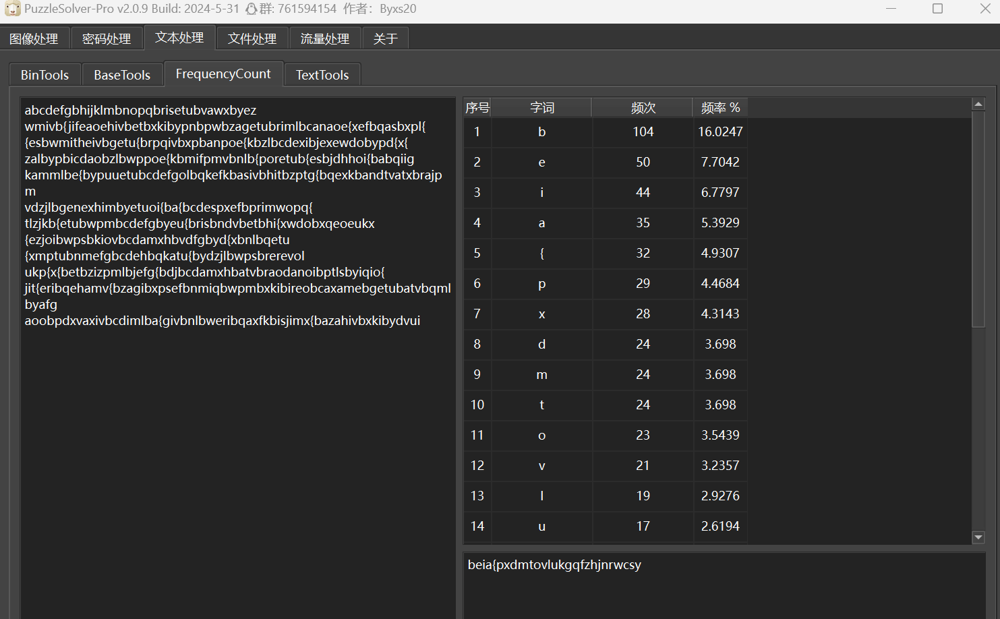

可以发现b这个字母的频率远远高于其他的字母，很明显这个就是代表了空格或者标点，先用空格替换字母b。因为现在字母b没有用了，建议用字母b替换本来密文里的{，不然quipqiup可能会认为这是符号而不是密文。接着复制密文去quipqiup跑一下，第一轮就能跑出来结果

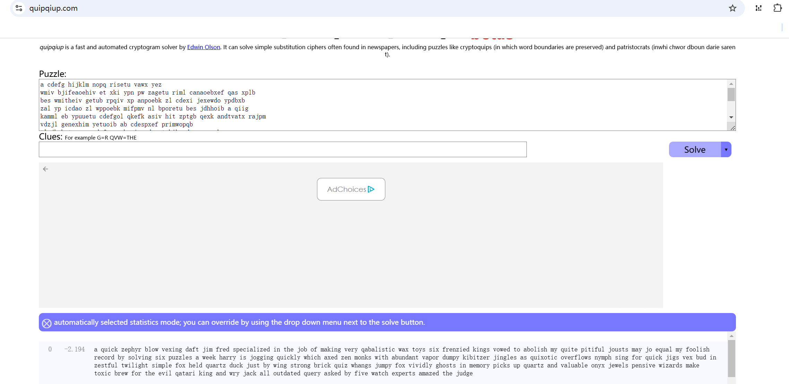

最后解出来是一首诗

```
a quick zephyr blow vexing daft jim
fred specialized in the job of making very qabalistic wax toys
six frenzied kings vowed to abolish my quite pitiful jousts
may jo equal my foolish record by solving six puzzles a week
harry is jogging quickly which axed zen monks with abundant vapor
dumpy kibitzer jingles as quixotic overflows
nymph sing for quick jigs vex bud in zestful twilight
simple fox held quartz duck just by wing
strong brick quiz whangs jumpy fox vividly
ghosts in memory picks up quartz and valuable onyx jewels
pensive wizards make toxic brew for the evil qatari king and wry jack
all outdated query asked by five watch experts amazed the judge
```

为了贴合题目的主题，因为之前的每一个步骤都是**消失**之后又被**找**回来的，从最开始不知道虚拟机密码然后改grub覆盖密码(当然基本上没有一个队伍是这么做的)；.bash_history被删除了然后被恢复了出来；网页消失了但可以找快照；github分支消失了但可以找commit记录；对应表找不到但可以通过词频分析恢复码表，所以最后一步这里我也不太想直接把flag给出来，也得**消失**之后再**找**回来才有趣

恰好当时看到了一篇文章，提到了法国作家乔治·佩雷克写的《消失》（La Disparition），这部小说就在300多页的全文中没有出现过字母**e**，在文学上这种写作方式叫做**Lipogram**，意为消失的字母(所以我那个图片也叫lost_flag，因为他lost了)，即避讳某字之文，所以想到了用字母的消失来表达信息的方式最后给出flag。

但当时自己出的时候，发现这个出起来是最难的，因为你想保证一段话里恰好包含了25个字母，最后整句话就会很长，选手就压根看不出来这是想考啥了。当时恰好又翻到了**Pangrams**，也就是全字母短句，在一句话中包含了全部26个字母，所以想到了糅合**Lipogram**和**Pangrams**，让每一句话里都包含25个字母，用缺的那个字母来表达信息。

当然即使用**Pangrams**构造**Lipogram**也是挺麻烦的，最后感觉每句话的句子都非常晦涩难懂，所以我怕大家看不出来我想考啥，专门把第一句也是最好懂的那句话放在了第一句，你直接谷歌*a quick zephyr blow vexing daft jim*，应该就能搜到这是一句非常知名的**Pangrams**，我感觉题目里遇到自己不知道意义的东西去谷歌一下应该是常识了，当然有的队伍甚至密文都没破解出来，直接就分析出来每一行里只有26种不同的字符，然后把每一行缺的字符提取出来用SUCTF这几个已知的对应关系来凑flag，这就是高手吗？

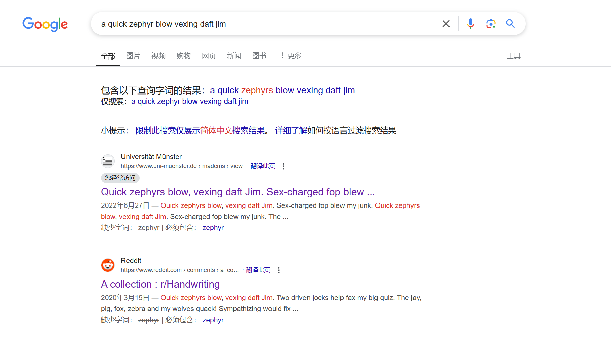

与搜出来的**Pangrams**对比一下就能发现，我这句话不是**Pangrams**，而是恰好缺了一个字母的，后续对照一下，可以发现每一句行都有同样的规律，所以写一个脚本提取一下每一行缺失的字母即可

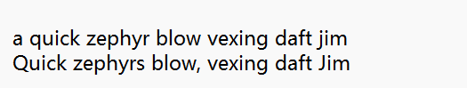

```
def find_missing_letters(line):
    """
    找出一行文本中缺失的字母。
    """
    alphabet_set = set('abcdefghijklmnopqrstuvwxyz')  # 所有字母的集合
    line_set = set(line.lower())  # 将行转换为小写并生成字符集合
    missing_letters = alphabet_set - line_set  # 计算缺失的字母
    return sorted(missing_letters)


def process_file(file_path):
    """
    逐行读取文件，并找出每行缺失的字母。
    """
    with open(file_path, 'r') as file:
        lines = file.readlines()
    
    for i, line in enumerate(lines):
        line = line.strip()  # 去除首尾空白符
        missing_letters = find_missing_letters(line)
        print(f"Line {i + 1}: Missing letters: {''.join(missing_letters)}")


if __name__ == "__main__":
    file_path = "flag.txt"  # 文本文件路径
    process_file(file_path)
```

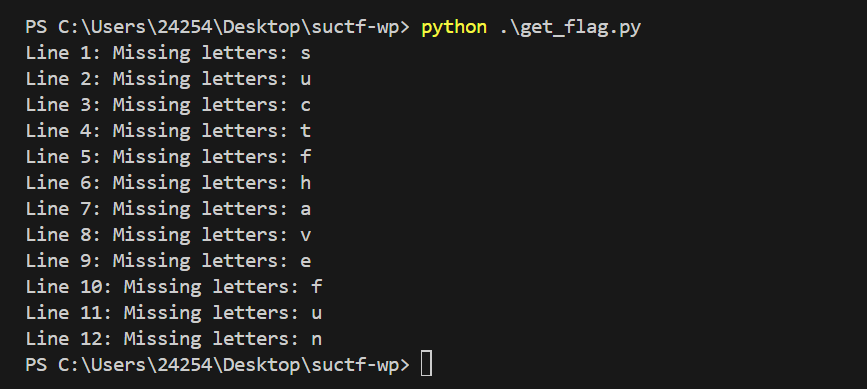

最后的flag：SUCTF{HAVEFUN}

