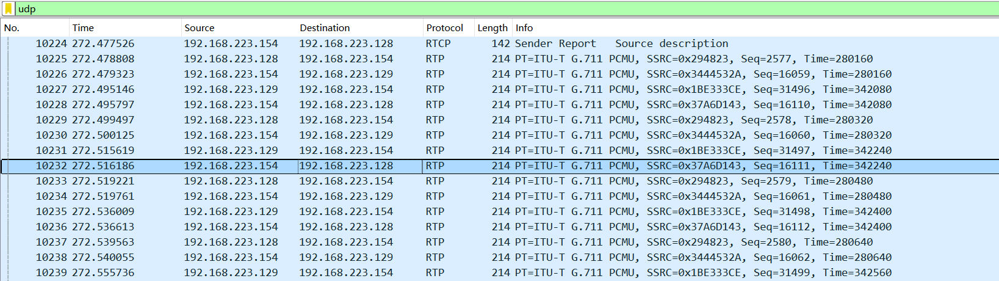
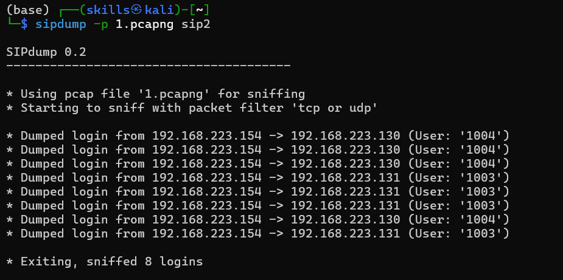
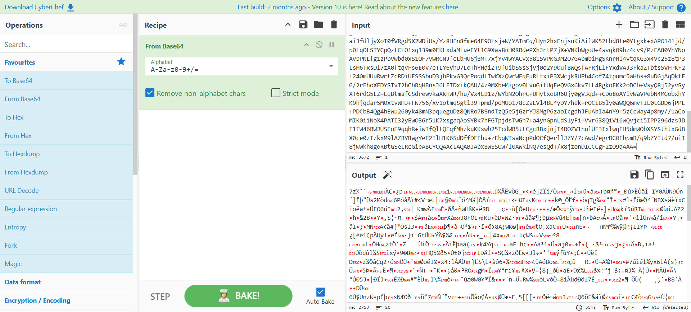
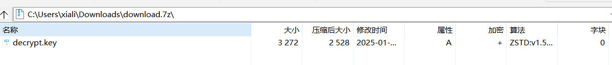
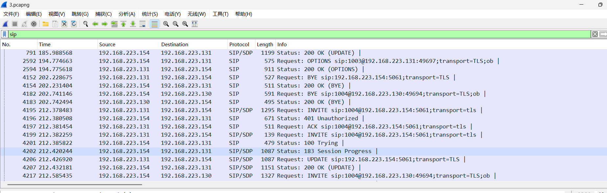
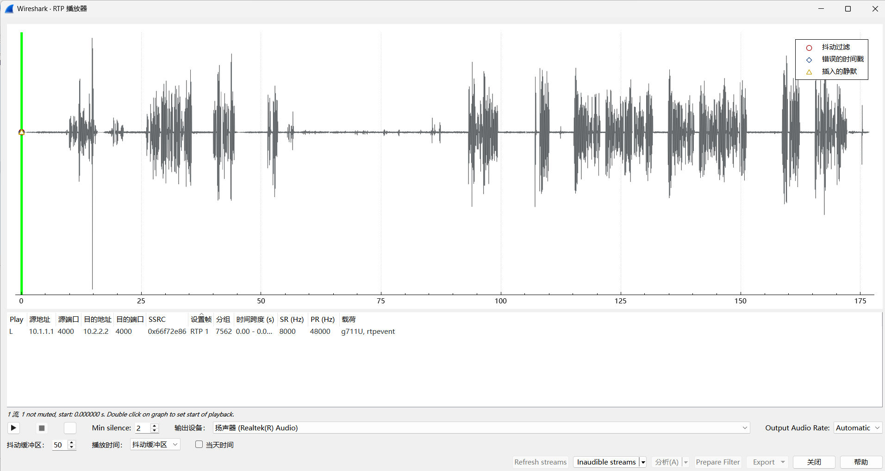
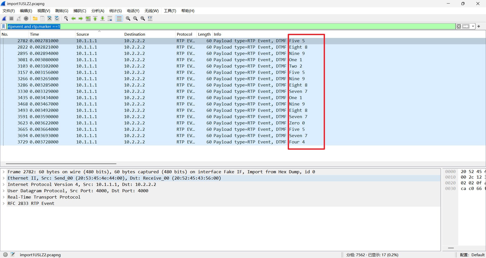
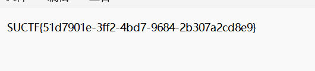

过滤 UDP 流 ，右键 Decode as 将其解码为 RTP



在 电话 -> RTP -> 中选择 RTP 播放器播放音频


听出或者使用 ASR 转录工具得到以下信息： 

```txt
员工A：小李，你知道老板的电脑密码吗？我需要访问一些重要文件。
Employee A: Xiao Li, do you know the boss's computer password? I need to access some important files.

员工B：哈哈，老板的密码总是很简单。他经常用同一个密码。
Employee B: Haha, the boss's password is always simple. He often uses the same one.

员工A：真的吗？那重要文件的密码呢？
Employee A: Really? What about the password for important files?

员工B：如果是重要文件，他通常会在后面加上8个8。别忘了，老板的工号是1003。
Employee B: If it's an important file, he usually adds eight 8s at the end. Don't forget, the boss's employee number is 1003.
```

随即使用 sipdump 和 sipcrack 破解流量包中关于1003的用户密码




破解后得到老板的密码是 "verde351971" ，按照前文的提示组合得到密码 "verde35197188888888"

过滤 sip 协议找到一段 1003 和1004 的 sip 信息发送记录


跟踪流打开发现一段可疑的base64编码，并且最终文件是一个压缩包



使用前面得到的密码 verde35197188888888 将文件解压后得到一个 tls 证书 *(解压需要使用最新的nanazip或者支持zstd压缩算法的压缩软件)* 



将该证书导入到 wireshark 中解密加密流量后过滤 sip 协议



在电话中分析 sip 流量握手包，抓取 srtp 的加密密钥


找到对应的握手流


定位密钥


使用密钥解密流量


解密后得到 hex 文件，将 hex 文件导入到 wireshark 中打开


播放流



从对话结果中梳理出以下逻辑
```txt
1老板：你好，王先生，感谢你今天能过来讨论我们的供货合同。
Boss: Hello, Mr. Wang, thank you for coming to discuss our supply contract today.

2供应商：您好，很高兴能再次合作。我们这次的报价和交货时间都做了一些调整，希望能更符合您的需求。
Supplier: Hello, it's a pleasure to work together again. We've made some adjustments to our pricing and delivery schedule this time, hoping to better meet your needs.

3老板：好的，我刚好在记录一些重要信息，请稍等……（开始在键盘上敲打）
Boss: Okay, I'm just recording some important information, please hold on... 

4供应商：当然，您请便。
Supplier: Of course, please go ahead.


按键58912598719870574


5老板：（一边敲打键盘一边说）抱歉，我正在记录一组密码，您知道的，现在信息安全很重要。
Boss: (while typing) Sorry, I'm recording a password, you know, information security is very important nowadays.

6供应商：是的，安全问题不容忽视。
Supplier: Yes, security issues cannot be ignored.

7老板：我最近发现我原来的密码使用方法不太安全，现在我喜欢用记录的密码和常用密码组合起来，然后进行哈希运算作为我机密文件的密码，这样就更安全了。
Boss: I recently discovered that my original way of using passwords wasn't very secure. Now I like to combine recorded passwords with common ones and then hash them to use as passwords for my confidential files, making it more secure.

8供应商：这是个好主意，能有效提升安全性。
Supplier: That's a good idea, it can effectively enhance security.

9老板：没错，这样即使有人知道了其中一个密码，也无法轻易破解我的账户。
Boss: Exactly, this way, even if someone knows one of the passwords, they can't easily crack my account.
```

接下来使用语法 `rtpevent and rtp.marker ==1` 过滤老板在对话时按键的信息



得到58912598719870574，再利用老板的密码组合得到 `58912598719870574verde351971` ，进行哈希运算后得到密码 5c0b1d057aa7d5e9f7b2b10387f58540e2a6f9fc82ccb5d5f3cb2915aa0d1f77


从http协议导出flag压缩包


使用该密码解压压缩包得到flag

