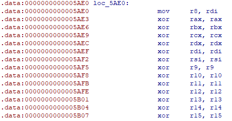
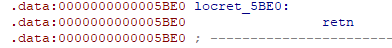
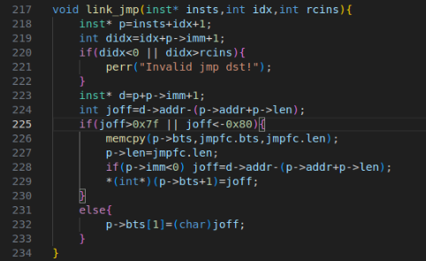
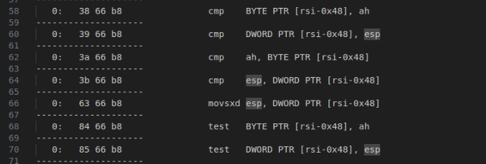
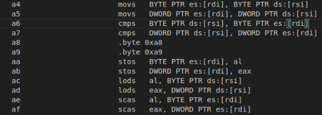

# JIT16 writeup

## 题目架构

题目设计了一台16比特的RISC虚拟机，让用户输入一段字节串，通过取指分析的方法，根据根据存储的代码数据变编译成jit写入到一段RW段中，然后将此段地址改为RX段，运行后读取返回值。

每条指令为32位，小端序下指令结构都如下所示。传入字节的时候需要转换成小端序。

```
data: |-- op kind --|-- op code --|-- src reg --|-- dst reg --|------------ imm 16 little endian ------------|
bits: |0           3|4           7|8          11|12         15|16                                          31|
```

其中可用的寄存器只有四个，分别为ax/bx/cx/dx，标号为0-4。

读入后匹配取指，进行预编译根据opkind进行switchcase，然后进入分支，每个opkind对应一个编译函数。在函数中，根据opcode判断具体的操作，再根据具体的来源与目的寄存器读取寄存器等数据，在个个表中查找具体的指令后，写入到每个条JIT16指令的临时空间中留待后面用，例如 `mov ax,bx` 可以在mrr[0][1]中查找到。预编译时会计算每条指令编译成x86指令的长度，然后计算当前这条指令的地址。

预编译完成后进行链接，主要处理跳转地址。JIT16提供了 `jmp` 和 `jeq` 两条指令，在这一步用来程序需要根据上一步预处理的地址计算跳转地址。

程序的起始和末尾提前写了两段代码，分别用来处理进入和退出，可以在逆向结果中找到。



进入的代码将 `rdi` 写入 `r8` 后清除了其和 `rsp`、`rbp` 之外的所有寄存器。其中 `rdi` 是调用用户输入代码时传入的第一个参数，参数为mmap申请的一段只读段，用来当作JIT16架构中的数据段，留待内存读写使用。



退出的代码为 `retn` 。由于 `rsp`、`rbp` 都保存了，且在JIT16的指令中完全无法涉及到这两个寄存器，所以直接可以返回到主函数。主函数通过读取 `rax` 的值来作为用户代码的执行结果。

## 漏洞分析

初步逆向后，可以侧重关注一下跳转的代码。以 `jmp` 为例子，预编译时，采取的代码为两字节的 `eb 00`。JIT16中允许输入的代码最多为256条，算上前后两段进入和退出的代码，转x86后不能超过4096字节。在JIT16指令中，跳转序号为偏移值，取0时相当于什么都不做，取正数n时跳过当前指令后面（不包含自身）的n条指令，取负数-n时往前跳包含自身的n条指令。因此，输入了n条指令（记标号为0到n-1）时，合法的跳转目标为n+1个，即第0条指令开头到第n-1条指令的末尾。

x86的 `eb` 指令操作数为单字节补码，可以跳到 `rip-128` 到 `rip+127` 之间的地址。在程序的链接过程中会判断跳转的偏移是否大于这个范围，如果是的话则替换成 `e9 00 00 00 00` 的四字节补码偏移跳转。



这里放出源码。首先按照两字节段跳短跳转计算一个跳转偏移 `joff`，比较是否超越了短跳范围，如果没超出则正常链接；如果超出的话则尝试替换成五字节长跳转。如果为向后跳转，则 `joff` 不变；如果是往前跳转的话，`joff` 要计算自己这条指令从两字节换成五字节产生的偏移差，所以需要重新计算。这样进行单跳转的链接就完成了。

但是这里也不难看出设计漏洞，由于按顺序链接时，计算 `joff` 用的是预编译时计算的各条指令地址，处理当前指令的时候，后面的指令的地址其实都不一定是最终确定的准确地址。只考虑单条跳转的话，计算 `joff` 偏移是不会变的；但如果一个跳转中越过了另一条跳转指令，且被跳转指令可能发生变化的时候，计算 `joff` 时采用的被减数地址就是错误的。

具体来说：

```

    A: jmp C
    ...
    B: jmp D
    ...
    C: some code 1
    ...
    D: some code 2
    ...
```

其中，B到D的偏移大于127字节，这样B就会从两字节变成五字节，但是计算A的跳转偏移时还是当B为两字节算，因此A最后会跳转到C-3字节处。如果这个地址所在的地方为用户可控的内容，那么就有可能达成类似于花指令的shellcode执行。

## 解题利用

按照上面的漏洞利用，可以考虑一下攻击者可以自由布置的内容。出题者只提供了最大两字节的立即数连续布置，和八字节或者四字节mov不同，很难进行大段的shellcode直接写入，但是仍然可以利用。这里介绍出题人的一个思路。

这里我们以 `mov ax,0x????` 为例子，x86的指令字节为 `66 b8 ?? ??`，在连续布置的时候就会造成下面的结构：

```
66 b8 xx yy 66 b8 ?? ?? 66 b8 ?? ?? 66 b8 ?? ?? 66 b8 ?? ??....
```

假设我们可以跳转到上面的第2个字节（从0开始计数）的xx，且xx是一条单字节指令，那么执行完xx后就开始执行yy。如果yy开始取指被解析成3字节指令，那么下一个mov开头的 `66 b8` 就会被跳过，继续执行下一个字节，这样就可以进行连续执行，但是限制是每条指令必须是单字节，最后一条指令可以是双字节。

首先解决如何设置yy的问题。写个脚本简单枚举一下可用的指令：

```python
from pwn import *
context.arch="amd64"
context.os="linux"
for i in range(256):
    shc=p8(i)+b'\x66\xb8'
    res=disasm(shc)
    if(len(res.split("\n"))==1):
        print("--------------------")
        print(res)
```

挑选了一系列指令（包括mov其他寄存器等）后发现基本只有下面这系列指令可以使用：



主要为 `rsi` 偏移寻址，读取后test、cmp等，只设置标志位，上下文只读，不产生其他寄存器和改动，唯一的限制是 `rsi` 必须可寻址。尝试了许多种可能，发现这个限制似乎没法绕过，所以后面的shellcode中除了第一条指令，必须要全程保证这点。考虑单字节指令当中有 `pop rsi`，且程序是通过call进入用户代码的，因此栈顶应该为一个程序代码的地址，第一条指令pop给rsi后就可以寻址了。

随后是布置参数的问题。题目没有控制沙箱，因此首先考虑execve。首先我们必须传入一个 `/bin/sh\0` 字符串，因此需要可读写地址。由于题目给的 `r8` 指向的是mmap申请的只读空间，无法用JIT16的内置指令来设置内存，因此还是只能用单字节shellcode来进行。这个可以通过各种pop指令来达成。随后我们需要布置字节，这里采用的方法主要集中在下面这套指令：



这类主要是连续读写指令，操作完成后会将牵扯到的寻址寄存器按照读写单位进行加减。例如 `a5` 指令，mov结束后会根据D标志位对 `rsi` 和 `rdi` 加四或者减四，D标志位用 `std` 和 `cld` 来设置。这样就可以通过加减构造 `rdi` 的最低位字节为想要的字符，然后设置寄存器，通过 `aa` 指令来写入。但是仍然要求 `rdi` 和 `rsi` 是合法地址。同时，通过 `push A; pop B` 可以达到 `mov B,A` 的效果。这样就可以生产一段代码来进行内存设置。

最终，我们规划各个寄存器的用途，就可以通过一系列单字节指令来设置 `rdi` 指向 `/bin/sh\0` 。需要注意的是，出题人给的exp中，`rdi` 的值只能 `push rsp` 来得到（因为我们只有这么一个可以写入的地址了），因此其最低字节有1/16的随机性，需要碰撞概率。设置 `rsi` 的时候，由于之前提到的 `rsi` 必须是可读地址，因此不能像平时一样将其设置为 `NULL` 。可以设置其为一个栈地址，且地址内的八字节数据为 `NULL` 。最后 `mov ax,0x050f`，来执行syscall。

最终执行的是 `execve("/bin/sh",{NULL},NULL)`（注意参数2和3的差别）。具体的脚本可以参考 `exp.py` 和 `asm.py`来跟进调试。调试shellcode时可以善用 `int 3` 和死循环 `jmp` 来在gdb中强行下断点。

## 进一步利用

考虑这题为了加大难度，专门把JIT16指令的内存写入功能给禁止了。可以把第二个mmap申请的段改成RW的来降低难度，这样就可以从R8中获取需要的信息。

考虑到，这个漏洞是可以利用多次的，我们可以通过在 `mov` 中正常放两字节指令而非花指令的方法来回到JIT16的正常指令集中，去用立即数设置 `rax/rbx/rcx/rdx` 四个寄存器后再利用一次这个漏洞来回到单字节shellcode中。这样就可以直接设置字节，而不用加减来麻烦地设置了值了，也不用撞概率。

根据上面思路，某些限制下也可以用orw来进行三次syscall。考虑到`open`的第二个参数为0，会使得 `rsi` 不可寻址，违反了上面的限制，可以改用第二个参数为文件名的 `openat`。