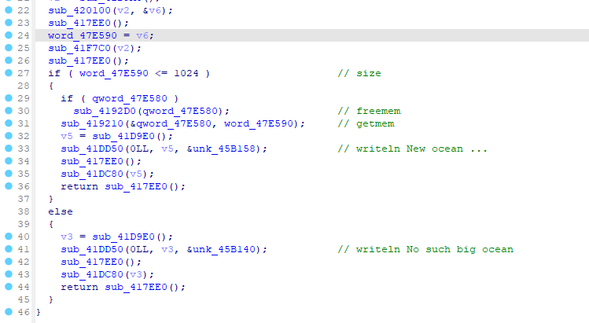
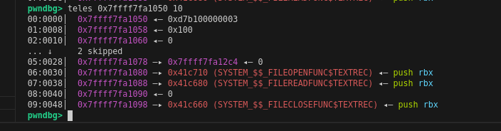
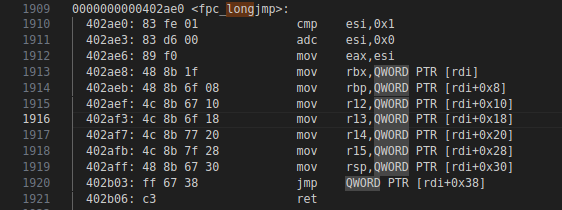
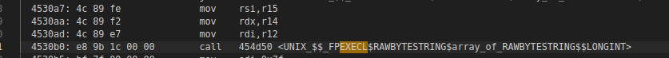
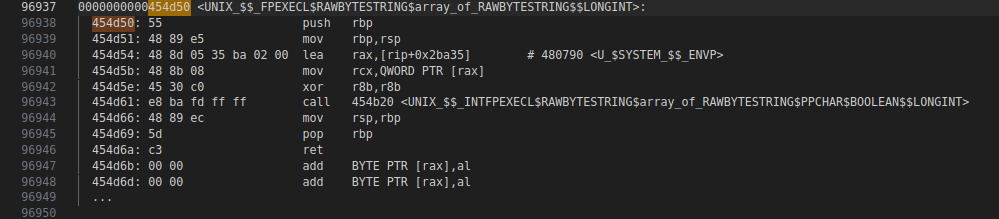
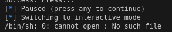
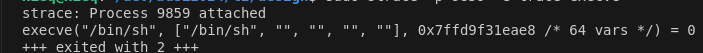

# PAS_sport writeup

## 题目架构

用Pascal语言（fpc-3.2.2）实现了一个菜单题（题目名称也是个提示），设计了一个类似传统堆题的经典溢出漏洞，考察选手在非常规语言和标准库等条件下的FSOP操作。

Pascal实现了一套自己的标准库接口，默认编译参数下完全静态，无符号信息，且不开pie。但是选手可以自己安装pascal环境，编译时加-g参数随便编译一份代码来生成带调试符号的二进制来帮助理解程序，同时这样也会生成一套带几乎相同标准函数接口的库静态编译在程序内，方便后期寻找利用方法。

关于本题目的逆向，建议动静态调试结合，通过strace、字符串查找等方式来获取各个函数的边界。pascal的短字符串常量数据结构会在字符数据开头加一字节长度，因此会有一点小麻烦。

题目菜单提供四个接口：

1. 打开新设备（/dev/urandom）
    * 以文本方式打开
    * 以字节方式打开
2. 关闭打开的设备
3. 修改缓冲区大小，如果没有申请则新申请一块
4. 从打开的设备中获取输入

其中，由于pascal的文件操作系统的设计，以文本和字节的方式打开，类似于限定了使用scanf/printf或者fread/fwrite来读写文件。

## 漏洞分析

分析完所有程序的输入输出操作后，基本可以理清楚程序大体的逻辑框架。观察选项3：



查看读取操作，先读入到全局变量size中，检查大小，小于等于0x400就重新申请缓冲区，太大的话会直接退出函数。这是个比较经典的原子化问题，改size变量和申请空间应当是一个原子操作，而非可以只操作前一步。只需要先申请一块小于等于0x400的缓冲区，然后再次调用功能3，输入一个大于0x400的size，就可以只改size而不重新申请缓冲区了，这样就在功能4中得到了一个任意溢出写的机会。

## 解题利用

观察一下我们能溢出什么。pascal自己实现了一套堆空间管理器，其中有一些freelist等的机制，但是在这题的预期解中用不到。题目的在从设备中读取字节后有回显，可以读出来在gdb中搜索，用以定位缓冲区地址，发现是在一个mmap的独立段上。通过strace观察每个功能的行为，可以发现先申请缓冲区时会调用mmap（先打开文件也会，出题人故意设计的），不同的size区间引发的mmap申请长度也不同，且申请相近的空间不会触发两轮mmap，因此基本可以得出一些堆管理性质。

继续跟进，在gdb中调试可以得到 `sub_419210` 和 `sub_419390` 都是malloc函数，只是接口不同。申请缓冲区和打开新文件的存放结构体，都在同一块堆空间上，几乎相邻，chunk的头部大小为0x20字节，userdata前面的8字节为size。

到此为止我们仍然只能从/dev/urandom中读取信息，但是希望可以从攻击者处读取信息。得到了堆上的大概排布后我们可以简单查看下文件结构体的申请行为。功能2中的调用的 `sub_419390` 函数会触发open的syscall断点，且在经过这个函数后，可以明显看到 `rdi` 指向空间（也就是文件结构体）开头的四字节从 `0xffffffff` 变成了 `0x00000003` （如果是第二个打开的文件，则会变成`0x00000004`） ，因此基本可以判定这开头的四字节就是fd。gdb中将这里改成0发现有输入阻塞，更加印证了这点。




同时，在申请text文件时，这段空间后面的部分我们发现了几个函数指针（很遗憾，byte文件里没有）。基本可以猜想这就是跳表了，也可以下断点来验证，分别为open、read、write、close。类似于musl中的文件结构体设计，函数指针与主文件结构体同级排列。

同时，题目里输出提示了，从urandom直接读取text文件可能行不通，其实是受限于pascal的文件管理机制，类似于scanf无法直接格式化字节的报错。

因此，可以规划下面的漏洞利用：

1. 先申请一块大小合适的缓冲区，然后打开byte结构体，最后打开text结构体。这样三块空间连续分布，方便溢出。
2. 从byte文件读取随机字节，溢出一字节到byte开头的fd中，撞1/256的概率使其变为0。
3. 从byte文件中读取字节，此时会从fd=0也就是stdin读取攻击者输入
4. 溢出到text文件中，伪造文件结构体进行FSOP

按照惯例这些文件结构体的函数指针第一个参数都是文件结构体指针，然而在pascal中结构体开头就是fd，且调用文件跳表函数的时候会先检查fd合法性。调试的时候乱改fd再调用就会直接打印 `file not open` 的错误。`rdi` 不完全可控，因此类似于直接劫持成 `system（"/bin/sh"）` 这样的调用是不太行的。（况且pascal标准库也没有单参数的system函数）

有经验的选手应当去寻找 `longjmp` 这类设置寄存器的函数了。可以随意编译一份带调试符号的pascal程序，用objdump导出后寻找。



因此我们获得了 `rdi` 到这些寄存器的数据流动。最关注的是 `rsp` ，可以进行栈迁移，但是发现没有可以布置栈的已知地址的用户可控输入空间，且所有回显都是用户覆盖过的，无法泄露。因此栈迁移的思路也用不了。这题的唯一已知空间只剩下了程序本身没开pie的部分。

于是只能找各种到 `syscall 0x3b` 的控制流，也就是execve。在经过长时间高强度的寻找后找到了`'/bin/sh\0'`字符串，根据字符串引用可以找到这样的execl接口：





其中封装了envp的赋值和其他参数处理。观察接口，得到三个参数数据流：

```
* rdi << r12 << [rdi + 0x10]
* rsi << r15 << [rdi + 0x28]
* rdx << r14 << [rdi + 0x20]
```

调试发现文件结构体这三个偏移处的篡改都不会引发报错，因此可以利用，参数一为字符串，参数二为字符串数组，参数三为int64，需要通过进一步调试推测下含义。

rsi劫持为NULL时会直接报错，但是劫持成存放地址的NULL指针时，设置rdx为0，可以正常到execve。然而execve会引发sh找不到文件的报错。



因此可以确定是参数设定的问题。继续尝试strace（参数 `-e trace=execve`），发现argv数组多了一个空参数。


进一步尝试修改rdx为3，发现有趣的现象：后面多了4个空参数。多尝试几个数字也是类似结果。



可以推测如下结论，考虑到第一个参数 `'/bin/sh'` 后，对这个execl接口而言，第三个参数和命令执行的参数个数有关：

```
rdx+1=argc-1
```

因此大胆尝试将 `rdx` 劫持为八字节补码的-1，结果成功getshell。

详细的文件结构体伪造和绕过见 `exp.py`。作者也是经过大量尝试才幸运找到最终的利用思路，不保证没有其他更加简便通用的利用路径。
