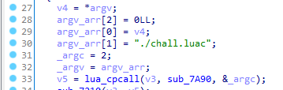
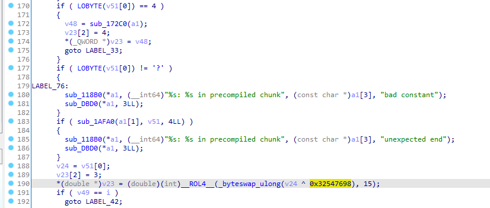
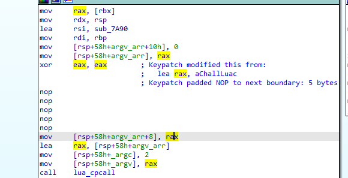
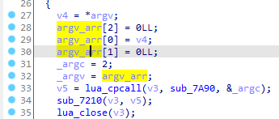
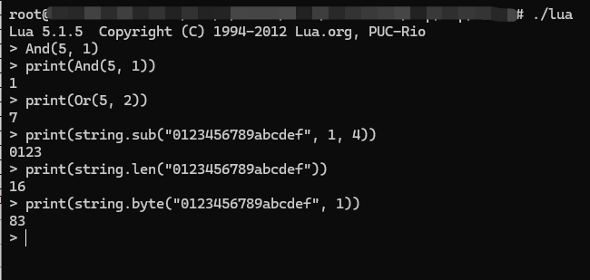
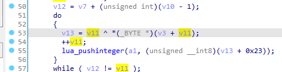

给了一个 lua 二进制文件和一个 luac 文件，简单看看 luac 文件就可以看出来它是被魔改过，需要先还原标准的 luac 。

lua 拖入 ida ， main 可以看到先定义了几个位运算函数：


看一下发现就只是标准的位运算。再下面看到直接把 chall.luac 传入给 pmain ：



这个 lua 二进制并不是最小化编译，可以修改这里的参数起交互命令行，这里后面再用。

要还原标准的 luac 文件就需要知道这个 luac 是怎么生成或者解析的，在 lua 源代码中分别就是 luaU_dump 和 luaU_undump 函数。

搜索 dump 可以找到 lua_dump 函数，但是发现 luaU_dump 被删掉了：


继续找 luaU_undump ，根据 0x61754C1B 这个常数 ("\x1bLua") 可以找到 luaU_undump 函数地址 0x181F0 ，然后和标准的 luaU_undump 对比可发现几处不一致的地方


LoadCode:


LoadConstants:



LoadString:


可以看到这三个地方做了修改，写个脚本处理一遍 luac 文件即可。详细代码见 exp 中的 process_luac51.py

luac 的指令集没有修改，得到的 out.luac 就可以使用 unluac 和 luadec 反编译了，结合二者输出可得到如下结果：

```lua
function hex(l_1_0)
  local l_1_2 = "0123456789abcdef"
  local l_1_1 = ""
  for l_1_9 = 1, string.len(l_1_0) do
    local l_1_6, l_1_7, l_1_8
    l_1_6 = string.byte(l_1_0, l_1_9)
    l_1_7 = And(Shr(l_1_6, 4), 15)
    l_1_8 = And(l_1_6, 15)
    l_1_1 = l_1_1 .. string.sub(l_1_2, l_1_7 + 1, l_1_7 + 1) .. string.sub(l_1_2, l_1_8 + 1, l_1_8 + 1)
  end
  return l_1_1
end

function from_uint(l_2_0)
  local l_2_2 = And(l_2_0, 255)
  local l_2_3 = And(Shr(l_2_0, 8), 255)
  local l_2_4 = And(Shr(l_2_0, 16), 255)
  local l_2_5 = And(Shr(l_2_0, 24), 255)
  return string.char(l_2_2, l_2_3, l_2_4, l_2_5)
end

function to_uint(l_3_0, l_3_1)
  if l_3_1 == nil then
    l_3_1 = 1
  end
  local l_3_2 = string.byte(l_3_0, l_3_1)
  l_3_2 = Or(l_3_2, Shl(string.byte(l_3_0, l_3_1 + 1), 8))
  l_3_2 = Or(l_3_2, Shl(string.byte(l_3_0, l_3_1 + 2), 16))
  l_3_2 = Or(l_3_2, Shl(string.byte(l_3_0, l_3_1 + 3), 24))
  return l_3_2
end

function rc4init(l_4_0, l_4_1)
  local l_4_11, l_4_12, l_4_13;
  l_4_12 = string.len(l_4_1)

  for l_4_9 = 0, 255 do
    l_4_0[l_4_9] = l_4_9
  end

  l_4_11 = 0;
  for l_4_14 = 0, 255 do
    l_4_11 = (l_4_11 + l_4_0[l_4_14] + string.byte(l_4_1, l_4_14 % l_4_12 + 1)) % 256
    l_4_13 = l_4_0[l_4_14]
    l_4_0[l_4_14] = l_4_0[l_4_11]
    l_4_0[l_4_11] = l_4_13
  end
end

function rc4crypt(l_5_0, l_5_1)
  local l_5_7 = nil
  local l_5_2 = nil
  local l_5_8, l_5_9, l_5_10
  l_5_10 = ""
  for l_5_11 = 0, string.len(l_5_1) - 1 do
    l_5_7 = (l_5_7 + 1) % 256
    l_5_2 = (l_5_2 + l_5_0[l_5_7]) % 256
    l_5_8 = l_5_0[l_5_7]
    l_5_0[l_5_7] = l_5_0[l_5_2]
    l_5_0[l_5_2] = l_5_8
    l_5_9 = Xor(string.byte(l_5_1, l_5_11 + 1), l_5_0[And(l_5_0[l_5_7] - l_5_0[l_5_2], 255)])
    l_5_10 = l_5_10 .. string.char(l_5_9)
    l_5_2 = (l_5_2 + l_5_9) % 256
  end
  return l_5_10
end

function rc4(l_6_0, l_6_1)
  local l_6_2 = {}
  rc4init(l_6_2, l_6_1)
  return rc4crypt(l_6_2, l_6_0)
end

function fail()
  print("wrong")
  os.exit(0)
end

function encrypt(A0_2, A1_2, A2_2)
  local L3_2, L4_2, L5_2, L6_2, L7_2, L8_2, L9_2, L10_2, L11_2, L12_2, L13_2, L14_2, L15_2, L16_2, L17_2, L18_2, L19_2
  L6_2 = to_uint(A2_2, 1)
  L7_2 = to_uint(A2_2, 5)
  L8_2 = to_uint(A2_2, 9)
  L9_2 = to_uint(A2_2, 13)
  L4_2 = 305419896
  L5_2 = 0
  for L13_2 = 1, 32, 1 do
    L4_2 = to_uint(rc4(from_uint(L4_2), A2_2))
    L5_2 = And(L5_2 + L4_2, 4294967295)
    A0_2 = And(A0_2 + Xor(Xor(Shl(A1_2, 4) + L6_2, A1_2 + L5_2), Shr(A1_2, 5) + L7_2), 4294967295)
    A1_2 = And(A1_2 + Xor(Xor(Shl(A0_2, 4) + L8_2, A0_2 + L5_2), Shr(A0_2, 5) + L9_2), 4294967295)
  end
  return A0_2, A1_2
end

function check(A0_2)
  local L2_2, L3_2, L4_2, L5_2, L6_2
  L2_2 = ""
  L3_2 = "thisshouldbeakey"
  A0_2 = rc4(A0_2, L3_2)
  for L9_2 = 0, 3, 1 do
    L4_2 = to_uint(A0_2, 1 + 8 * L9_2)
    L5_2 = to_uint(A0_2, 1 + 8 * L9_2 + 4)
    L4_2, L5_2 = encrypt(L4_2, L5_2, L3_2)
    L2_2 = L2_2 .. from_uint(L4_2) .. from_uint(L5_2)
  end
  L2_2 = hex(L2_2)
  L6_2 = L2_2 == "ac0c0027f0e4032acf7bd2c37b252a933091a06aeebc072c980fa62c24f486c6"
  return L6_2
end

function main()
  print("input flag: ")
  local l_10_0 = io.read()
  if string.len(l_10_0) ~= 39 then
    fail()
  end
  if string.sub(l_10_0, 1, 6) ~= "SUCTF{" then
    fail()
  end
  if string.sub(l_10_0, 39) ~= "}" then
    fail()
  end
  if check(string.sub(l_10_0, 7, 38)) then
    print("correct")
  else
    fail()
  end
end

main()
```

逻辑相对来说还是比较清晰的，下面就可以写代码求解。但是求解无法得到正确的输出，可能是 lua 执行过程中有什么隐藏的逻辑。再回到 lua 的 main 中，将 第二个参数修改为 NULL ：





再运行 lua 就有交互式终端了。将反编译得到的 lua 代码中的一些操作、函数依次尝试之后即可发现 string.byte 存在问题：



找到 string 库注册的函数表：


F5 之后即可发现隐藏的逻辑：



将 string.byte 修正之后写逆就能得到 flag 了，详细代码见 exp 。