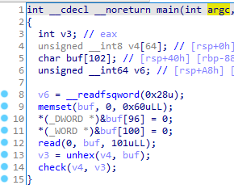
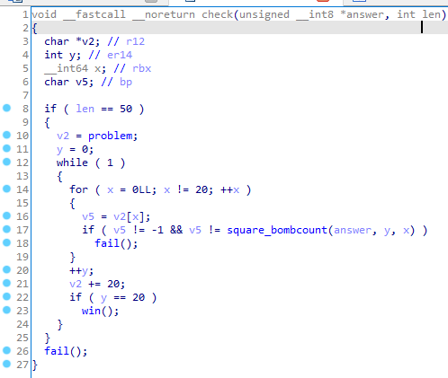

题目逻辑不多也不难，很容易逆向得到：





输入经过换表的 unhex 后传给 check ， problem 是一个 `char[20][20]` 的数组，每个值表示包含当前格子在内的 3x3 范围内雷的数量， -1 表示这个值无效，与传统扫雷的不包含自己不太一样。变换后的输入的每个 bit 表示一个格子是否为雷，总共是 20x20=400 bit 也就是 50 字节。

看明白逻辑之后就能发现这是一个逻辑约束的谜题，当然可以自己手动玩出来（x）比较好的方式时用 z3 写逻辑约束求解，详细代码见 exp 。
``` python
#!/usr/bin/env python3

from z3 import *
import hashlib

problem = [
	[3, 4, -1, -1, -1, 5, -1, -1, -1, -1, -1, 4, 4, -1, -1, -1, -1, 2, -1, -1],
	[4, -1, 7, -1, -1, -1, 4, 6, 6, -1, -1, -1, -1, 6, 5, 6, 4, -1, 5, -1],
	[4, 7, -1, 8, -1, 6, -1, -1, 6, 6, 5, -1, -1, -1, -1, -1, 3, 3, -1, 3],
	[-1, 5, 6, 6, -1, -1, -1, -1, 4, 5, 4, 5, 7, 6, -1, -1, 4, -1, 2, 1],
	[-1, -1, -1, 3, 4, -1, -1, 5, 4, 3, -1, -1, 7, 4, 3, -1, -1, 1, 1, -1],
	[-1, 4, 3, -1, 2, -1, 4, 3, -1, -1, 2, -1, 5, 4, -1, -1, 2, 2, -1, -1],
	[4, -1, 4, -1, 3, 5, 6, -1, -1, 0, -1, -1, -1, 2, -1, -1, -1, 1, 4, -1],
	[-1, 7, 5, -1, -1, 3, 3, 2, -1, -1, 4, -1, -1, 5, 7, -1, 3, 2, 4, 4],
	[-1, 7, 5, 4, 3, -1, -1, 4, -1, 2, 4, 5, -1, -1, 6, 5, 4, -1, 2, -1],
	[-1, 7, 4, -1, -1, 3, -1, 4, 4, -1, -1, -1, -1, -1, -1, -1, 4, 3, 2, 2],
	[-1, -1, 2, 4, 3, 5, -1, -1, 5, -1, 4, -1, 6, -1, -1, 6, -1, -1, -1, -1],
	[3, 3, -1, 4, -1, -1, -1, -1, -1, 6, -1, 6, 6, -1, 7, 6, 4, -1, 4, 3],
	[-1, 4, 3, 5, 4, -1, -1, -1, -1, -1, -1, -1, 4, 6, 7, -1, -1, 4, -1, -1],
	[-1, 7, -1, 5, -1, 5, -1, -1, 6, 7, 7, -1, 5, 6, 6, -1, -1, 2, 4, 4],
	[-1, -1, -1, -1, -1, 6, -1, -1, 7, 7, 6, -1, 6, -1, -1, -1, -1, 3, -1, 3],
	[5, -1, 7, -1, 5, -1, 6, -1, 5, -1, -1, 7, 8, -1, -1, 3, -1, 3, -1, -1],
	[-1, -1, -1, 3, -1, -1, -1, -1, -1, -1, -1, 6, 5, 3, -1, 4, 5, 5, 3, -1],
	[-1, 6, 5, 5, 6, -1, 6, 5, 2, 4, 3, 4, -1, -1, 3, 4, 4, 6, 5, -1],
	[3, -1, 5, 5, 5, -1, -1, 5, -1, -1, 4, -1, -1, 4, -1, 7, 7, 8, 6, -1],
	[-1, -1, -1, 5, -1, -1, -1, 4, -1, 3, -1, 3, -1, -1, -1, -1, -1, -1, 5, 3]
]

def var_at(y, x):
	if y < 0 or x < 0 or y >= 20 or x >= 20: return 0
	return blocks[y][x]

def sum_at(y, x):
	s = 0
	for dy in range(-1, 2):
		for dx in range(-1, 2):
			s += var_at(y + dy, x + dx)
	return s

blocks = [[ Int('x_%d_%d' % (y, x)) for x in range(20) ] for y in range(20) ]


solver = Solver()
for line in blocks:
	for block in line:
		solver.add(Or(block == 0, block == 1))

for y in range(20):
	for x in range(20):
		if problem[y][x] != -1:
			solver.add(sum_at(y, x) == problem[y][x])

print('checking')
assert solver.check() == sat
model = solver.model()
# print(model)

answer = bytearray(400 // 8)
for y in range(20):
	print('|', end='')
	for x in range(20):
		v = model[var_at(y, x)].as_long()
		if v:
			print('#', end='')
		else:
			print(' ', end='')
		answer[(20 * y + x) // 8] |= v << ((20 * y + x) % 8)
	print('|')

answer = answer.hex()
answer = answer.translate(str.maketrans('0123456789abcdef', 'abcdef0123456789'))
print(answer)
# f57503596fb80f955fa5cad3cb282aa18ac62922a1981ea7b53b07a30709b508f3176601154250d509b7bee0f2170b898617

print('SUCTF{%s}' % hashlib.md5(answer.encode()).hexdigest())
# SUCTF{d661b98e4241de7423ef2d953098329d}

```

